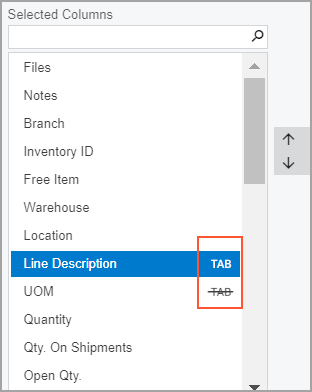

# Default Table Layout and Accessibility {#_30f3229f-20f1-4055-9c03-e0fe3b37080d .concept}

Your organization may have specific requirements for processing documents in Acumatica ERP, which can be reflected in the table layout on particular forms. If your user account is assigned the *Administrator* role in Acumatica ERP, you can set the default column configuration for all users of the system or configure table layouts for particular users, as described in this topic.

## Setting and Changing the Default Table Layout { .section}

You can configure the required table layout \(such as the order of columns and the set of columns to be displayed\) and set this configuration as the new default layout, while logged in to a user account that has the *Administrator* role. After you have set the new default layout for a particular table, the system applies this layout to the following users:

-   All new users added to the system after you set the default layout
-   All existing users who haven't changed the default layout

If users have personalized layouts of a particular table, you can override their table settings with these default settings.

## Setting the Visibility of the Table Columns { .section}

For each table of a data entry or mass processing form, you can define the visibility of the columns by using the **Column Configuration** dialog box. In the **Selected Columns** list of this dialog box, the system displays the columns that are visible on the table. These table columns may look like those in the following screenshot.

One of the following indicators \(also shown in the previous screenshot\) can be shown for each column:

-   : Indicates that the column is accessible through a keyboard \(that is, a user can tab to the column\). This button is not visible by default and appears only when you point at the column name.
-   : Indicates that the column is not accessible through a keyboard. In this case, when a user attempts to tab to the column by pressing the Tab key on the keyboard, the system instead skips the column \(and any others that are inaccessible through a keyboard\) and goes to the next accessible column. If accessibility for a column has been turned off, this button is visible by default and stays visible when you point at the column name.

To change the state of the accessibility of a column, in the **Selected Columns** list of the dialog box, you point at the column name and click the  or  button.

By default, changes in the column configuration are applied to the current user account. However, a user with administrative access to the system can configure the column accessibility; this administrative user can then share its configuration with specific users in the system or make it the default configuration for all users.

## Configuring Table Layouts and Accessibility Settings for Particular Users { .section}

If particular users have specific requirements for the table layout and accessibility on a form, you can set up the required configuration while logged in to a user account that has the *Administrator* role, and you can then apply this configuration to these users only. These users will see this table configuration when they navigate to the form, but other users will not. Users can change this default table configuration at any time. To configure the layout and accessibility settings of a table or multiple tables on a form for particular users, you do the following:

1.  You navigate to the form and configure the layout and accessibility settings required by users of the table or tables on the form.
2.  On the form title bar, you click **Help** &gt; **Share Column Configuration**. The **Share Column Configuration** dialog box is opened. \(For a description of the dialog box, see [Share Column Configuration Dialog Box](Form_Title_Bar.md#_a54385c8-f301-4412-8594-405f3ea1cc44).\)
3.  In the dialog box, you do the following:
    1.  On Page 1, you select the table or tables you have configured.
    2.  On Page 2, you clear the **Set as the Default** check box.
    3.  In the Users table of Page 2, you select the users to which you want to apply the table layout. If these users are all assigned a particular role, in the **User Role** box, you can select this role to filter the list of users in the list and then select the needed users.

**Parent topic:**[Adjusting the Table Layout](../InterfaceGuide/Details_Table_Using.md)

