# Modern UI: Changes in UI Elements {#_5fec9220-52be-4566-93b4-f5cfbdba9429 .concept}

The Modern UI was introduced in Acumatica ERP 2025 R1. Key benefits of the Modern UI include the following:

-   An improved look and feel, with important information easier to find at a glance
-   Faster performance
-   The ability to personalize forms to fit your specific workflows and information needs
-   A responsive layout that adapts seamlessly to the device you are using

In the following sections, you’ll find information about the notable improvements to the user experience.

## Responsive Layouts { .section}

Because more users access Acumatica ERP from mobile devices, the Modern UI was designed to be more mobile-friendly. In the Classic UI, forms had fixed layouts and UI elements had predefined sizes, which looked odd on some devices. The system’s appearance in the Modern UI is visually appealing on any device because it features flexible layouts, with forms and UI elements seamlessly adapting to different screen sizes. The following screenshots demonstrate how the same form looks on tablets in the Classic UI and in the Modern UI.

|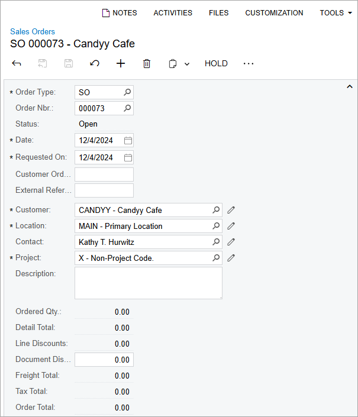|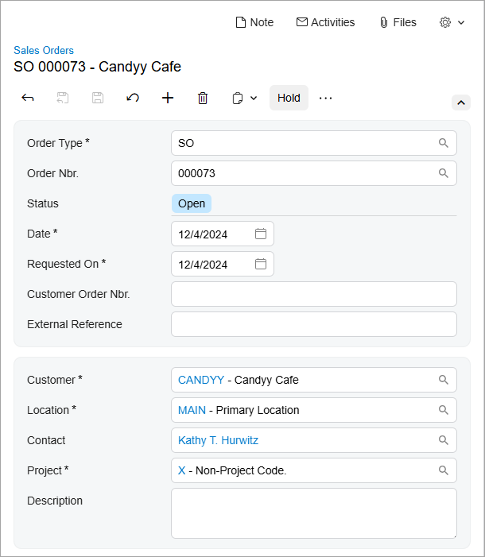|

## Form Title Bar Menus { .section}

Every Acumatica ERP form in the Classic UI displayed the **Customization** and **Tools** menus on the form title bar. In the Modern UI, these two menus have been combined into the Settings menu so that you can find the needed menu commands in one place. \(See the following screenshots.\)

|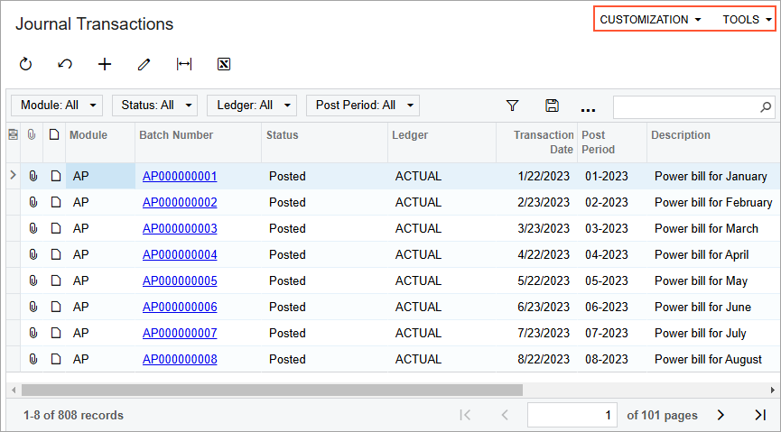|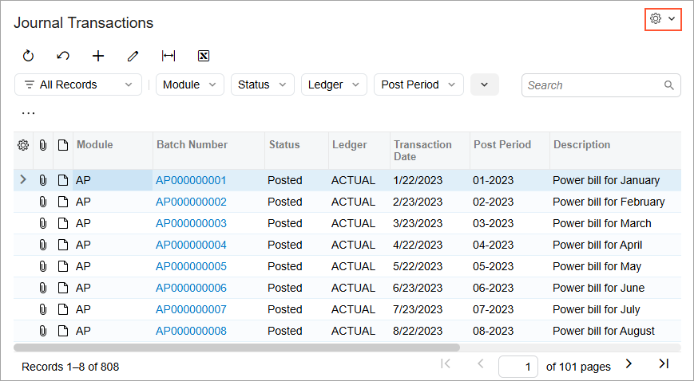|

## Grouped UI Elements { .section}

In the Modern UI, related elements are now visually grouped with color blocks \(shown in the second screenshot below\), enhancing clarity and making key settings easier to see at a glance. \(These color blocks were not used in the Classic UI, as you can see in the first screenshot.\)

|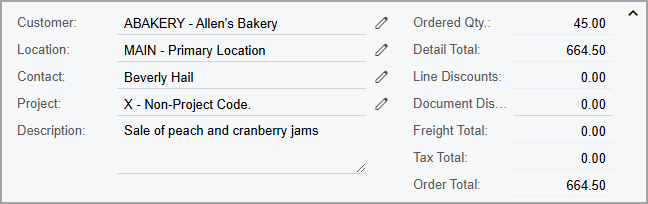|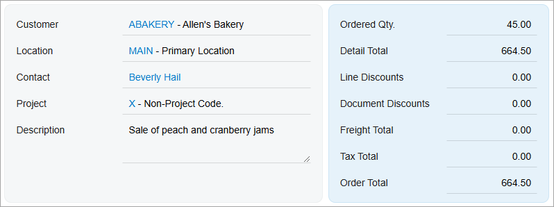|

## Elements with Magnifier Buttons { .section}

If a box or column has a magnifier button, you can click the magnifier button to open a lookup table and select a value.

If a value has already been selected, you may want to view the selected record on the form where it has been created. In the Classic UI, you did this by clicking the Edit button. In the Modern UI, the system displays the selected value as a link for visual uniformity. When you click the link, the system opens the selected record on the creation form. The following screenshots show these changes.

|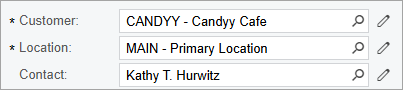|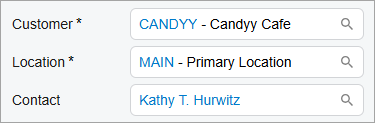|

Depending on the control's configuration, the magnifier button, the link, or the Edit button may be hidden.

## Errors, Warnings, and Informational Messages { .section}

In the Classic UI, Acumatica ERP displayed errors, warnings, and some informational messages by using the browser's modal dialog boxes. The Modern UI displays these messages in the form's upper-right corner. \(See the following screenshots.\)

|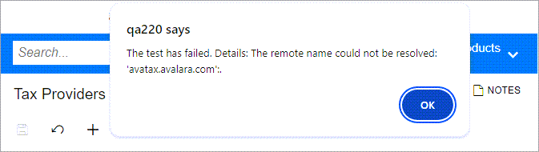|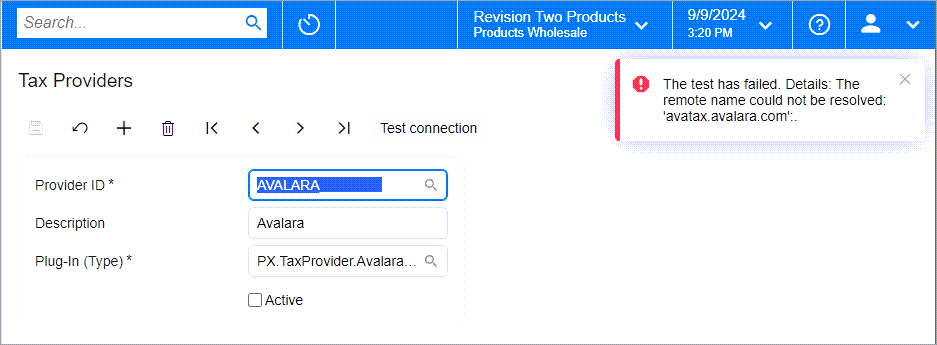|

In the Classic UI, informational messages were displayed as regular text, as shown below. In the Modern UI, informational messages are now highlighted in color to make them easier to notice \(also shown below\).

|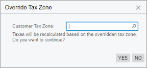|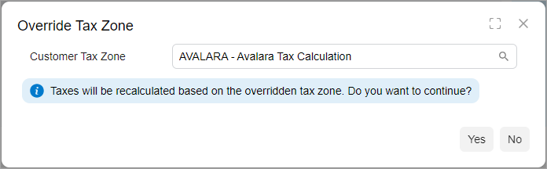|

## Errors and Warnings in Table Values { .section}

In the Classic UI, when an incorrect value was entered in a table, an error icon appeared next to the tab name \(if applicable\) and beside the cell containing the incorrect value. \(See the first screenshot below.\) Similarly, for a warning related to a cell value, a warning icon was displayed next to both the tab and the cell. To view the description of the error or warning, you hovered over the respective icon.

In Modern UI, when there’s an error or warning message related to a table value, the system displays an error or warning icon next to the tab name and beside the cell containing the incorrect value; it also highlights the entire row with the error. To view the description of the error or warning, you hover over the icon or the highlighted row. \(See the second screenshot below.\)

|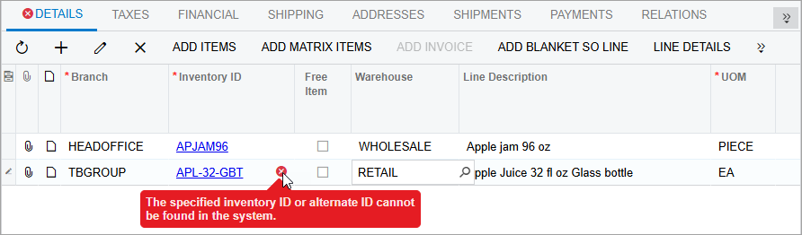|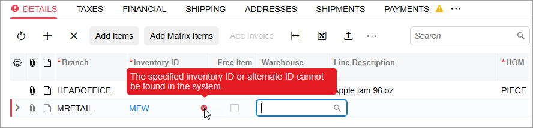|

## Numeric Columns in Tables { .section}

In the Classic UI, numeric values in table cells were truncated to fit the column width \(shown in the first screenshot below\). In the Modern UI, when a numeric value doesn’t fit the column width, it’s replaced with the *\#* characters \(shown in the second screenshot\). This explicitly indicates that the respective values did not fit. To see the actual value, you hover over the cell, and the value is displayed as a tooltip.

|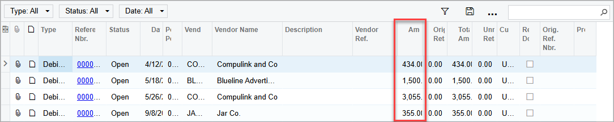|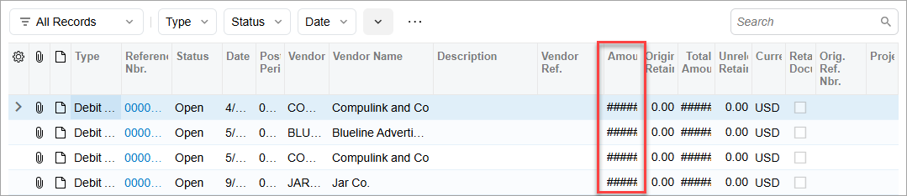|

## A Single View of Data { .section}

For some tables, in the Classic UI, you could switch between a grid view and form view of the data, as shown in the following screenshot. The grid view was a standard table view, with all details arranged in a table and each row representing one detail. The form view showed a set of elements intended for only one detail or document row, and you used the navigation buttons to move to a different detail.

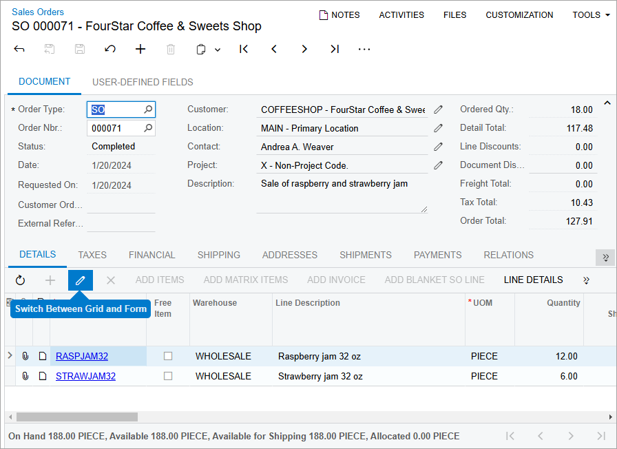

In Modern UI, for simplicity, this data can be viewed and entered only in the table, as it was designed to be viewed and entered.

## Table Filters { .section}

In the Modern UI, table filters have been enhanced to simplify data filtering. To learn more about these improvements, see [Modern UI: Filters](UIG__con_Modern_UI_Filters.md).

## Multiline Text Boxes { .section}

In the Classic UI, when you pressed Enter in a multiline text box, a new line was inserted.

However, in the Modern UI \(unless the developer has configured it otherwise\), when you press Enter, the system moves the focus to the next control instead. To insert a new line in the Modern UI, you need to press Ctrl+Enter.

**Parent topic:**[Modern UI](../InterfaceGuide/UIG__con_Modern_UI.md)

