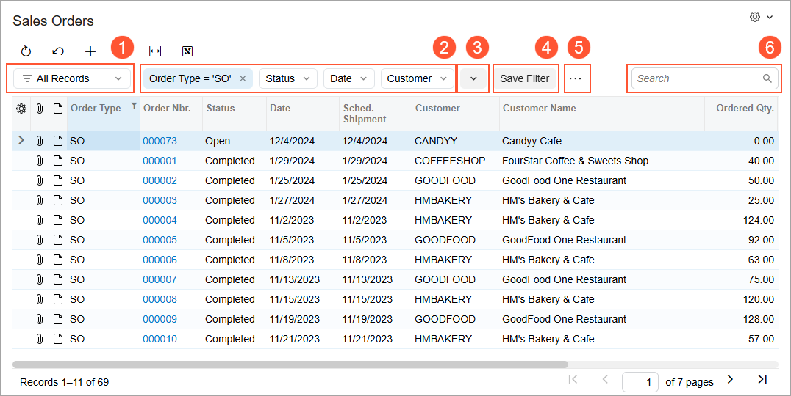
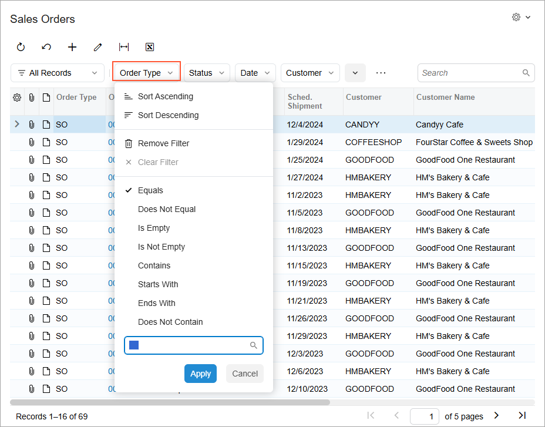
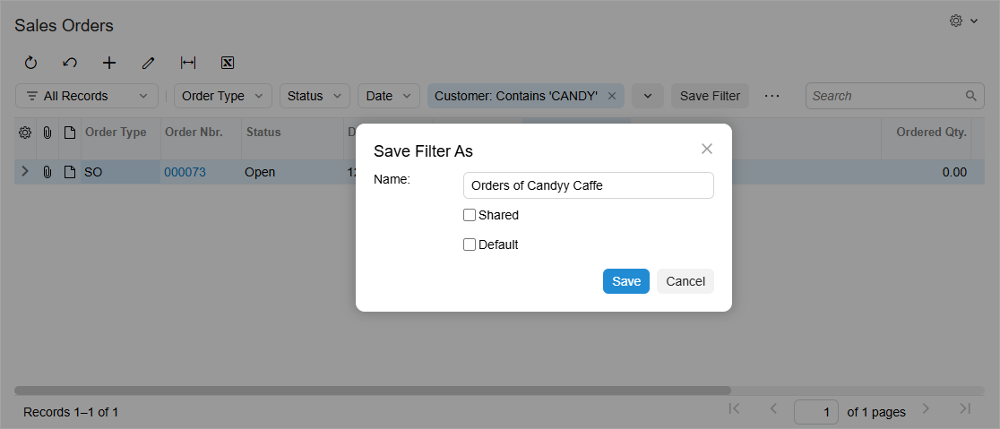
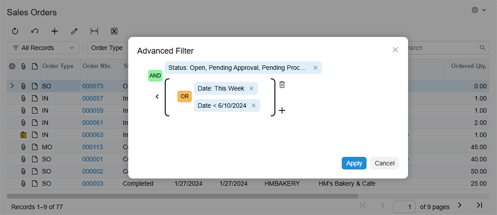
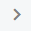
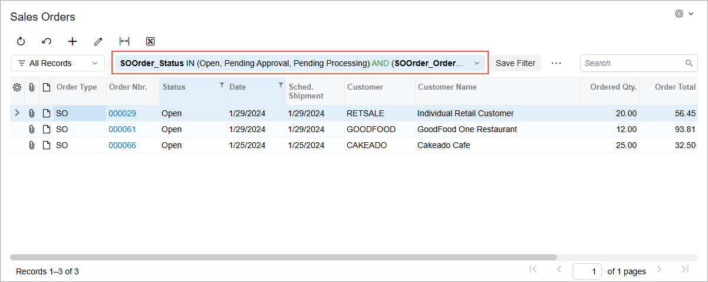

# Modern UI: Filters {#_670f4502-7700-4a07-8a32-491275b7f211 .concept}

In the Modern UI, table filters have been enhanced to simplify data filtering. Additionally, a new Advanced Filter editor has been introduced.

**Tip:** A form’s existing filters will remain effective even after the form is switched to the Modern UI.

## Filtering Area { .section}

The filtering area of Acumatica ERP tables has been redesigned. The screenshot below shows the basic elements of the filtering area for the Sales Orders \(SO3010PL\) list of records.

1.  The Filter List button, which you can click to display a list of saved personal and shared filters.
2.  The Quick Filter buttons, which you can click to define quick filter criteria, specify the sorting order, or remove the Quick Filter button for the respective columns.
3.  The **Add Quick Filter** button, which you can click to add more Quick Filter buttons for columns or to open the Advanced Filter editor.
4.  The **Save Filter** button, which you can use to save the filter for future usage. This button is visible only when the current filter has not been saved.
5.  The **...** button, which you can click to execute menu commands for managing filters.
6.  The Search box, which you can use to enter a string to highlight cell values that include the search term. By default, the maximum length for the search string is 100 characters, and the system uses the *Contains* condition to perform the search.

## Filter List { .section}

In the Modern UI, saved personal and shared filters are listed in a special Filter List drop-down menu instead of as filter tabs, as they were in Classic UI. To open the list of filters, click the Filter List button in the filtering area, as shown in the screenshot below.

In the Filter List drop-down menu, you can perform basic actions as follows:

-   To apply one of the filters, click the filter name in the list.
-   To search for a filter, type its name in the search box.
-   To mark a filter as a favorite, hover over the filter name and click the star icon. Favorite filters are displayed at the top of the list.

Filters shared between all users of Acumatica ERP are denoted with the  icon in the Filter List drop-down menu.

## Quick Filters { .section}

A quick filter is a reusable filter that you can apply to columns in a particular table. You can apply multiple quick filters simultaneously; if you do, you will see multiple Quick Filter buttons in the filter area. If you click one of these buttons, the Quick Filter drop-down menu will open, as shown in the screenshot below.

In the Quick Filter drop-down menu, you can act upon the selected filter as follows:

-   To sort the table rows by the values of the selected column, click **Sort Ascending** or **Sort Descending**.
-   To specify filter criteria, select the conditions, specify a value \(if needed\), and click **Apply**. The list of available conditions and values varies depending on the type of the column's underlying data field.
-   To discard filtering by the respective column, click **Clear Filter**.
-   To remove the Quick Filter button for the selected column, click **Remove Filter**.

You can also rearrange the order of Quick Filter buttons in the filtering area by dragging the button to the needed position.

To add a Quick Filter button for a particular column, do one of the following:

-   Drag the column header to the filter area.
-   Click the **Add Quick Filter** button, and select the name of the column in the dialog box that opens.
-   Click the column header, specify the filter conditions and values, and click **Apply**. This will add the Quick Filter button and apply the specified filter criteria.
-   Click within the cell and press Shift+F. This will add the Quick Filter button and filter the contents by the value of the selected cell.

## Operations with Filters { .section}

To keep the filter criteria for future usage, or to share the filter with other users, do either of the following:

-   Click the **Save Filter** button. This button is visible only when the current filter has not been saved.
-   Click the **...** button in the filter area and then click the **Save As** command.

Either of these actions will open the **Save Filter As** dialog box, which is shown in the following screenshot.

In the dialog box, you specify the name of the filter and click **Save**. Additionally, you can make the system apply this filter each time you open the form by selecting the **Default** check box before you click **Save**. Also, if you have access to the [Filters](../UserGuide/CS_20_90_10.md) \(CS209010\) form, you can make the filter available to other users by selecting the **Shared** check box before you click **Save**.

Saved personal and shared filters are listed in the Filter List drop-down menu.

To modify the properties of the existing filter, click the **...** button in the filter area and then click the **Edit Filter** command.

To delete an existing saved filter, click the **...** button in the filter area and then click the **Delete Filter** command.

## Advanced Filter Editor { .section}

By using the **Advanced Filter** dialog box, you can visually and intuitively specify complex filtering criteria—that is, one or more simple filtering criteria grouped and joined by logical operators. To open the dialog box, do either of the following:

-   Click the **...** button in the filter area and then click the **Open Advanced Filter** command.
-   Click the **Add Quick Filter** button and select **Advanced** in the dialog box that opens.

The following screenshot shows the **Advanced Filter** dialog box.

In the editor, you can do the following:

-   To define filter criteria, click the name of the needed data field, specify the conditions and the values \(if needed\), and then click **Apply**. The list of available conditions and values varies depending on the data field type.
-   To clear filter criteria, click the name of the needed data field and then click **Clear Filter**.
-   To delete filter criteria, either click the  icon or click the name of the needed data field and then click **Remove Filter**.
-   To add another data field, click the plus icon next to an existing data field and select the name of the data field to be added in the dialog box that opens.
-   To change the logical operator, click the operator name. Possible operators are *AND* and *OR*.
-   To group multiple filter criteria, hover over the logical operator and click the  icon. Groups define the order of logical operations. Grouped criteria are denoted with parentheses.
-   To cancel the grouping, hover over the parentheses and click the  icon.
-   To delete a group, hover over the parentheses and click the  icon.
-   To apply the current filter to the table and close the editor, click **Apply**.
-   To close the editor without applying the filter, click **Cancel**.

Once the advanced filter has been applied to a table, it is displayed as a row in the filtering area, as shown in the following screenshot.

**Parent topic:**[Modern UI](../InterfaceGuide/UIG__con_Modern_UI.md)

