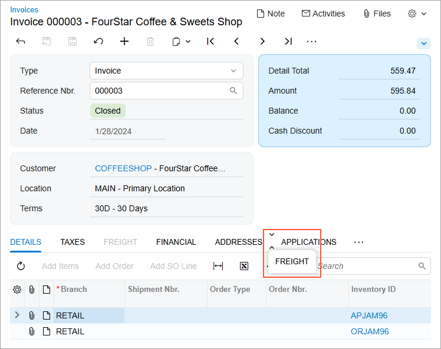
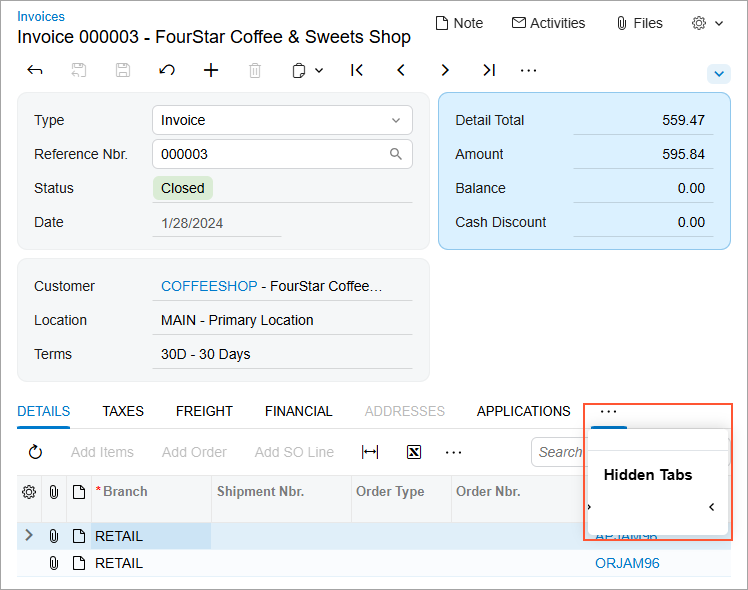
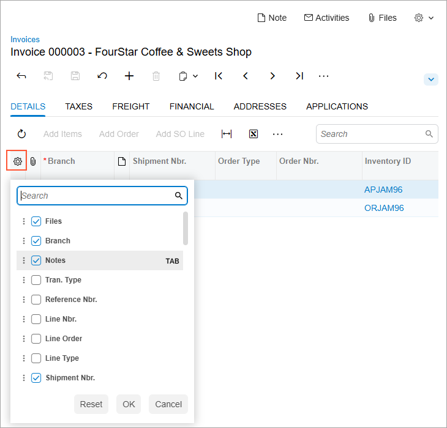
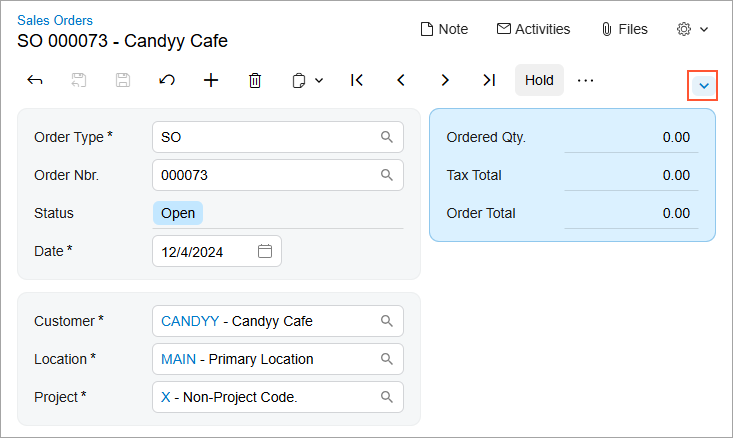
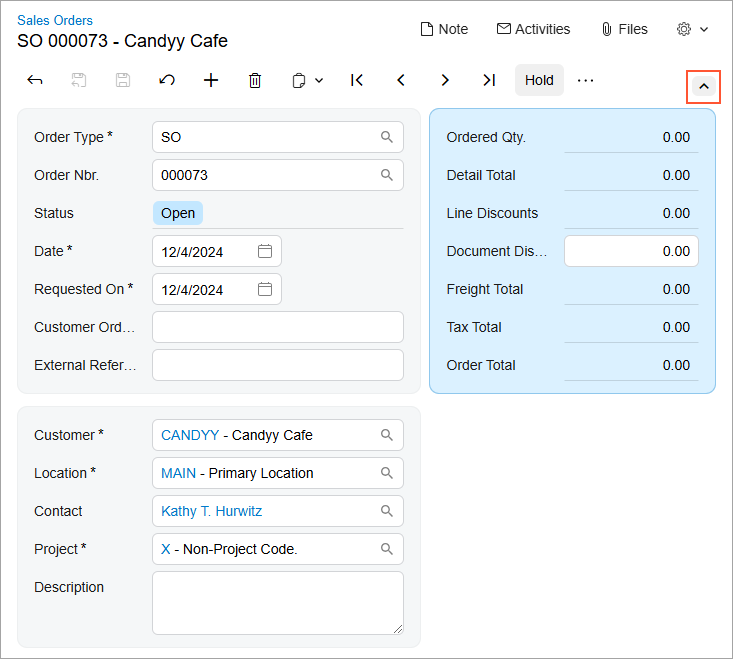

# Modern UI: User Personalization {#_c03e368f-4805-4eaf-8054-ebe8036fabaf .concept}

In the Modern UI, you can easily personalize the layout of forms. This topic describes various ways that you can adjust the user interface for your own user accounts. In the Modern UI, personal layouts of forms are retained between sessions and apply only to your user account.

## Customizing Tab Controls { .section}

Once a form has been switched to the Modern UI, you can change the order of tabs and hide or display individual tabs. Changes to the tab controls will be applied to the personal layout of the form.

To reorder a tab, click and hold the tab name and then drag it to the desired position \(as shown in the screenshot below\).

To hide a tab, click and hold the tab name, first drag it to the More button, and then drag it to the **Hidden Tabs** section \(as shown in the screenshot below\).

To display a hidden tab, click the More button and then drag the tab name from the **Hidden Tabs** section to the needed position.

## Customizing Table Controls { .section}

In Modern UI, you can personalize the appearance and content of table controls: add or remove visible columns, reorder columns, and change any column's width. Changes to the table would be applied to the personal layout of the form.

In the Modern UI the Settings button is displayed in the upper-left corner of the table control. By clicking this button, you can open the Column Configuration dialog box, as shown in the following screenshot.

In the Column Configuration dialog box, you can do any of the following:

-   To hide or display a column, clear or select the check box next to the column name.
-   To modify the order of the columns, drag the column name to the desired position in the list.
-   To change whether the column should receive focus when you press Tab, hover over the column name and click **Tab** to change its state \(which will cause the word to be crossed out or appear normal\).
-   To apply the column configuration, click **OK**.
-   To cancel the column configuration, click **Cancel**.
-   To reset the configuration and restore the default layout of the table, click **Reset**.

## Collapsible Areas of a Form { .section}

You can collapse and expand certain areas of a form to display fewer or more UI elements. These areas are known as collapsible areas of a form. The collapsed or expanded state of a collapsible area is retained for your user account between sessions.

To collapse or expand the area, click the arrow icon above the area, as shown in the screenshots below.

**Parent topic:**[Modern UI](../InterfaceGuide/UIG__con_Modern_UI.md)

