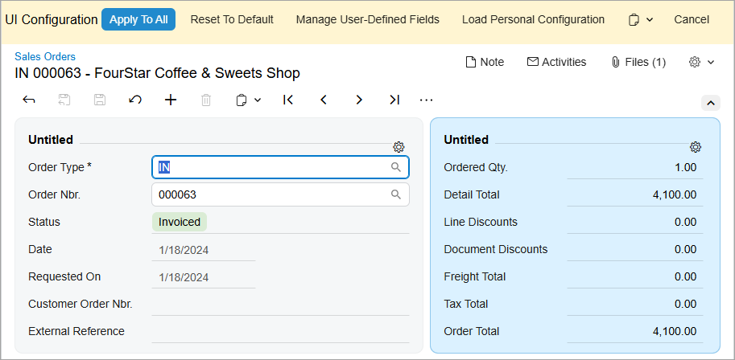
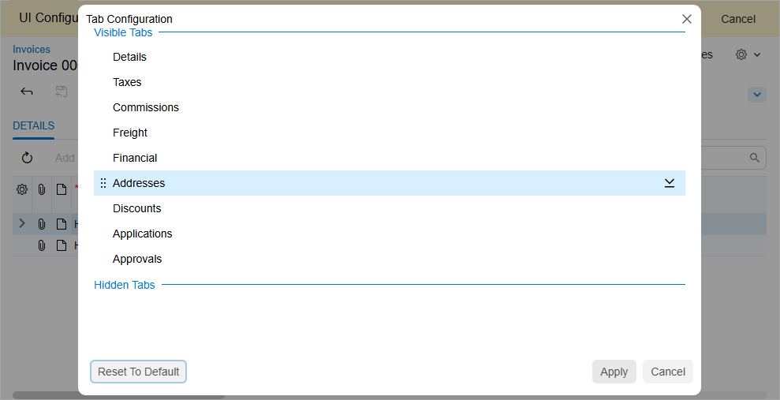
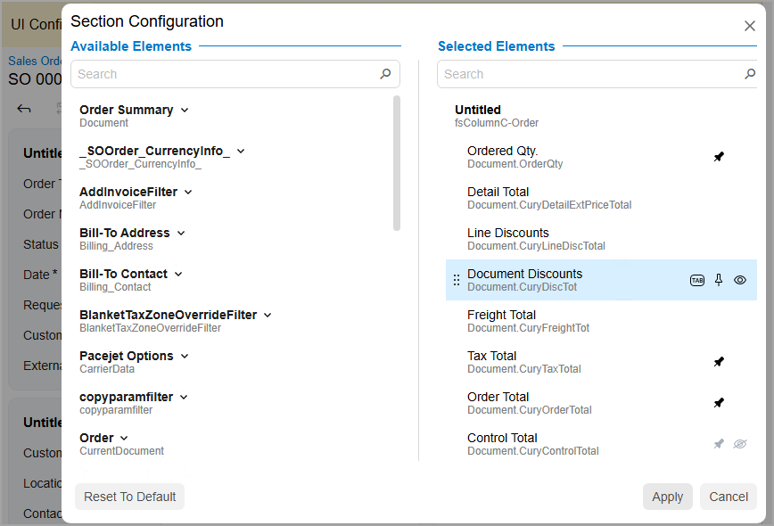

# Modern UI: System-Wide Form Configuration {#_8788a111-5714-4d33-9962-059e49baf657 .concept}

With Modern UI functionality, if you have the appropriate privileges, you can modify the overall appearance of Acumatica ERP forms, including both standard and custom forms. Additionally, you can set a default form layout for the entire site. You can perform this system-wide form configuration only if your user account is assigned both the *Administrator* and *Customizer* roles.

Any system-wide modifications you make will be shared among all system users. When you apply these changes, you can choose to either keep or override any personalized layouts that system users have made.

## Using UI Configuration Mode { .section}

To modify a form’s appearance, you click the Settings button on the form title bar and then click **UI Configuration**. You are now working in UI Configuration mode \(as shown in the following screenshot\) for the current form; if you navigate to another form, the mode is deactivated, discarding any changes you have made.

When UI Configuration mode is active, the system does the following:

-   Applies either the default layout of the current form or the layout shared between all users \(if one has been configured\)
-   Displays the UI Configuration pane on the top of the form
-   Displays the Settings buttons next to each section and tab control

The buttons that appear in the UI Configuration pane are described in the following table.

|Button|Description|
|------|-----------|
|**Apply to All**|Applies the changes to the layout shared between all users and deactivates UI Configuration mode. The system prompts you about whether it should replace or retain the personalized layouts of individual users.|
|**Reset to Default**|Restores the form to the default layout supplied by Acumatica ERP.|
|**Manage User-Defined Fields**|Opens a dialog box where you can manage user-defined fields associated with the current form. See [Modern UI: Managing User-Defined Fields](UIG__con_Modern_UI_User_Defined_Fields.md) for details.|
|**Load Personal Configuration**|Opens a dialog box that displays other users' personalized layouts for the current form and gives you the ability to apply the selected layout to the layout shared between all users.|
|**Export Configuration**|Exports the current form’s configuration to an external file.|
|**Import Configuration**|Imports the form’s configuration from an external file and applies it to the current form.|
|**Cancel**|Discards all changes and deactivates UI Configuration mode.|

## Configuring Tab Controls { .section}

In UI Configuration mode, you can change the order of tabs and hide or display individual tabs. Changes to the tab controls will be applied to form layout shared among all users.

To reorder a tab, click and hold the tab name and then drag it to the desired position \(as shown in the screenshot below\).

To hide a tab, click and hold the tab name, first drag it to the More button, and then drag it to the **Hidden Tabs** section \(as shown in the screenshot below\).

To display a hidden tab, click the More button and then drag the tab name from the **Hidden Tabs** section to the needed position.

Additionally, in UI Configuration mode, Settings buttons appear next to each tab control. If you click one of these buttons, the **Tab Configuration** dialog box opens for the tab, as shown in the screenshot below.

In the **Tab Configuration** dialog box, you can do the following:

-   To hide a tab, drag it from the **Visible Tabs** section to the **Hidden Tabs** section, or click the arrow button next to the tab name.
-   To display a tab, drag it from the **Hidden Tabs** section back to the **Visible Tabs** section, or click the arrow button next to the tab name.
-   To modify the order of the tabs, drag the tab name to the desired position in the list.
-   To apply the tab configuration, click **Apply**.
-   To cancel the configuration of the tab, click **Cancel**.
-   To reset the configuration and restore the default layout of the tab control, press **Reset to Default**.

## Configuring Tables { .section}

In UI Configuration mode, you can add or remove visible columns, reorder columns, and change a column's width. Any changes you make to the table will be applied to the layout that all users share.

In the Modern UI the Settings button is displayed in the upper-left corner of the table control. By clicking this button, you can open the Column Configuration dialog box, as shown in the following screenshot.

In the Column Configuration dialog box, you can do any of the following:

-   To hide or display a column, clear or select the check box next to the column name.
-   To modify the order of the columns, drag the column name to the desired position in the list.
-   To change whether the column should receive focus when you press Tab, hover over the column name and click **Tab** to change its state \(which will cause the word to be crossed out or appear normal\).
-   To apply the column configuration, click **OK**.
-   To cancel the column configuration, click **Cancel**.
-   To reset the configuration and restore the default layout of the table, click **Reset**.

## Configuring Collapsible Areas of a Form { .section}

In UI Configuration mode, you can collapse and expand the collapsible areas of a form to display fewer or more UI elements. The collapsed or expanded state of the collapsible areas would be applied to the form layout shared between all users.

To collapse or expand the area, click the arrow icon above the area, as shown in the screenshots below.

## Configuring Sections { .section}

When UI Configuration mode is active, the Settings buttons appear in the upper-right corner of sections. If you click one of these buttons, the **Section Configuration** dialog box opens, as shown in the screenshot below.

In the **Section Configuration** dialog box, you can perform the following actions:

-   To rename the section, hover over the group title in the **Selected Elements** pane, click the Edit button, and specify the new name of the section.
-   To add a UI element to the section, locate the desired element in the **Available Elements** pane and drag it to the **Selected Elements** pane.
-   To remove a UI element from the section, hover over the element name in the **Selected Elements** pane and click the **Delete** button.

    **Tip:** Default UI elements cannot be removed; only personalized elements can be.

-   To change whether the UI element should receive focus when a user presses Tab, hover over the element name in the **Selected Elements** pane and click **Tab** to change its state \(which will cause the word to be crossed out or appear normal\).
-   To change whether the UI element should be displayed when the collapsible area corresponding to this section is collapsed, hover over the element name in the **Selected Elements** pane and click **Pin**.
-   To hide the UI element, hover over the element name in the **Selected Elements** pane and click the **Visible** button. If all elements in a section are hidden, the entire section becomes hidden.
-   To modify the order of UI elements, drag the element name to the desired position in the **Selected Elements** pane.
-   To apply the section configuration, click **Apply**.
-   To cancel section configuration, click **Cancel**.
-   To reset the configuration and restore the default layout, click **Reset to Default**.

**Parent topic:**[Modern UI](../InterfaceGuide/UIG__con_Modern_UI.md)

