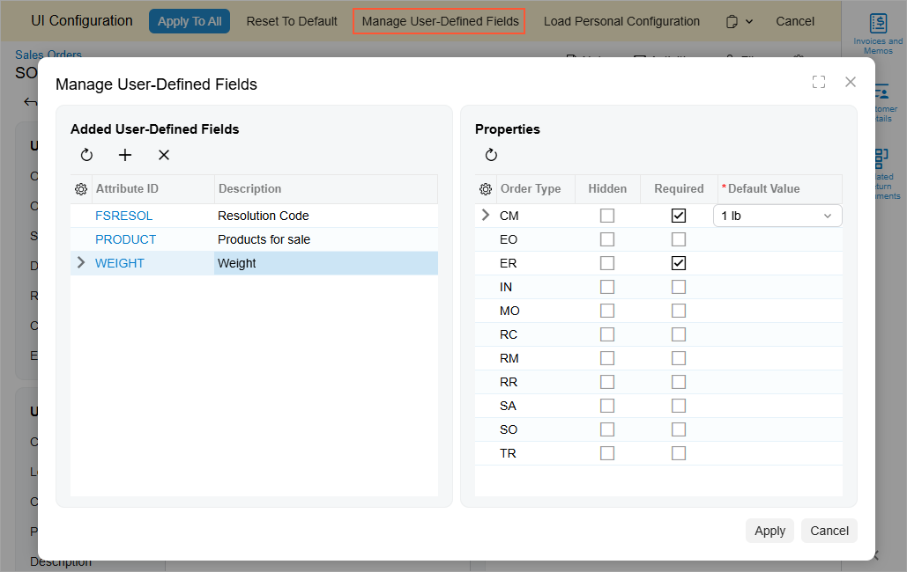
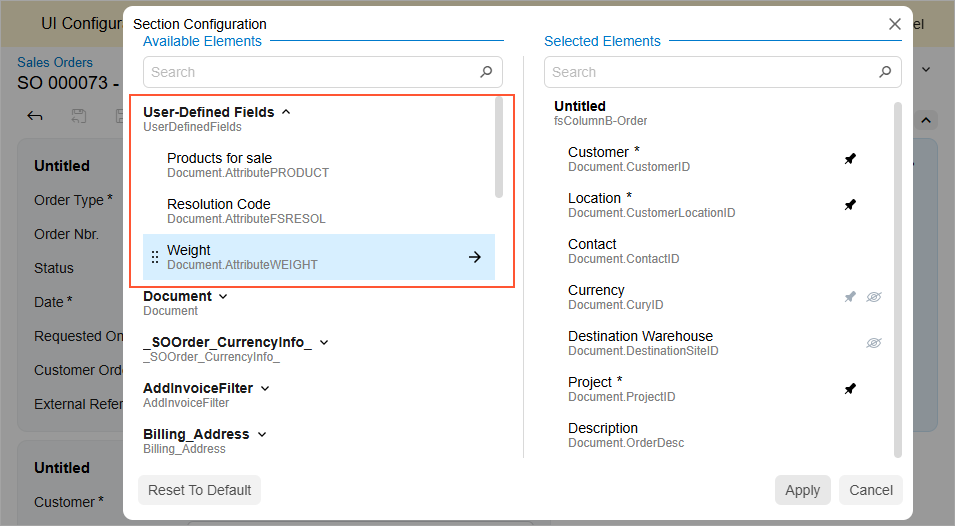

# Modern UI: Managing User-Defined Fields {#_d7c0ced9-0ff5-4a78-9cab-ef17f68acb76 .concept}

When personalizing data entry forms across the site in the Modern UI, you can conveniently add user-defined fields directly to these forms. For more information, see the [Managing Attributes and User-Defined Fields](../UserGuide/CS__con_Attributes_and_User_Defined_Fields.md) chapter.

**Attention:** You can perform site-wide personalization only if your user account is assigned both the *Administrator* and *Customizer* roles.

## Managing User-Defined Fields of a Form { .section}

Adding each user-defined field to a form in the Modern UI involves the following steps:

1.  Selecting or creating the attribute that will be used as the user-defined field. User-defined fields are based on predefined and site-specific attributes that have been defined in the system.
2.  Associating the selected field with the desired form.
3.  Adding the field as a UI element to the desired section of the form.

Each of these steps is described in the sections below.

## Choosing Attributes { .section}

Before adding any user-defined fields to a form, you should be sure the corresponding attributes have been defined on the [Attributes](../UserGuide/CS_20_50_00.md) \(CS205000\) form. These attributes can be either ones already defined in the system or new ones that you create. For instructions on how to create attributes, see [To Create an Attribute](../UserGuide/Admin_how_CreateAttribute.md).

## Associating the Field with the Form { .section}

To associate a user-defined field with the form where it will be shown, you open this form and use the **Manage User-Defined Fields** dialog box \(shown in the screenshot below\). To open the dialog box, you first turn on Form Configuration mode by clicking the Settings button on the form title bar and then clicking **UI Configuration**. Then you click the **Manage User-Defined Fields** button at the top of the form.

In the **Manage User-Defined Fields** dialog box, you can perform the following actions:

-   To associate a user-defined field with the form, click the **Add Row** button in the **Added User-Defined Fields** pane and specify the ID of the attribute in the **Attribute ID** column.
-   To remove a user-defined field from a form, first click the row in the **Added User-Defined Fields** pane and then click the **Delete Row** button on the table toolbar.
-   To refresh the list of user-defined fields, click the **Refresh** button on the table toolbar of the **Added User-Defined Fields** pane.
-   To refresh the list of properties, click the **Refresh** button on the table toolbar of the **Properties** pane.
-   To denote that a field should not be displayed on the form, select the desired field and record type \(if the form supports multiple types of records\) and select the **Hidden** check box.
-   To mark a field as mandatory, select the desired field and record type \(if the form supports multiple types of records\) and select the **Required** check box.
-   To specify the field's default value, select the desired field and record type \(if the form supports multiple types of records\) and specify the value in the **Default Value** column.
-   To close the dialog box and apply the changes to the user-defined fields, click **Apply** in the lower right corner.
-   To close the dialog box without saving any changes, click **Cancel** in the lower right corner.

## Adding a Field to the Form { .section}

Once user-defined fields are associated with the form, you can add them to any section of the form by using the **Section Configuration** dialog box \(shown below\). To open the dialog box, you first turn on UI Configuration mode by clicking the Settings button on the form title bar and then clicking **UI Configuration**. Then you click the Settings button in the top-right corner of the target section.

User-defined fields associated with the form are listed under the **User-Defined Fields** node of the **Available Elements** pane.

To add a field to the section, locate the field in the **Available Elements** pane and drag it to the **Selected Elements** pane.

Once you have added all the needed user-defined fields, click **Apply** to close the **Section Configuration** dialog box. Then click **Apply to All** in the UI Configuration pane to apply the layout changes to the form and turn off UI Configuration mode.

In this way, you can customize any form to display user-defined fields.

**Parent topic:**[Modern UI](../InterfaceGuide/UIG__con_Modern_UI.md)

