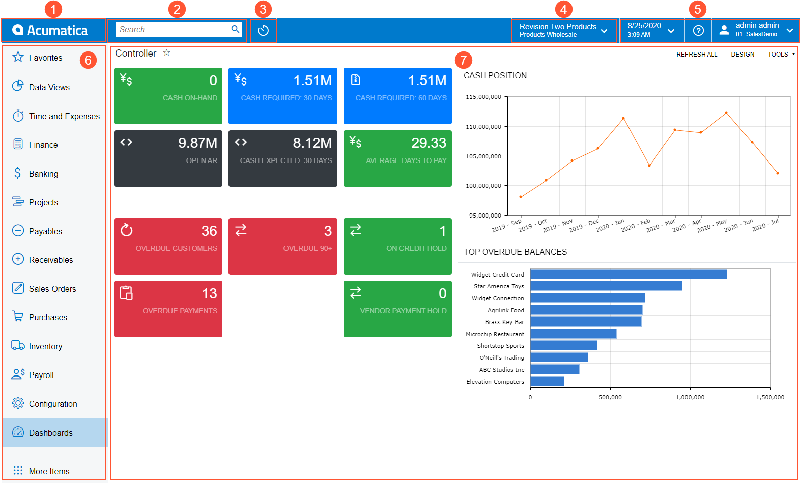

# Basic Elements of the User Interface {#_8e210e7f-25bf-438d-9c90-43c282ce482d .concept}

Every Acumatica ERP screen includes basic elements that users use for navigating the system, viewing and managing data, and performing other basic functions. The following screenshot shows a typical Acumatica ERP screen in the user interface with the basic elements that appear on it.

1.  Home button
2.  Search box
3.  Recently Viewed button
4.  Company and Branch Selection menu
5.  Info area
6.  Main menu \(displayed as a panel\)
7.  Working area

## Home Button { .section}

When you click the Home button, which has the Acumatica logo on it and is located in the top left corner of the top pane of the Acumatica ERP screen, you are forwarded to the home page of your instance. You can specify a custom home page that will be opened instead of the default home page. For details, see [Your Working Environment: Process Activity](../UserGuide/GS_Managing_User_Profile_Process_Activity.md).

The Home button is displayed on the top pane only if the main menu panel is shown on the left side of the screen. If the main menu is minimized, you see the **Menu** button instead of the Home button.

## Search Box { .section}

By using the **Search** box on the top pane of the Acumatica ERP screen, you can search for a text string in menu items, form titles, help topics, files, notes, and *entities* that have been created using system forms, such as vendors, customers, prospects, employees, leads, and cases. Additionally, you can search for a form by its title and by its ID. For details, see [Search](UIG__con_New_UI_Search.md).

**Attention:** If a link to a form, report, or dashboard has not been added to any workspace, you cannot find this form or report by using the **Search** box in the top pane of the Acumatica ERP screen.

## Recently Viewed Button { .section}

By using the Recently Viewed button, you can easily navigate to the records you have recently used \(or viewed\) if you need to work with them again. The system stores up to 500 records that have been viewed. When you click the Recently Viewed button, the system displays a workspace with the following lists: **Record Types**, **Records**, **Favorite Records**. For details, see [Recently Viewed](UIG__con_New_UI_Recently_Viewed.md).

## Company and Branch Selection Menu { .section}

You can switch between companies and branches by clicking the Company and Branch Selection menu on the top pane of the Acumatica ERP screen. When you click the Company and Branch Selection menu, you can view the list of companies and their branches that you have access to. To switch to a particular company or branch, you click the name of the company or branch. If you have more companies and branches than the system can display, you can use the search box that is also a part of the Company and Branch Selection menu. For more information, see [Company and Branch Selection Menu](UIG__con_New_UI_Company_Branch_Selector.md).

## Info Area { .section}

The info area, in the upper-right corner of the top pane of the Acumatica ERP screen, contains the menus and buttons that you can use to sign out from the system, change the settings of your account, and change the business date. For more information, see [Info Area](UIG__con_New_UI_Info_Area.md).

## Main Menu { .section}

The main menu in Acumatica ERP contains the links to your favorites and workspaces \(menus with links to forms and reports\). By default, the main menu is a panel located on the left side of the Acumatica ERP screen. You can minimize the menu so that it is displayed as a button in the top left corner of the screen \(instead of the Home button\). For details, see [Main Menu](UIG__con_New_UI_Main_Menu.md).

When you click a workspace item on the main menu, the workspace menu opens. This menu contains the forms and reports dedicated to a particular functional area. For details, see [Workspaces](UIG__con_New_UI_Workspaces.md).

## Working Area { .section}

The working area, which is the large area on the right side of the screen, may display any of the following:

-   Form: Acumatica ERP has forms of multiple types. For more information, see [Forms](Forms.md).
-   Report: A report is a type of a form specifically designed to organize data in a presentable format, as described in [Reports](Report_Processing_Options.md).
-   Dashboard: A dashboard is a collection of widgets, displayed on a single page, that give you needed information at a glance. For more information, see [Designing Dashboard Contents](../UserGuide/RPT_Designing_Dashboard_Contents_Mapref.md).

## Work with Acumatica ERP on Mobile Devices { .section}

If you use Acumatica ERP in a browser of a mobile device, the main menu becomes minimized. In the minimized menu, you can see the icons and the titles of the links to workspaces. To open a workspace, you tap the needed link on the main menu. On the workspace, you can open any entity provided there by doing one of the following:

-   To open a form in the same window, tap the link.
-   To open a form with the main menu and header available in a new tab, long-press the link and select **Open in new tab**.

**Tip:** For maximum usability of the system on a mobile device, we recommend that you use the Acumatica mobile app.

**Parent topic:**[Acumatica ERP User Interface](../InterfaceGuide/UIG__con_New_UI.md)

