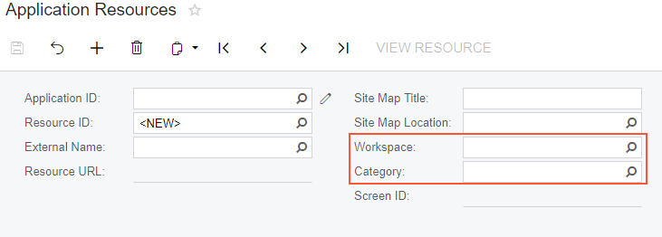
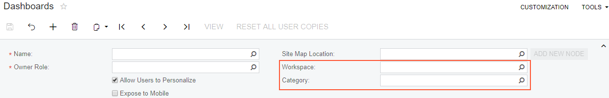
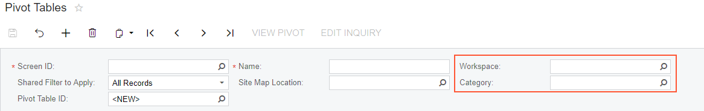
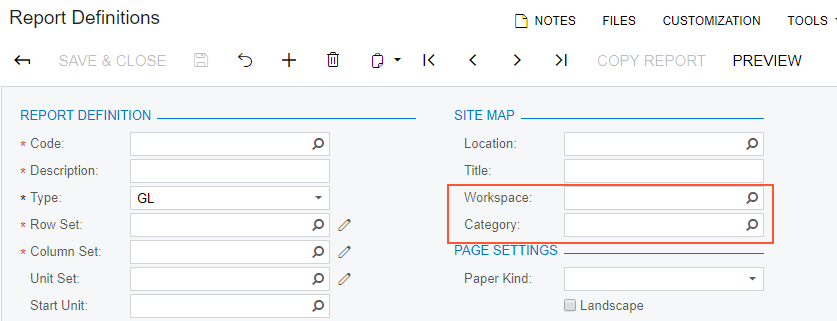

# Categories and Workspaces for Entities of Specific Forms {#_727ec8d0-331d-4bb0-9403-5fd83c542813 .concept}

In Acumatica ERP, you can specify a category and the workspace you want to save a form or a report to. On the forms below, you can create entities for which the separate links can be placed to the system. You can easily define the workspace and category in which each entity created on these forms is organized:

-   [Application Resources](../UserGuide/SM_30_10_10.md) \(SM301010\)
-   [Classic Dashboards](../UserGuide/SM_20_86_00.md) \(SM208600\)
-   [Pivot Tables](../UserGuide/SM_20_80_10.md) \(SM208010\)
-   [Report Definitions](../UserGuide/CS_20_60_00.md) \(CS206000\)

The needed workspace and category of a particular entity are specified in the **Workspace** and **Category** boxes of the related forms.

Any application resource, dashboard, generic inquiry, pivot table, or ARM report is visible in the system \(listed on the [Site Map](../UserGuide/SM_20_05_20.md) \(SM200520\) form\) when a user saves the new entity for the first time. When the site map title is specified for a new entity created on one of these forms, the system inserts the default values in the **Workspace** and **Category** boxes, thus causing the entity to be placed in the default workspace and category for the type of entity. A user can either leave the default values or change them to the needed ones. The following table shows the default values of these boxes on each of the forms where these entities are created.

|Form title|Workspace|Category|
|----------|---------|--------|
|[Application Resources](../UserGuide/SM_30_10_10.md)|**Data Views**|**Other**|
|[Classic Dashboards](../UserGuide/SM_20_86_00.md)|**Data Views**|**Dashboards**|
|[Pivot Tables](../UserGuide/SM_20_80_10.md)|**Data Views**|**Pivot Tables**|
|[Report Definitions](../UserGuide/CS_20_60_00.md)|Report definitions of the *GL* type: **Finance**|**Financial Statements**|
|Report definitions of the *PM* type: **Projects**|**Reports**|

For an existing entity, a user may override the values in the **Workspace** and **Category** boxes any time.

## The **Workspace** and **Category** Boxes on the Application Resources Form { .section}

On the [Application Resources](../UserGuide/SM_30_10_10.md) \(SM301010\) form, which is shown below, the **Workspace** and **Category** boxes are displayed in the Summary area.

## The **Workspace** and **Category** Boxes on the Dashboards Form { .section}

On the [Classic Dashboards](../UserGuide/SM_20_86_00.md) \(SM208600\) form, the **Workspace** and **Category** boxes are displayed in the Summary area, as shown in the following screenshot.

## The **Workspace** and **Category** Boxes on the Pivot Tables Form { .section}

On the [Pivot Tables](../UserGuide/SM_20_80_10.md) \(SM208010\) form, which is shown in the following screenshot, the **Workspace** and **Category** boxes are displayed in the Summary area.

## The **Workspace** and **Category** Boxes on the Report Definitions Form { .section}

On the [Report Definitions](../UserGuide/CS_20_60_00.md) \(CS206000\) form, the **Workspace** and **Category** boxes are displayed in the **Site Map** section. \(See the following screenshot.\)

**Parent topic:**[Workspaces](../InterfaceGuide/UIG__con_New_UI_Workspaces.md)

