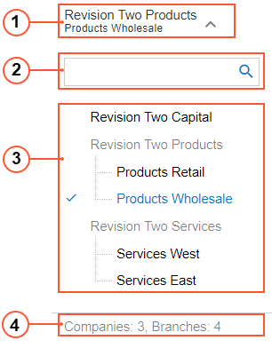

# Company and Branch Selection Menu {#_97287b48-5fe1-4b94-9a8f-56d47b00a42a .concept}

In Acumatica ERP, you can switch between the companies and branches defined in the instance by using the Company and Branch Selection menu of the user interface. This menu contains the list of companies and branches that you have access to.

By using this Company and Branch Selection menu, shown in the screenshot below, you can view the total number of accessible companies and branches, and easily navigate to the needed one by clicking it. If the number of accessible companies and branches exceeds the number that can be displayed on the Company and Branch Selection menu, you can search for the needed company or branch in the **Search** box of this menu.

1.  Company or branch name: Displays the name of the company or branch \(or both\) to which you are currently signed in
2.  Search box: Is used to search for a particular company or branch by its name, as described below
3.  List of companies or branches \(or both\): Displays the list of the companies and their branches \(if any\) to which you have access
4.  Company and branches counter: Displays the total number of companies and the total number of branches to which you have access

## Switching Between Companies and Branches { .section}

To switch between the companies and branches that you have access to, you use the Company and Branch Selection menu. You click the Company and Branch Selection menu on the top pane of any screen, and then click the name of the company or branch to which you want to sign in.

If a company has multiple branches, you can switch to its branches only. The company name is unavailable for selection in that case.

The selected company or branch is printed in blue and has a check mark left of its name.

## Searching for a Company or a Branch { .section}

The Company and Branch Selection menu can display a limited number of companies and branches because of size and design limitations. If you have access to multiple companies and branches but the Company and Branch Selection menu doesn't display a company you want to access because of insufficient space in the menu, you can search for the specific company or branch by its name.

You search for a company or a branch by typing its name in the Search box of the Company and Branch Selection menu. The system initiates the matching process and displays the search results as soon as you begin typing in this box.

**Parent topic:**[Acumatica ERP User Interface](../InterfaceGuide/UIG__con_New_UI.md)

