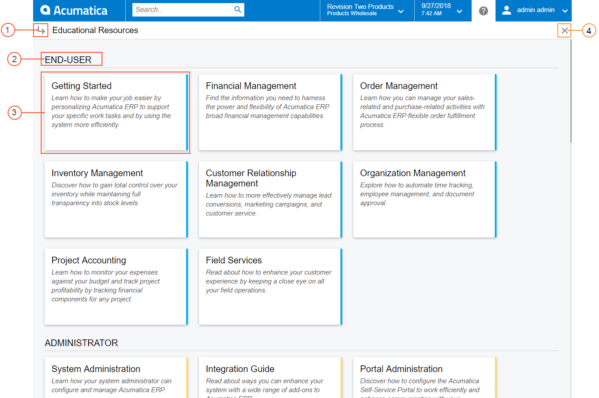
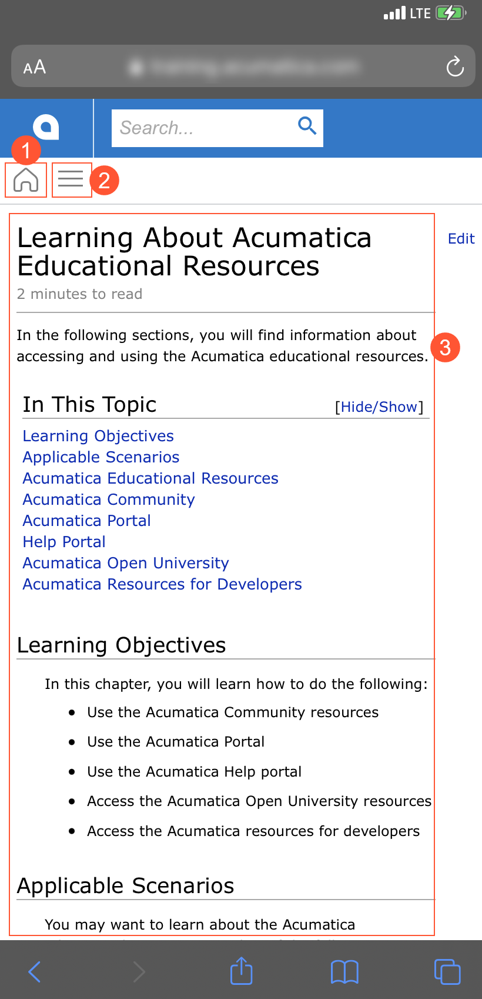
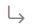
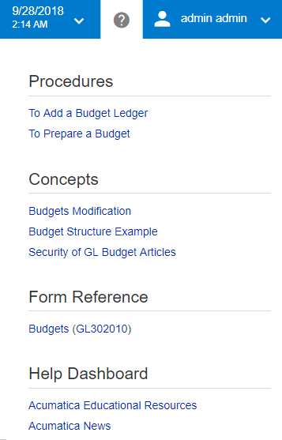
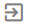
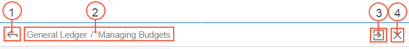
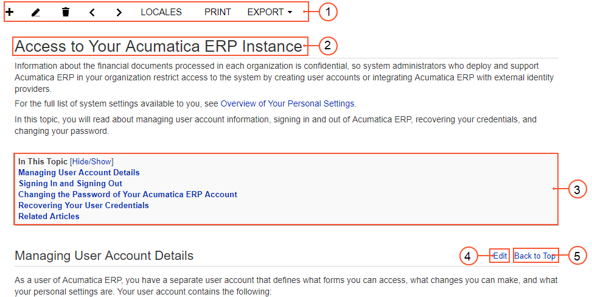

# Help {#_0fec956f-b1a6-4b15-b545-e1cf4b935efe .concept}

In the user interface of Acumatica ERP, you can click the Open Help button \(\) to view Help information that is relevant to your current work. The specific Help information you view depends on the item that is displayed in the working area when you click this button, as follows:

-   If the working area is displaying a form other than a data entry form or mass processing form, the Help dashboard, which contains cards with descriptions of guides and links to them, is opened in a separate tab of a browser. For details, see [Help Dashboard](#_ba077830-4359-4b30-96c2-71a7aadf0ae4).
-   If the working area is displaying an Acumatica ERP a data entry form, processing form, or maintenance form, the Help menu specific to this form appears over the working area. The Help menu contains links to the conceptual, procedural, and reference topics that are related to the form. For more information, see [Form-Specific Help Menu](#_748cc56f-2d2d-4b67-ab00-36a37675b30b).
-   If the working area is displaying a dashboard, the Help menu appears over the working area and displays links to the conceptual, procedural, and reference topics that are related to dashboards. For more information, see [Form-Specific Help Menu](#_748cc56f-2d2d-4b67-ab00-36a37675b30b).
-   If the working area is displaying a report, the reference topic that describes this report is opened in a separate tab of a browser.

The Help menu covers part of the working area. While viewing it, you can come back to the page that had been displayed in the working area by clicking the Open Help button again. The Help dashboard is opened in a separate browser tab, as are Help topics. If you want to open the Help dashboard and Help topics over the working area, you should press Ctrl and click the Open Help button.

## Help Dashboard {#_ba077830-4359-4b30-96c2-71a7aadf0ae4 .section}

The Help dashboard \(see the following screenshot\) is the main navigation page of Acumatica ERP documentation.

1.  Topic View button
2.  Help section title
3.  Guide card
4.  Close Help button

You click the Topic View button to switch from the Help dashboard to a Help topic. The Help topic that you last viewed in the current session is displayed. If you haven't opened any Help topic yet, you see the list of Help guides in the navigation pane.

The guides in the Help section are organized in sections, based on the type of system user these guides are developed for \(for example, *End User* or *Administrator*\), or based on the function these guides perform \(for example, *Reference* or *Quick Guides*\).

A guide card is a card that contains a description of each guide. You click the guide card to open the guide.

You click the Close Help button to close the Help dashboard. The form, report, or dashboard that was displayed in the working area before you opened Help becomes visible on the screen.

## Mobile-Friendly User Interface of the Help Topics {#section_c5t_db3_sqb .section}

In Acumatica ERP, Help topics are flexible and easy to read on mobile devices. The screenshot below displays an example of a Help topic opened on a mobile device.

The following items are shown in the screenshot:

1.  Home button: Opens the Help dashboard, which has cards for the guides available on the Help Portal
2.  Open/Hide button: Displays or hides the tree of topics available in the Help guide of the selected topic
3.  Topic text: Is adjusted to the width of the screen of the device

When you open a Help topic on a mobile device, the system opens it with the topic tree closed by default. You can click the Open/Hide button to open the tree of available topics.

If you click the Home button, the system navigates to the Help dashboard with the list of available guides. You can then click the Back button \(\) to return to the topic that was last opened.

In the mobile view of the topic, the Help topic toolbar is not available.

Text blocks are adjusted to the screen size automatically to fit the text to the screen, whereas the code blocks remains as they are but a horizontal scroll bar appears for these blocks. If you rotate the screen, the system automatically resizes the text blocks to fit them to the screen width.

## Form-Specific Help Menu {#_748cc56f-2d2d-4b67-ab00-36a37675b30b .section}

A form-specific Help menu is opened when you click the Open Help \(\) button while viewing the majority of forms \(except for reports and generic inquiries that are not described in Help\) and dashboards. In this menu, you can see links to Help topics that are related to the form if a form is opened in the working area \(see the following screenshot\) or to dashboards if a dashboard is opened in the working area. The menu pane partially overlaps the working area.

## Help Navigation Toolbar { .section}

By default, when you click a link in the form-specific Help menu, the Help topic or the Help dashboard opens in a new tab of your browser. If you click the *Acumatica News* link in the *Help Dashboard* section of the form-specific Help menu, the system opens the Welcome to Acumatica page in the current tab. For more information, see [Welcome to Acumatica Page in Acumatica ERP](UIG__con_New_UI_Welcome_to_Acumatica.md).

If you want to open the Help topic or the Help dashboard in the same tab of your browser, you press Ctrl and click the needed link in the form-specific Help menu. You can navigate to different Help topics within a guide \(item 2 in the screenshot below or selecting the topic in the Help tree\) or switch to another guide by clicking the Open Help Dashboard button \(item 1 in the screenshot below\), and clicking the needed guide. If you want to return to the form where you initiated the form-specific Help menu or the Help topic, you click the Open Help \(\) button. To return to the form-specific Help menu, you click the Open Form-Specific Help menu button \(; item 3 in the screenshot below\), which appears near the Close button.

When you open a Help topic, you can see the navigation toolbar, which has tools you can use to quickly switch between Help topics and to close the Help topic you are viewing \(see the following screenshot\).

1.  Open Help Dashboard button
2.  Path to the opened topic in the Help tree
3.  Open Form-Specific Help menu button \(appears only if you have opened the Help topic or the Help dashboard by pressing Ctrl+click\)
4.  Close

You click the Open Help Dashboard button to open the Help dashboard \(for example, if you want to switch to another guide\).

Each segment of the path to the opened topic is a link to the corresponding Help topic. By clicking the link, you can open a parent topic on any level.

You click the Close button to close the current topic. The main menu becomes visible on the screen.

## Search of Help Topics { .section}

You can search for information in Help in the following ways:

-   By using the Open Help button: If you are working with a form or report and have questions related to the form or report, you can click the Open Help button to open a form-specific Help menu with links to related topics \(for a form\) or a reference topic \(for a report\).
-   By using the **Search** box: If you want to find information that is not related to the form you are currently working with, you can type a search string in the **Search** box, switch to the **Help Topics** search filter tab, and find the necessary information in the search results.
-   By using navigation in Help: If you want to read all information related to a particular functional area \(for example, what tools the system provides for cash management\), you open the Help dashboard, open a particular guide, and in the Help topic tree, click the title of the chapter you want to read.

## View of a Help Topic { .section}

The following screenshot shows a view of an Acumatica ERP Help topic with the parts that appear on it.

1.  Help topic toolbar
2.  Help topic title
3.  Topic table of contents \(optional\)
4.  **Edit** button \(available to users with sufficient access rights\)
5.  **Back to Top** button

By using the buttons on the Help topic toolbar, you can carry out the following common tasks:

-   **Locales**: change the language of the topic.
-   **Print**: print the topic.
-   **Export**: export the topic to Word or as a plain text.

Large Help topics may include a table of contents, so you can navigate through the topic more easily. The table of contents lists links to sections of the topic; you can click any link to navigate to that section. By default, the table of contents is open. To minimize the table of contents or maximize it if it is closed, click **Hide/Show** on the table of contents.

Acumatica ERP Help topics can be edited or reorganized by a user with sufficient access rights. To edit the entire topic, you click the **Edit Current Article** button on the topic toolbar, which is available if you have sufficient access rights. For more information about access rights, see [Wiki Access Management](../UserGuide/SM__con_Wiki_Access_Setup.md). To edit a section in a Help topic, you click the **Edit** button right of the section title. By default, this button is hidden, even for users with sufficient access rights to edit the topic. If you have these access rights, to be able to view and click the **Edit** button, you point to the section title.

When you scroll down in a large topic, you may want to easily return to the beginning of the topic. For this purpose, you can click the **Back to Top** button, which is also right of each section title. By default, this button is hidden. It appears when you point to the section title.

**Parent topic:**[Acumatica ERP User Interface](../InterfaceGuide/UIG__con_New_UI.md)

