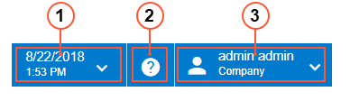
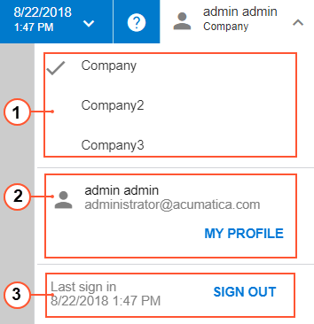

# Info Area {#_944fc9ef-b0c2-40b7-ab3a-22f190f098e5 .concept}

The info area, in the right corner of the top pane on the Acumatica ERP screen in the user interface, includes a group of menus and buttons, as shown in the screenshot below. These menus and buttons communicate the status of your user account in the system and provide access to certain settings.

1.  Business Date menu button
2.  Open Help button
3.  User menu button

You can find more details about these items in the following sections.

## Business Date and Time {#section_t4t_43r_f3 .section}

By default, in Acumatica ERP, any user can change the business date by clicking the Business Date menu button and then selecting the needed date. If the *Secure Business Date* feature is enabled on the [Enable/Disable Features](../UserGuide/CS_10_00_00.md) \(CS100000\) form, only users with the *BusinessDateOverride* role assigned to them can change the business date. The business date is the date that the system will insert by default on the records that you add to the system. By default, the current date is set as the business date. If you set a different date as the business date, this date will be used as the default date on Acumatica ERP forms and on documents that you create by using the forms. For details on changing the business date, see [Your Working Environment: To Change the Business Date](../UserGuide/Setting_Business_Date.md) in the Acumatica ERP Getting Started Guide.

## Open Help Button { .section}

By clicking the Open Help button, you can open the Help menu, which overlaps with the working area. The content of this menu depends on the item displayed in the working area when you click this button. For a detailed description of Help capabilities in Acumatica ERP, see [Help](UIG__con_New_UI_Help.md).

## User Menu {#section_i3t_q3r_f3 .section}

The User menu button displays your first and last name, and the name of the tenant to which you signed in if multiple tenants are configured in your Acumatica ERP instance. The following screenshot shows the items of the User menu.

The User menu includes the following sections:

1.  Tenants
2.  My Profile
3.  Sign-In

The Tenants section of the User menu contains the list of tenants to which you can sign in if multiple tenants are configured in your Acumatica ERP instance. The tenant you are currently signed in to is indicated with a check mark. You can switch to a different tenant by clicking the tenant name. For more information on the configuration of multiple tenants, see [Tenants: General Information](../UserGuide/SA_Managing_Tenants_Using_Web_GeneralInfo.md) in the Acumatica ERP System Administration Guide.

The My Profile section contains your username, your email address, and the **My Profile** button, which you click to open the [User Profile](../UserGuide/SM_20_30_10.md) \(SM203010\) form. For more information about the settings of your profile, see [Managing Your Basic Working Environment](../UserGuide/GS_Managing_User_Profile_Mapref.md) in the Acumatica ERP Getting Started Guide.

The Sign-In section contains the date and time of your last sign-in to the system and the **Sign Out** button, which you click to sign out of the system. For more information, see [Accessing Acumatica ERP](../UserGuide/GS_Accessing_Acumatica_ERP_Mapref.md) in the Acumatica ERP Getting Started Guide.

**Parent topic:**[Acumatica ERP User Interface](../InterfaceGuide/UIG__con_New_UI.md)

