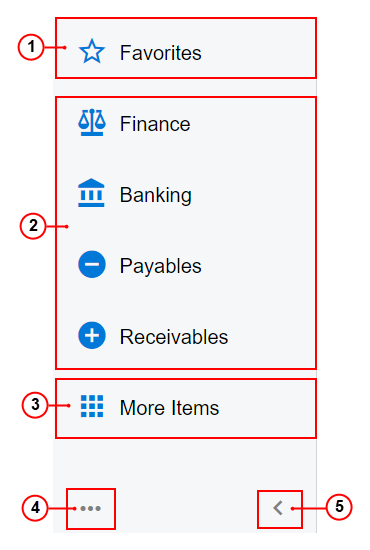

# Main Menu {#_6a017d1d-51cc-44ba-be8b-cedc2af80039 .concept}

The main menu in the user interface of Acumatica ERP, shown in the following screenshot, includes the **Favorites** menu item, the workspace menu items, the **More Items** menu item, the configuration menu, and the Collapse or Expand button.

1.  **Favorites** menu item
2.  Workspace menu items
3.  **More Items** menu item
4.  Configuration menu
5.  Collapse or Expand button

You click the **Favorites** menu item to view your favorite forms. You click this item to open the list of your favorites.

You click each of the workspace menu items to view the forms and reports of that workspace, which is a particular functional area. If you need to open the current workspace \(which is highlighted in the main menu\), you can press `Alt+G`. By default, the most commonly used workspaces are represented with menu items on the main menu; you can add workspace menu items to the main menu or remove existing menu items. For details on workspaces, see [Workspaces](UIG__con_New_UI_Workspaces.md).

When you click the **More Items** menu item, a menu is opened with tiles, grouped by broader functional areas, that represent all of the possible workspaces. You can pin any of these workspaces to the main menu by pointing to the workspace tile and clicking the Pin \(\) button.

The configuration menu contains commands that you click to configure the location of the main menu and to edit the menu items in the whole system \(if you are signed in to an account with the *Administrator* role assigned\). The menu commands are listed in the following table. For details on configuring the location of the main menu, see [Learning About the Acumatica ERP UI](../UserGuide/GS_Learning_UI_Mapref.md) in the Getting Started Guide.

|Command|Description|
|-------|-----------|
|**Collapse to Top**|Collapses the main menu panel and adds the **Menu** button in the top left corner of the screen \(instead of the Home button with the Acumatica logo\). When the main menu is collapsed, the work area expands to cover the area where the main menu had been.

 This menu command is displayed only when the main menu panel is shown on the left side of the screen.

|
|**Expand to Left**|Displays the expanded main menu panel on the left side of the screen.

 This menu command is displayed only when the main menu is collapsed and the **Menu** button is shown in the top left corner of the screen.

|
|**Edit Menu**|Switches the system to Menu Editing mode. In this mode, authorized users can customize menu items for the whole system.

 This menu command is displayed only to users with a role specified in the **Menu Editor Role** box on the [Security Preferences](../UserGuide/SM_20_10_60.md) \(SM201060\) form.

 For details, see [Menu Editing Mode](UIG__con_New_UI_Edit_Menu_Mode.md).

|

By clicking the Collapse button, you can collapse the main menu panel so that it displays only icons, and by clicking the Expand button, you can expand the panel to the full width. By clicking these buttons, you can change the width of the main menu pane when the menu is in both locations—expanded on the left and collapsed to the top.

**Parent topic:**[Acumatica ERP User Interface](../InterfaceGuide/UIG__con_New_UI.md)

