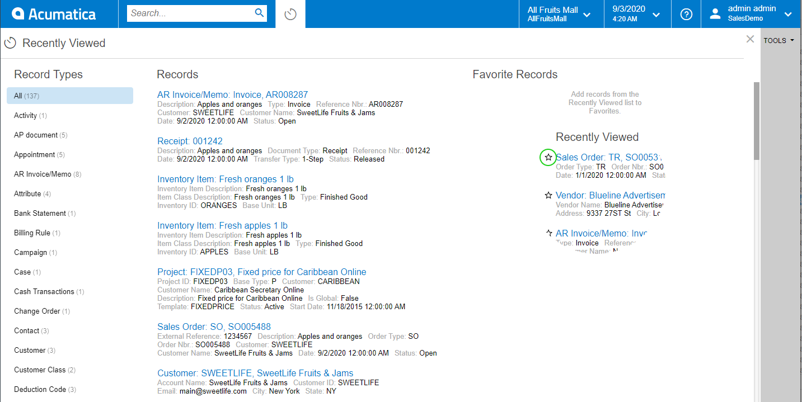
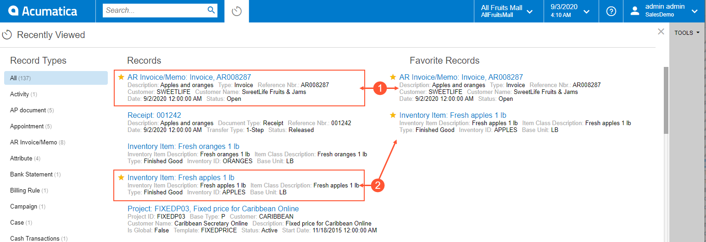

# Recently Viewed {#_389c09e5-48cd-42bf-bd3d-c643c115b5cc .concept}

In fast-growing companies, it is important to organize employees' work so that all the needed information is at hand. This makes the work processes run smoothly and quickly. In Acumatica ERP, you can easily access the recently viewed records because the system stores the records you have recently accessed.

The recently viewed functionality is specific to each individual user. The system keeps the last 500 records you have interacted with and displays them in the **Recently Viewed** workspace, which appears when you click the Recently Viewed button. The system stores only those records that have been created and opened on data entry forms. The frequently viewed records are placed at the top of the list so that you can have easy access to them.

## The Recently Viewed Button { .section}

To open the workspace showing your recently viewed records, you click the Recently Viewed button, which is located right of the Search box, as shown in the following screenshot. Each time you click the button, the system uses the data it has collected and refreshes the workspace to show the most recently used records.

Clicking the button opens the **Recently Viewed** workspace \(see the following screenshot\), which is placed over the working area of the screen.

This workspace includes the following lists:

-   **Record Types**: This list can be used to filter records by their type. By default, the system displays all records \(the **All** record type\). If needed, a user can select another record type to view records of only the selected type in the **Records** and **Favorite Records** lists. Record types are predefined, and the system adds the appropriate record types to the **Recently Viewed** workspace automatically each time a user opens the workspace.
-   **Records**: This list displays the last 500 records the user has interacted with. If the user has selected a record type other than **All**, the system filters the records and displays in this list only records of the selected record type.
-   **Favorite Records**: This displays the records the user has marked as favorites for easy access to them, regardless of when they were last accessed.

**Attention:** If a user changes a locale and opens the **Recently Viewed** workspace, **Record Types**, **Records**, and **Favorite Records** will list localized content, including records with localized names from the locale that the user has opened these records before.

## Favorite Records { .section}

When a user works with specific records frequently, the user can add them to **Favorite Records** in the **Recently Viewed** workspace. This won't remove them from the **Records** list; the record will be listed under both **Records** and **Favorite Records**.

To add a record to the list of favorite records, in the **Records** list, the user should hover over the needed record, and when the star icon appears, click the icon. The yellow color of the star indicates that the record has been added to the list of favorites. \(The user needs to refresh the workspace to reflect these changes.\)

## Search for the Recently Viewed Records { .section}

You can utilize the standard Search functionality to search among the recently viewed records. When the **Recently Viewed** workspace is open, the system runs the search only among the last 500 records you have interacted with. If this workspace is closed, then the system runs the system-wide search and displays all records that correspond to your search request.

**Parent topic:**[Acumatica ERP User Interface](../InterfaceGuide/UIG__con_New_UI.md)

