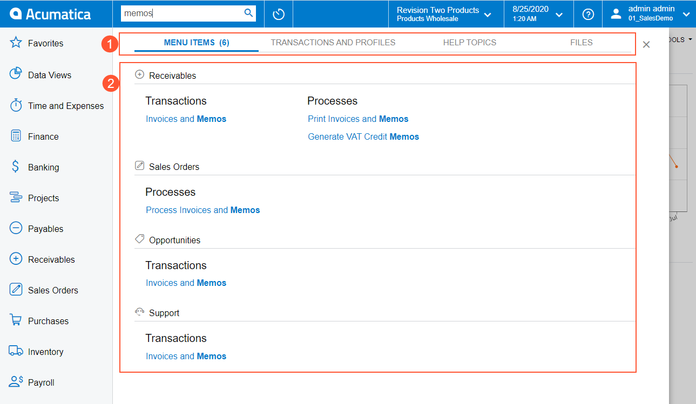
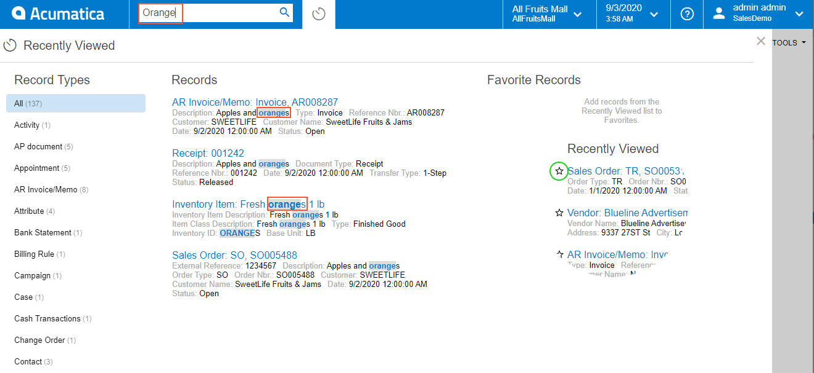
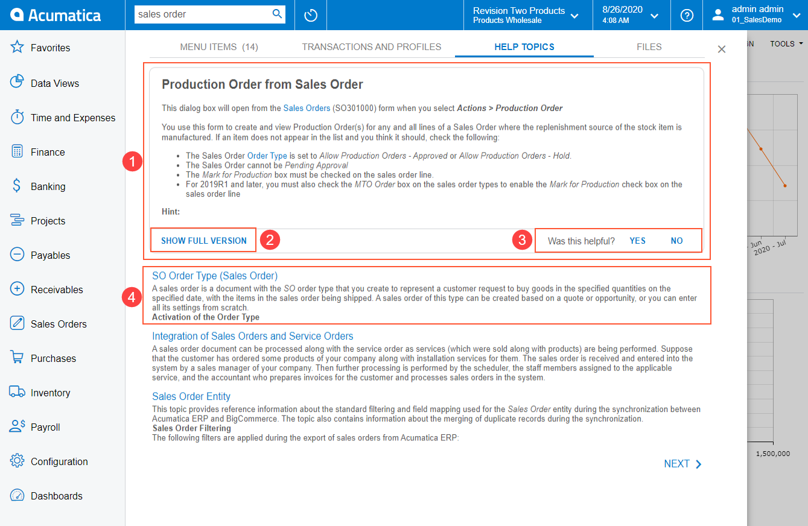
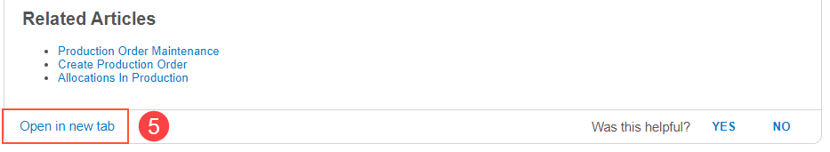

# Search {#_09ed14e6-3600-4d60-8267-66531025f5c3 .concept}

Searching in Acumatica ERP gives you the ability to quickly open a form \(or a record on a form\), find a file, find a help topic, or find a record in a recently viewed list of records. This topic contains information on performing searches in the user interface of Acumatica ERP.

## Search Workspace { .section}

To begin a search, you type a text string in the **Search** box. \(You can use the Ctrl+Q keyboard shortcut to place the cursor in the **Search** box.\) The system opens the Search workspace in the working area, on top of the page \(such as a dashboard or a form\) that was opened when you started your search. The workspace is shown in the following screenshot.

1.  Search filter tabs
2.  Search results

You can look through the search results on the Search workspace and go back to the page you had opened before you performed the search. For example, you can start to enter data on some Acumatica ERP form, search for some information, and then go back to the form and continue to enter data because your previous changes have been preserved.

## Search Filter Tabs { .section}

By default, the search in Acumatica ERP is performed in form and report names. You can switch to one of the search filter tabs to change the scope of the search. The following tabs are available:

-   **Menu Items**: On this tab, you can scan for specific forms or reports by name or ID.
-   **Transactions and Profiles**: On this tab, you can look for specific system records, such as customers, vendors, prospects, employee accounts, and notes attached to records.
-   **Help Topics**: This tab lists search results in all guides and help topics. When you click a link to a Help topic, the topic is opened in a separate tab of a browser. If you want to open the Help topic over the working area, you should press Ctrl and click the link.
-   **Files**: On this tab, you can view files attached to system records.

When you type a text string in the **Search** box and switch between the search filter tabs, your text string is preserved, and search results are automatically displayed for this text string.

## Search in the List of Recently Viewed Records { .section}

When you open the **Recently Viewed** workspace, you might see an enormous number of records, because the system keeps up to 500 of the most recently viewed records in the **Recently Viewed** workspace. If you know the key information about the record you are searching for—, like the name or the number of a record, or any information from the record description—you can search for this record by using the standard Acumatica ERP search functionality. If you perform this search when the **Recently Viewed** workspace is open, the search is performed only among the records on this workspace. If this workspace is closed, then the system runs the system-wide search and displays all records that correspond to the user search request.

## Search Results { .section}

In Acumatica ERP, an intelligent search is implemented. The system performs a flexible search, considering all possible forms of the text string that you have entered in the **Search** box, and then lists the search results from the most relevant to the least relevant. For more information about turning on semantic search, see [Preparation for the Acumatica ERP Installation: System Environment](../UserGuide/INST_Preparing_Installation_System_Environment.md) in the Acumatica ERP Installation Guide.

**Note:** If you have searched by entering the name of an Acumatica ERP entry form that has a substitute form, the form name with a link to the substitute form \(rather than the entry form\) is displayed in the search results, but the entry form is not. When you use the form ID to search for the entry form, the system does not display a link to this entry form in the search results. You can open the entry form by using the substitute form.

The system narrows the search results based on the access rights of the user who performs the search. If you don't have permissive access rights to particular data \(such as vendor accounts\), these objects do not appear in the search results, even though they match the search criteria. Your access rights to file attachments are determined by your rights to the entities to which the files are attached.

Search results displayed on the **Transactions and Profiles** tab prioritizes records of the following entity types:

|Entity|Data access class|
|------|-----------------|
|Business account|`PX.Objects.CR.BAccount`|
|Customer|`PX.Objects.AR.Customer`|
|Payroll employee|`PX.Objects.PR.PREmployee`|
|Contact|`PX.Objects.CR.Contact`|
|Vendor|`PX.Objects.AP.Vendor`|
|Employee|`PX.Objects.EP.EPEmployee`|
|Lead|`PX.Objects.CR.CRLead`|
|Inventory item \(stock or non-stock\)|`PX.Objects.IN.InventoryItem`|

If you are using an Acumatica ERP tenant with demo data you need to build search indexes to accelerate searching in the system. For a procedure, see [Search Indexes: General Information](../UserGuide/SA_Building_Search_Indexes_GeneralInfo.md) in the Acumatica ERP System Administration Guide.

## Search Tips { .section}

Keep the following tips in mind when you use the search capabilities in Acumatica ERP:

-   To search for all possible forms of a particular word or phrase, you type it as is without any additional characters. For example, if you type *invoice* in the **Search** box, the system displays all strings that contain *invoice*, *invoices*, and *invoiced*.
-   To search for an exact match of a particular word or phrase, you enclose it in quotation marks. For example, if you type *“Western Star Trucks”* in the **Search** box, the system returns only the customer with this exact name.
-   To search for a particular string everywhere in the system \(in form names, help topics, system entities, and files\), you type the string in the **Search** box and then switch to each of the filtering tabs.

## Usage of Online Help System in Search { .section}

The built-in Help is provided with the Acumatica ERP instance. Topics in the built-in Help are relevant to the version of the Acumatica ERP instance in use and are not updated until the instance is updated.

Unlike built-in Help topics, online Help topics are regularly updated to the latest version of Acumatica ERP, and online Help contains the newest topics. The search functionality in online Help also takes into account the relevance of topics to the search term. If the system has been configured to use the online Help functionality, users can get the most relevant search results from the [Online Help Portal](https://help.acumatica.com/), which is the open source of Help topics.

By default, the online Help search functionality is not turned on. To turn it on, you select the **Use Online Help System** check box on the [Site Preferences](../UserGuide/SM_20_05_05.md) \(SM200505\) form.

**Note:** Currently, the online Help functionality is available for only Acumatica ERP instances in a public cloud.

When the **Use Online Help System** check box is selected on the [Site Preferences](../UserGuide/SM_20_05_05.md) \(SM200505\) form, the search results for the Help topics are displayed as shown in the following screenshots.

1.  Topic preview box: This box displays a preview of the topic that the system has determined is the most relevant.
2.  The **Show Full Version** button: The user can click this button at the bottom of the preview box to open the whole topic in a preview box. If the user clicks the **Show Full Version** button, the preview box is enlarged and the **Open this article at Help Portal** button appears, as shown in the second screenshot above.
3.  Feedback section: The user can leave feedback by selecting **Yes** or **No** right of **Was this helpful?** in the preview box of the topic.
4.  Other topics: The system displays the other topics that are relevant to the search string.
5.  The **Open in new tab** button: This button \(shown in the second screenshot above\) appears only if the user has clicked the **Show Full Version** button in the preview box or the topic itself was short. When the user clicks this button, the system navigates to the full version of the topic, opening the online Help in a new browser tab.

**Parent topic:**[Acumatica ERP User Interface](../InterfaceGuide/UIG__con_New_UI.md)

