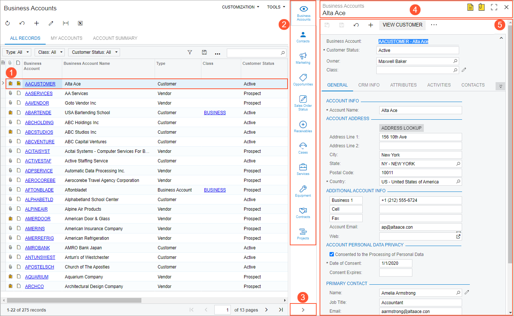

# Side Panels on Forms {#_976195cd-3233-4cd3-b529-ca9aeaf00871 .concept}

On particular forms in Acumatica ERP, you can simultaneously view forms or dashboards with information related to the selected record without navigating away from the form. These forms or dashboards are displayed in the side panel in the right part of a form.

In this topic, you will find information about side panels.

## UI Elements of the Side Panel { .section}

The following screenshot displays the main UI elements of the side panel. The screenshot shows the Business Accounts \(CR3030PL\) list of records, with the side panel showing information about the selected record \(the first record in the table\).

1.  Record for which the side panel is shown
2.  Side panel tabs
3.  Expand or Collapse button
4.  Form or dashboard title bar
5.  Form or dashboard area

## Record Whose Information Is Shown { .section}

Depending on the type of form with a side panel, the record whose information is shown in the side panel might be any of the following:

-   The record that you have opened on a data entry or maintenance form, such as a bill of material on the [Bill of Material](../UserGuide/AM_20_80_00.md) \(AM208000\) form. The side panel of this form has tabs where you can view various information related to the bill of material.
-   A record selected in a list of records, which is a type of form that shows the records created by using the corresponding data entry or maintenance form. On the side panel of the Stock Items \(IN2025PL\) list of records, for example, you can view the settings of the selected stock item on the [Stock Items](../UserGuide/IN_20_25_00.md) \(IN202500\) form without leaving the list of records. The screenshot in the next section provides another example of a side panel for a list of records.
-   A record selected in a table of details or inquiry results on a form. For example, the [Inventory Planning Exceptions](../UserGuide/AM_40_30_00.md) \(AM403000\) form has a table showing the list of exceptions generated during MRP that meet your selection criteria. You can continue to view that form while the side panel displays additional information related to the exception whose row is selected in the table.

## Side Panel Tabs { .section}

A side panel can contain one tab or multiple tabs. To view information in a side panel for a particular record, you select the entity on a form \(for an entry form\) or click the entity row in the list \(for a form with a list of records or other table\) and then click a tab icon in the side panel.

A tab can display a data entry form or a maintenance form, an inquiry form \(including a generic inquiry\), or a dashboard. Information displayed on the tab is related to the record selected on the main form.

Tabs that have been predefined to appear on the side panel may or may not be displayed, depending on the set of features enabled on the [Enable/Disable Features](../UserGuide/CS_10_00_00.md) \(CS100000\) form and the settings of the selected record.

## Expand or Collapse Button {#section_zdp_vfr_ssb .section}

By default, the side panel is collapsed and displays only the tab icons. By clicking the Expand button, you can expand the panel to the full width. By clicking the Collapse button, you can collapse the panel. When the panel is expanded, you can resize it by dragging its left border.

## Form or Dashboard Title Bar {#section_cgy_rfr_ssb .section}

The form or dashboard title bar may contains the following elements:

-   Form or dashboard title: Shows the title of the current form or dashboard.
-   Record title: For a data entry form or class form, shows the record title, which represents the ID and name, description, or additional information about the specific record.
-   Notes button: Gives you the ability to attach notes to the record or view notes attached to the record. This button is displayed only for standard forms.
-   Files button: Opens the **Files** dialog box, which gives you the ability to attach files to the record and manage the attached files. This button is displayed only for standard forms.
-   Maximize button: Maximizes the side panel to the width of the main form.
-   Minimize button: Minimizes the side panel to the default size.
-   Close button: Collapses the expanded side panel.

For details on the standard elements of the form title bar, see [Form Title Bar](Form_Title_Bar.md).

## Form or Dashboard Area { .section}

The form or dashboard area displays the data related to the record that is open or selected on the main form.

**Parent topic:**[Forms](../InterfaceGuide/Forms.md)

