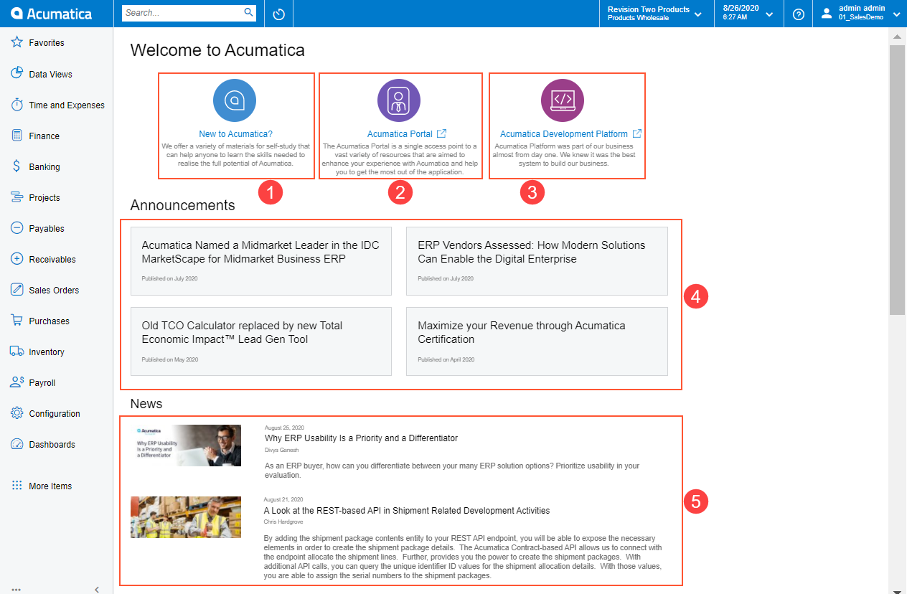
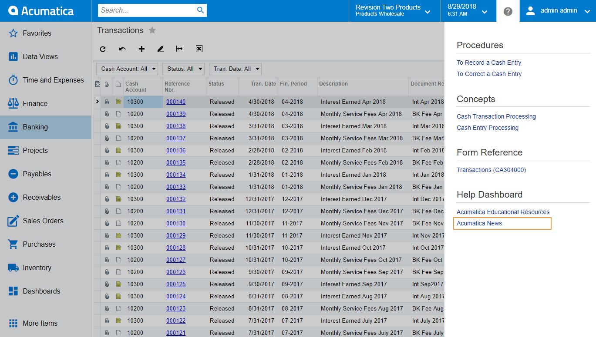

# Welcome to Acumatica Page in Acumatica ERP {#_5b252a71-0020-4116-9df6-9ffbdb2c0b99 .concept}

In Acumatica ERP, the Welcome to Acumatica page is a built-in page that provides links to Acumatica external resources, such as Acumatica announcements and news, the Customer Portal, the Developer Network website, and the Acumatica educational resources.

You cannot modify any section of this page. When you click the links on the Welcome to Acumatica page, the system opens a pop-up window in the same tab or a new tab in your browser with the page that corresponds to the link.

## Welcome to Acumatica Elements { .section}

The Welcome to Acumatica page consists of five sections, as shown in the following screenshot.

1.  *New to Acumatica?*: This section provides a set of external links to the Acumatica educational resources and social networks. When you click the section link, the system opens a pop-up window with the following three tabs:
    -   **Get Extra Resources**: This tab provides links to Acumatica documentation, such as job aids, user guides, framework guides, API reference guides, and quick guides. You can download the job aids, which are available in MS Word.
    -   **Visit Acumatica Open University**: This tab provides links to the pages with sets of courses available in Acumatica Open University. Each set of courses is organized by the functional area to which the courses belong in Acumatica ERP. Acumatica Open University is a free educational website available for any user. On this site, you can find such training resources as training guides, files for training, training session recordings, job aids, quick guides, and links to download Acumatica ERP and Acumatica Framework.
    -   **Follow on Social Networks**: This tab provides links to the Acumatica accounts on social networks.
2.  *Customer Portal*: This section provides the link to the page where you can navigate directly to the Customer Portal, or request access to portal if you do not have an Acumatica portal account yet.
3.  *Acumatica Development Platform*: This section provides the link to the Acumatica Developer Network site. This site has a great deal of information that can be useful for developers and other users as well.
4.  *Announcements*: This section provides the links to the latest Acumatica announcements.
5.  *News*: This section provides a feed of company news, which is regularly updated.

## Access to the Welcome to Acumatica page { .section}

By default, the system displays the Welcome to Acumatica page as the Home page if you have no dashboards configured in the system, an internet connection is available, and *www.acumatica.com* is accessible.

To open the Welcome to Acumatica page from other forms in the system, you can do one of the following:

-   If no dashboards are configured in the system, no Home page is specified, and an internet connection is available, click the Acumatica logo to navigate to the Home page.
-   If you have configured dashboards or specified a different Home page in the system, in the Info area of the system, click the **Open Help** button, and in the **Help Dashboard** section of the Help drop-down menu, click **Acumatica News**, as it is shown on the screenshot below.

    

**Parent topic:**[Acumatica ERP User Interface](../InterfaceGuide/UIG__con_New_UI.md)

