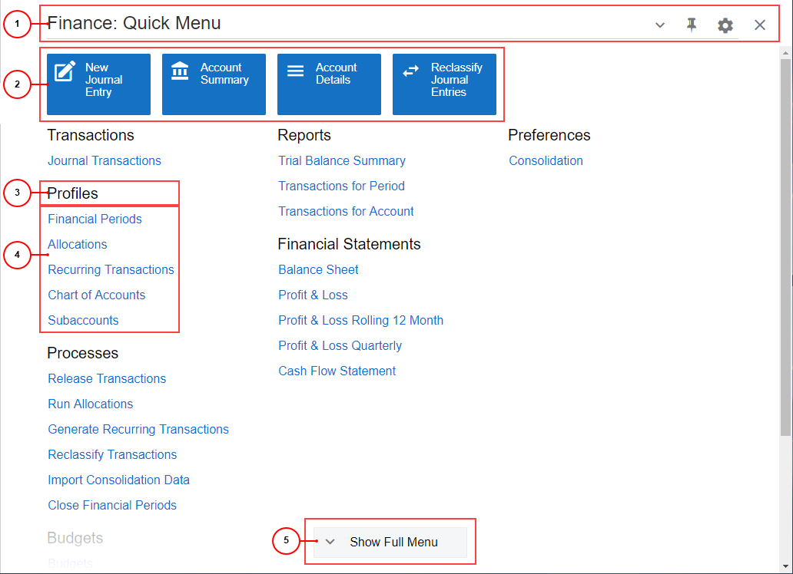
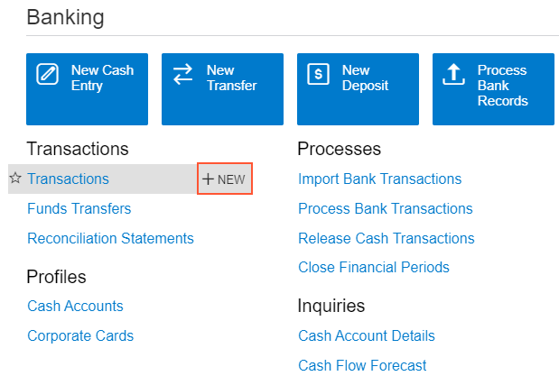

# Workspaces {#_51c2588f-6596-4091-9545-1d6fe1447303 .concept}

In the user interface of Acumatica ERP, a workspace is a menu that contains links to the forms and reports of a particular functional area of the product. In the following screenshot, the basic elements of a workspace are shown.

1.  Workspace title bar
2.  Tiles
3.  Category
4.  Links to forms and reports
5.  Workspace footer

The system displays the list of forms and reports in a workspace in one of the following views:

-   **Quick Menu** \(default; shown in the screenshot above\): In this view, the most commonly used forms and reports are displayed.
-   **Full Menu**: In this view, all forms and reports that have been added to the workspace are displayed.

On the workspace title bar, the system displays the view name. To toggle between these views, you can do any of the following:

-   Click the workspace title bar.
-   On the workspace footer, click the **Show Full Menu** or **Show Quick Menu** button.

You can personalize the list of forms displayed in the quick menu of a workspace for you \(that is, your user account\) when you switch to **Configuration** mode. The changes you make affect the current user session and all future sessions. For details, see [Learning About the Acumatica ERP UI](../UserGuide/GS_Learning_UI_Mapref.md) in the Getting Started Guide.

A user with the role specified in the **Menu Editor Role** box on the [Security Preferences](../UserGuide/SM_20_10_60.md) \(SM201060\) form can use Menu Editing mode to customize the user interface for all users in the system. For details on the user interface elements of Menu Editing mode, see [Menu Editing Mode](UIG__con_New_UI_Edit_Menu_Mode.md). For more information about customizing the menu elements in Acumatica ERP, see [Customizing the User Interface](../UserGuide/SA_Customizing_UI_Mapref.md) in the System Administration Guide.

## Workspace Title Bar { .section}

In the workspace title bar, you can find the workspace title, the view in which the list of workspace items are displayed \(**Quick Menu** or **Full Items**\), and workspace title buttons \(which are described in the following table\).

|Button|Icon|Description|
|------|----|-----------|
|Pin||Pins the workspace to the main menu panel.|
|Unpin||Unpins the workspace from the main menu panel.|
|Workspace Configuration||Opens the workspace in **Configuration** mode. In this mode, you can select the items \(such as forms and reports\) that are displayed on the Quick Menu of the workspace.|
|Close Workspace||Closes the workspace and displays the page opened in the working area.|
|**Reset to Default**| |Resets the list of items you currently have displayed in the Quick Menu of the workspace to the list of items that the system administrator configured for the Quick Menu.

 This button appears only if you are viewing a menu in **Configuration** mode.

|
|**Exit**| |Saves your changes and closes **Configuration** mode for the workspace, returning you to the mode in which you were viewing the workspace.

 This button appears only if you are viewing a menu in **Configuration** mode.

|

## Tiles {#_61d15fc8-4657-43b1-9f84-5df65deea3c8 .section}

A tile is a special button on a workspace that you click to open a form or report with predefined settings \(or, for a data entry form, with most settings blank so you can define a new entity\). For example, by clicking a tile, you can open the [Vendors](../UserGuide/AP_30_30_00.md) \(AP303000\) form with a particular vendor selected in the **Vendor** box.

Predefined workspaces contain tiles with the most popular actions and forms for the workspace. You can make a tile your favorite by clicking \(\) in the lower right corner of the tile.

If your user account is assigned the *Administrator* role, you can manage the tiles in a workspace for all system users. For details, see [UI Navigation Options: Tiles and Links to Forms in a Workspace](../UserGuide/SA_Customizing_UI_Tiles_and_Links_Concept.md) in the System Administration Guide.

## Categories {#_f0e79a7c-3693-4497-bf83-9763e12a7536 .section}

In each workspace, categories are used to group items by type, which makes it easier for users to find needed items. For example, the **Transactions** category contains forms you can use to process transactions. The system provides a predefined group of categories.

If your user account is assigned the *Administrator* role, you can manage the groups of categories in the system. For more information, see [UI Navigation Options: Tiles and Links to Forms in a Workspace](../UserGuide/SA_Customizing_UI_Tiles_and_Links_Concept.md) in the System Administration Guide.

## Links to Forms and Reports { .section}

On a workspace, you can find links to different types of forms: data entry forms, inquiries, processing forms, report forms, and substitute forms. You use a link on the workspace to open a particular form or report form that you want to work with.

For some forms, you can initiate the creation of a new document or other entity. Usually these forms have substitute forms. A substitute form has a list of records related to the form for which it is being substituted. For substitute forms for data entry forms \(on which you can initiate a new record\), the **+ NEW** button appears on the workspace when you point at the name of the form; this button is not available for reports, inquiry forms, or processing forms.

By using this button, you can open the entry form for creating a new entity directly from the workspace with just one click.

## Workspace Footer { .section}

On the workspace footer, you can find one of the buttons \(which are described in the following table\) that you use to toggle between the workspace views.

|Button|Description|
|------|-----------|
|**Show Full Menu**|Toggles the workspace to the **Full Menu** view. This button is displayed in the **Quick Menu** view of workspace items.|
|**Show Quick Menu**|Toggles the workspace to the **Quick Menu** view. This button is displayed in the **Full Menu** view of workspace items.|

## Favorite Reports and Forms { .section}

In the workspace, you can add a form to your favorites by pointing to the form name and clicking  to the left of the form name. Forms that you have added to favorites are marked with .

-   **[Categories and Workspaces for Entities of Specific Forms](../InterfaceGuide/UIG__con_New_UI_Categories_Workspaces.md)**  

**Parent topic:**[Acumatica ERP User Interface](../InterfaceGuide/UIG__con_New_UI.md)

