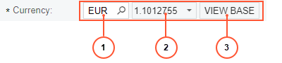
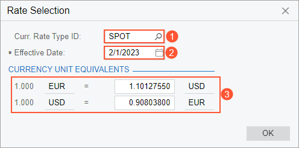

# Currency Boxes {#_b04ea255-3fb2-444e-ad37-dfaedf7bc22b .concept}

An Acumatica ERP currency box is a special type of lookup box. It contains information about the currency and exchange rate, as well as controls to give you advanced functionality, as shown in the following screenshot.

1.  **Currency Identifier** box, which has a magnifier button that you can click to open the currency lookup table
2.  **Exchange Rate** box, which has an arrow you can click to open the **Rate Selection** dialog box \(described and shown in the next section\)
3.  **Currency Toggle** button

## Rate Selection Dialog Box { .section}

In the **Rate Selection** dialog box, you can specify the ID of the currency rate type \(see Item 1 in the following screenshot\) and the date on which the rate becomes effective \(Item 2\).

The **Currency Unit Equivalents** section of the dialog box \(Item 3\) shows the exchange rates between the selected foreign currency and the base currency.

In the example in this screenshot, 1 euro \(EUR\) is equal to 1.10127550 US dollars \(USD\), and 1 US dollar is equal to 0.90803800 euros.

## The Currency Toggle Button { .section}

For the documents with amounts in a foreign currency, the Currency Toggle button switches the currency of the amounts between the base currency and the selected foreign currency. The label on the Currency Toggle button depends on the currently selected currency of the amount:

-   **View Base**: The amount is displayed in the foreign currency; click the button to view the amount in the base currency.
-   **View Cury**: The amount is displayed in the base currency; click the button to view the amount in the foreign currency.

The Currency Toggle button does not affect the documents with amounts in the base currency only.

**Parent topic:**[Form Elements](../InterfaceGuide/Form_Fields.md)

