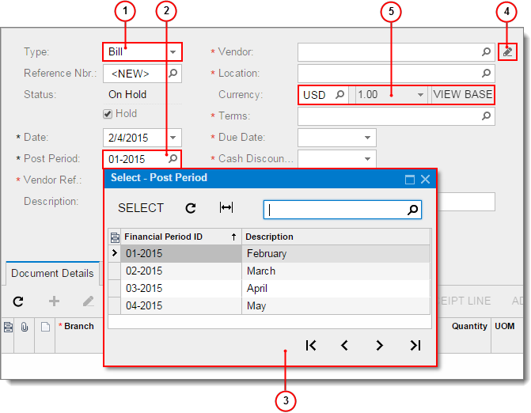

# Lookup Boxes {#_595cc9bc-e514-40b7-83ad-74e863ad248c .concept}

Acumatica ERP uses the following types of lookup boxes:

-   *Drop-down list*: The currently selected option is shown in the box. Click the arrow to see the other options.
-   *Multi-select drop-down list*: A type of drop-down list in which you can select one option or multiple options at once. Click the arrow to view the available options, and then select the check boxes for the options you want to select. The selected options are displayed in the box, separated by commas.
-   *Lookup table*: This lookup box has a selector button that is indicated with a magnifier icon. Click the selector button to open a lookup table that shows objects in the database and information about each object.

In some cases, a lookup box offers additional buttons. For example, on a variety of forms, you can click **Edit** \(\) to the right of the **Vendor** box to open the [Vendors](../UserGuide/AP_30_30_00.md) \(AP303000\) form as a pop-up and create a vendor record on the fly.

The Acumatica ERP currency box is a type of lookup box that provides additional buttons for currency manipulation. For more information, see [Currency Boxes](Using_Currency_Fields.md).

In the screenshot below, you can see an Acumatica ERP form with the types of lookup boxes called out.

1.  Lookup box with drop-down list
2.  Lookup box with lookup table
3.  Lookup table
4.  Additional button: **Edit**
5.  Currency box

## Using Autocomplete { .section}

When you enter values into most lookup boxes that have a lookup table, you can use *autocomplete*, which is a feature providing automatic completion of typed strings: You start typing in the box, and the system displays in the lookup table the list of suggestions that include the string you have typed.

**Note:** You can turn off autocomplete for your user account on the [User Profile](../UserGuide/SM_20_30_10.md) \(SM203010\) form by clearing the **Lookup Box Suggestions** check box.

For example, suppose you wanted to find a customer whose name is *Nautilus Bar SABL*. In the **Customer** box, you might type `bar`, and the list of customers would be filtered to include only the customers whose ID or name includes the string you typed, as shown in the following screenshot. Now you would press the Down Arrow key two times to navigate to Nautilus Bar SABL and press Enter to select the customer.

## Selecting a Value in the Lookup Box { .section}

To select a value in the lookup box, do one of the following:

-   If you know the value, type it in the box and press Enter.

    For example, on the [Purchase Orders](../UserGuide/PO_30_10_00.md) \(PO301000\) form, to select a purchase order with the number 100, type `100` in the **Order Nbr.** box.

-   Click the magnifier icon and select the value in the lookup table.

    **Note:** You can use filtering options to display only documents with specific properties. For more information, see [Filters](IB_Filters.md).

-   If the box supports autocomplete, start typing the value, and then select the value in the table.

**Parent topic:**[Form Elements](../InterfaceGuide/Form_Fields.md)

