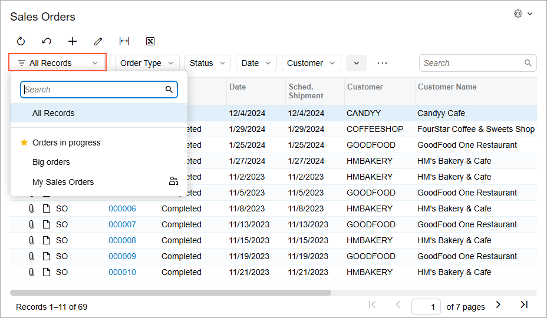

# Saving of Filters for Future Use {#_c5d6bff8-2f29-49af-bb5a-fe876efe07fd .concept}

Reusable filters, which are available on processing and inquiry forms, are created to filter data in the table part of the form and can be reused anytime after you create them. You can reuse quick filters and advanced filters. For details on the filter types, see [Types of Filters](Filter__con_Filter_Types.md).

## Reusable Filters on Forms { .section}

You can reuse filters on a particular processing or inquiry form in one of the following ways:

-   By creating and saving a quick filter directly on that form.
-   By creating and saving an advanced filter directly on that form by using the **Filter Settings** dialog box. For more information on the **Filter Settings** dialog box, see [Filter Settings Dialog Box](../UserGuide/GS__ref_Reusable_Filter_Settings_dialog.md).

You can do the following with quick or advanced filters you have defined for forms:

-   Create a filter and save it for later use, as described. For more information on designing complex filter conditions for advanced filters, see [Managing Advanced Filters](../UserGuide/GI_Reusable_Filters_Mapref.md).
-   Update the clauses of an existing filter, as described in [Managing Advanced Filters](../UserGuide/GI_Reusable_Filters_Mapref.md).
-   Share a filter with other users, as described in [Filtering and Sorting Capabilities: To Create a Simple Filter](../UserGuide/GS_Filtering_and_Sorting_Process_Activity.md). For more information on working with shared filters, see [Managing Advanced Filters](../UserGuide/GI_Reusable_Filters_Mapref.md).
-   Delete an obsolete filter, as described in [Filtering and Sorting Capabilities: To Create a Simple Filter](../UserGuide/GS_Filtering_and_Sorting_Process_Activity.md).

## Shared Filters { .section}

In Acumatica ERP, quick and advanced filters can be shared with other users, no matter who created the filters. You can share your filters with other users and use the filters that have been created and shared by other users. Shared filters are available to all users of the system.

You can modify or delete a shared filter through the form to which it is applied as well as on the [Filters](../UserGuide/CS_20_90_10.md) \(CS209010\) form. For more information on shared filter management, see [Managing Advanced Filters](../UserGuide/GI_Reusable_Filters_Mapref.md) in the Acumatica ERP System Administration Guide.

## Filter List {#section_kkw_jzc_dgc .section}

On a form, saved personal and shared filters are listed in a special Filter List drop-down menu. To open the list of filters, click the Filter List button in the filtering area, as shown below.

In the Filter List drop-down menu, you can perform basic actions:

-   To apply one of the filters, click its name in the list.
-   To search for a filter, type its name in the Search box.
-   To mark a filter as a favorite, hover over the filter name and click the star icon. Favorite filters are displayed at the top of the list.

Filters shared between all users of Acumatica ERP are denoted with the  icon in the Filter List drop-down menu.

-   **[To Save a Filter for Future Use](../InterfaceGuide/Filters__how_Reusable_Add.md)**  

-   **[To Modify a Saved Filter](../InterfaceGuide/Filters__how_Reusable_modify.md)**  

-   **[To Share a Filter](../InterfaceGuide/Filters__how_Reusable_Share.md)**  

-   **[To Delete a Filter](../InterfaceGuide/Filters__how_Reusable_delete.md)**  

**Parent topic:**[Filters](../InterfaceGuide/IB_Filters.md)

