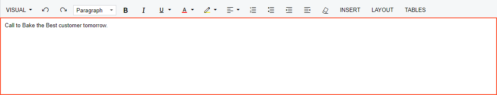
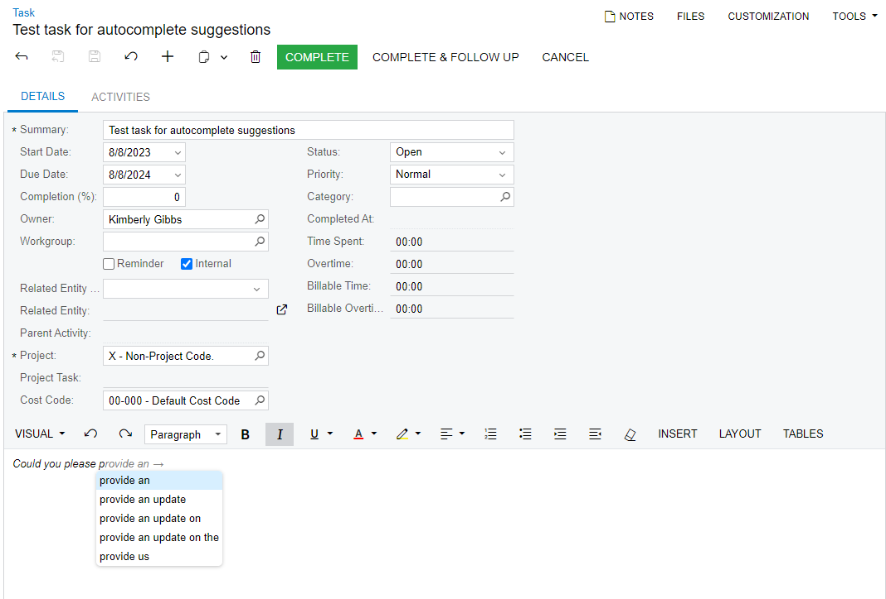

# Text Area {#_fdec0ab7-8fa0-4d19-98ba-b6aae91ff3bd .concept}

A text area is used for the entering comments about or a description of the record selected on the data entry form. \(See the following screenshot.\) The text area is a part of a rich text editor, which is used in some boxes or areas on a data entry form.

## Using Intelligent Text Completion { .section}

The intelligent text completion functionality provides automatic suggestions to continue text that you start to type in a text area of a data entry form. The autocomplete suggestions are available in a text area only if the *Intelligent Text Completion* feature is enabled on the [Enable/Disable Features](../UserGuide/CS_10_00_00.md) \(CS100000\) form and the **Intelligent Text Completion** check box is selected on the [User Profile](../UserGuide/SM_20_30_10.md) \(SM203010\) form for your user account.

When the *Intelligent Text Completion* feature is enabled by the system administrator for the first time, the system uses the built-in model for all users \(unless intelligent text completion has been turned off for their user account\). This model provides the most commonly used polite phrases \(for example, *Could you please provide an update on …*\). The following screenshot shows the text area of the [Task](../UserGuide/CR_30_60_20.md) \(CR306020\) form with suggestions to complete the text that has been typed.

You can switch between suggestions by using the Up and Down arrow keys on the keyboard; you select the needed string by using the Right arrow key. You can instead ignore the suggestions and continue typing all the needed text.

To improve the quality of suggested text over time, the system generates text completion models that collect the phrases that a particular user types and then use these phrases as training data. The system generates a model for each user separately, depending on the user's activity and the phrases that this user types most commonly. By default, the system performs the generation of models for all users every week on Saturday. The text completion model is updated if the system has collected new training data for the particular user since the previous model generation. On the [Generate Models for Text Completion](../UserGuide/SM_50_80_00.md) \(SM508000\) form, the system administrator can create a new schedule or manually generate models for certain users or for all users.

**Note:** If the system does not collect new training data for a particular user, the system does not generate a new model; instead, it continues to use the last generated model.

You can turn off this functionality for your user account by clearing the **Intelligent Text Completion** check box in the **Personal Settings** section on [User Profile](../UserGuide/SM_20_30_10.md) form. This setting affects only your user account.

**Parent topic:**[Form Elements](../InterfaceGuide/Form_Fields.md)

