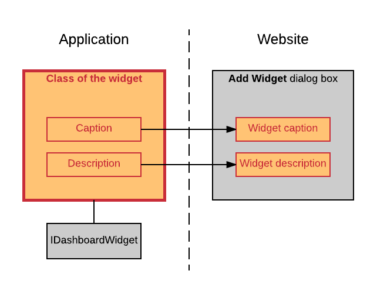
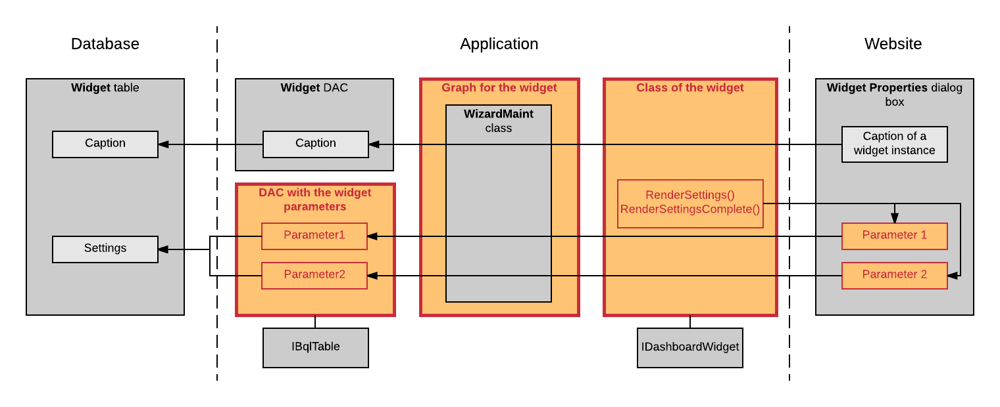
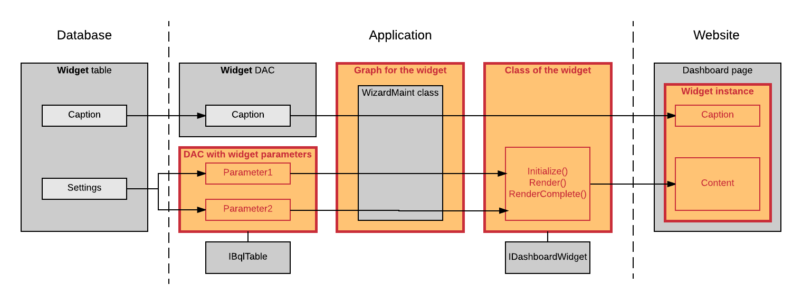

# Use of Widgets {#_587b5310-b40a-4381-8b3b-2bce63ca5b20 .concept}

In this topic, you will learn how a custom widget is used in Acumatica ERP or an Acumatica Framework-based application. For more information on how to work with widgets on a dashboard page, see [Configuring Widgets](../UserGuide/RPT_Configuring_Widgets_Mapref.md).

## How the Widget Is Detected in an Application { .section}

Once the library that contains the class of the widget is placed in the `Bin` folder of an instance of Acumatica ERP or an Acumatica Framework-based application, the **Add Widget** dialog box, which you open to add a new widget to a dashboard page, contains the caption and description of the new widget. The system takes the caption and description of the widget from the implementation of the Caption and Description properties of the IDashboardWidget interface.

The following diagram illustrates the relations of the class of the widget and the **Add Widget** dialog box. In the diagram, the items that you add for the custom widget are shown in rectangles with a red border.

## How a Widget Instance Is Configured { .section}

When you select the widget in the **Add Widget** dialog box and click **Next**, the controls for the parameters that should be configured for a new widget instance—that is, the predefined **Caption** box and the controls for the parameters, which are defined in the custom DAC—are displayed in the **Widget Properties** dialog box. These controls are maintained by using the graph for the widget, to which the reference is provided by the class of the widget. The graph uses the Widget DAC and the custom DAC with the widget parameters to save the parameters of a widget instance in the `Widget` table of the application database.

To display custom controls, such as buttons and pop-up panels, in the **Widget Properties** dialog box, the system uses the implementations of the RenderSettings\(\) and RenderSettingsComplete\(\) methods of the IDashboardWidget interface from the class of the widget. For more information on adding custom controls to the dialog box, see [To Add Custom Controls to the Widget Properties Dialog Box](CC__how_Add_Custom_Controls_to_Widget_Wizard.md#).

The following diagram illustrates the interaction of the components of the widget with the **Widget Properties** dialog box. In the diagram, the items that you add for the custom widget are shown in rectangles with a red border.

## How a Widget Instance Is Displayed on a Dashboard Page { .section}

After a widget instance is configured and saved in the **Widget Properties** dialog box, the widget instance is displayed on the dashboard page. To display the caption of the widget instance on the dashboad page, the widget graph retrieves the caption from the `Widget` table of the database by using the Widget DAC. To display the widget contents, the system uses the implementations of the Render\(\)and RenderComplete\(\) methods of the IDashboardWidget interface from the class of the widget. These implementations use the parameters of the widget, which the widget graph retrieves from the `Widget` table of the application database by using the DAC with the widget parameters.

You can specify how the widget should be loaded to a dashboard page and implement custom scripts to manage the way the widget is displayed on a dashboard page. For more information, see [To Load a Widget Synchronously or Asynchronously](CC__how_Load_Widget_Asynchronously.md#) and [To Add a Script to a Widget](CC__how_Add_Script_to_Widget.md#).

The following diagram illustrates the interaction of the components of the widget with a dashboard page. In the diagram, the items that you add for the custom widget are shown in rectangles with a red border.

**Parent topic:**[Creating Widgets for Dashboards](../PlugInDevelopmentGuide/CC__mng_Creating_Widgets_for_Dashboards.md)

