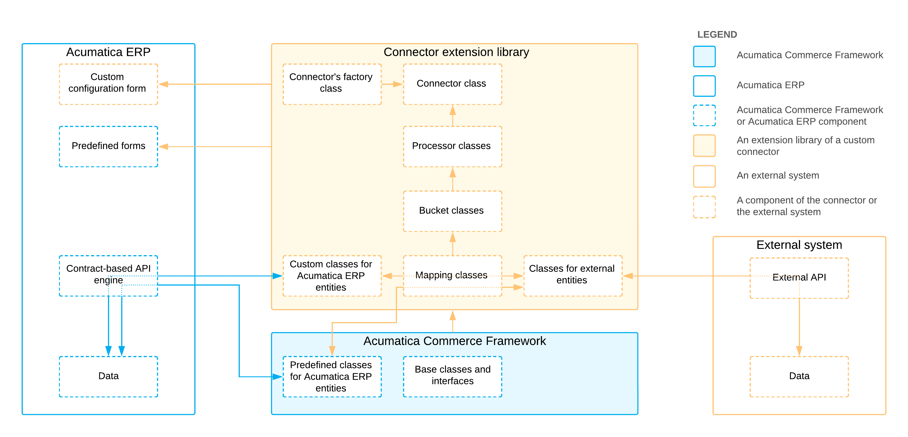

# Connector Implementation: General Information {#_cb1739c5-5bc7-4a78-9212-1ad431e55859 .concept}

A connector between Acumatica ERP and an external system is a plug-in that synchronizes particular entities in Acumatica ERP with the corresponding entities in the external system. This synchronization can be performed based on a schedule or in real time.

## Learning Objectives { .section}

In this chapter, you will learn how to create a custom connector.

## Applicable Scenarios { .section}

You create a connector between Acumatica ERP and an external system if you need to synchronize data between Acumatica ERP and the external system.

## Parts of the Connector { .section}

The connector consists of the following major parts, which are shown in the diagram below:

-   Classes for Acumatica ERP entities, which function as adapters for the entities of the contract-based REST API of Acumatica ERP. For more information about these classes, see [Connector Implementation: Classes for Acumatica ERP Entities](CommerceConnector_Implementation_ClassesForAcumaticaEntities.md).
-   Classes for external entities, which function as adapters for the entities of the API of the external system. For details about these classes, see [Connector Implementation: Classes for External Entities](CommerceConnector_Implementation_ClassesForExternalEntities.md).
-   Mapping classes, which define the mappings between internal and external entities. Mapping classes are described in [Connector Implementation: Mapping Classes](CommerceConnector_Implementation_MappingClasses.md).
-   Bucket classes, which define buckets of entities whose synchronization depends on one another. For more information, see [Connector Implementation: Bucket Classes](CommerceConnector_Implementation_BucketClasses.md).
-   Processor classes, which implement the synchronization of the entities between the external system and Acumatica ERP. Processor classes are described in greater detail in [Connector Implementation: Processor Classes](CommerceConnector_Implementation_ProcessorClasses.md).
-   A connector class, which connects other classes in the connector code with Acumatica ERP forms and defines the settings for these forms. For details about the implementation of the connector class, see [Connector Implementation: Connector Class](CommerceConnector_Implementation_ConnectorClass.md).
-   A connector's factory class, which initializes the connector. For details about the connector's factory class, see [Connector Implementation: Connector's Factory Class](CommerceConnector_Implementation_ConnectorFactoryClass.md).
-   A configuration form where an administrator can specify the basic settings of the connector. For example, for the built-in BigCommerce connector, Acumatica ERP provides the [BigCommerce Stores](../UserGuide/BC_20_10_00.md) \(BC201000\) configuration form.

## Creation of a Connector for an External System { .section}

To create a connector for an external system, you need to perform the following general steps:

1.  **Creating an extension library for Acumatica ERP.**

    Before you develop the connector for the external system, you need to create an extension library and include it in an Acumatica ERP customization project. For details about the creation of an extension library, see [To Create an Extension Library](../CustomizationPlatform/cg_platform_tocreateextensionlib.md).

    Acumatica Customization Platform adds the default references to the project of the extension library, such as PX.Data and PX.Common. You also need to add the libraries that are described in [Connector Implementation: Required Libraries](CommerceConnector_Implementation_Dependencies.md) to the project of the extension library.

2.  **Creating classes for Acumatica ERP entities.**

    You need to create classes for the Acumatica ERP entities to be synchronized with the external system through the connector. For details about the classes, see [Connector Implementation: Classes for Acumatica ERP Entities](CommerceConnector_Implementation_ClassesForAcumaticaEntities.md).

3.  **Creating classes for external entities.**

    You need to create classes for the external entities that you need to synchronize with the Acumatica ERP system through the connector. For details about the classes, see [Connector Implementation: Classes for External Entities](CommerceConnector_Implementation_ClassesForExternalEntities.md).

4.  **Defining the mapping classes between the internal and external entities.**

    For each pair of an internal entity and an external entity that should be synchronized, you must create a mapping class. For details about the mapping classes, see [Connector Implementation: Mapping Classes](CommerceConnector_Implementation_MappingClasses.md).

5.  **Creating the bucket classes for the mapped entities.**

    For each mapping class, you need to create a bucket class. For details about bucket classes, see [Connector Implementation: Bucket Classes](CommerceConnector_Implementation_BucketClasses.md).

6.  **Creating a DAC with the connector’s configuration settings.**

    You need to create a DAC with the configuration settings that will be used by the connector. For an example of the DAC, see [Connector Implementation: DAC for the Connector's Configuration Settings](CommerceConnector_Implementation_DAC.md). For this DAC, you also need to add a database table and include it in the customization project.

7.  **Implementing an API client of the external system.**

    You need to implement an API client of the external system. For more information about implementation of an API client, see [Connector Implementation: API Client](CommerceConnector_Implementation_APIClient.md).

8.  **Implementing the processor classes.**

    For each pair of entities that you need to synchronize, you need to create a processor class. For details about processor classes, see [Connector Implementation: Processor Classes](CommerceConnector_Implementation_ProcessorClasses.md).

9.  **Implementing the connector class.**

    In the connector class, you need to implement the synchronization of the Acumatica ERP entities and the external entities. For a detailed description of the connector class, see [Connector Implementation: Connector Class](CommerceConnector_Implementation_ConnectorClass.md).

10. **Implementing the connector's factory class.**

    For the system to create the connector class, you need to implement the connector's factory class. For details about the connector factory class, see [Connector Implementation: Connector's Factory Class](CommerceConnector_Implementation_ConnectorFactoryClass.md).

11. **Creating the configuration form.**

    For a user to specify the basic settings of the connection with the external system, you need to create a custom form in Acumatica ERP. You can create the form in either of the following ways:

    -   From scratch. For details about the creation of custom forms, review the *T200 Maintenance Forms* training course.
    -   By using the configuration forms that are available for the predefined connectors as a template and adjusting these forms.
12. **Testing the connector.**

    When you have completed the development of the connector, you need to test the connector. To start the testing of the connector, you need to enable the *Custom Connectors* feature on the [Enable/Disable Features](../UserGuide/CS_10_00_00.md) \(CS100000\) form. \(The corresponding check box can be found under **Third Party Integrations** &gt; **Advanced Integration Engine** on this form.\)

**Parent topic:**[Implementing a Connector for an External System](../PlugInDevelopmentGuide/CommerceConnector_Implementation_Mapref.md)

