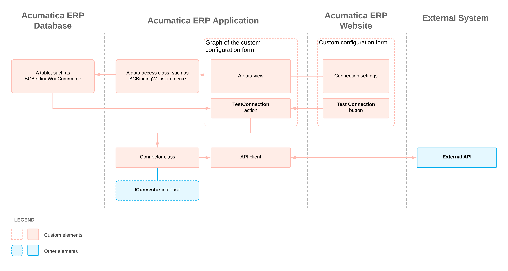

# Connector Implementation: How the Connection with the External System Is Established {#_ef23f8cb-140b-4c28-86c7-f22631ab68c9 .concept}

A user specifies the connection settings of a store on the configuration form, such as the [BigCommerce Stores](../UserGuide/BC_20_10_00.md) \(BC201000\) form. The system saves the settings in a database table, such as the `BCBindingWooCommerce` database table, which is shown in an example in [Connector Implementation: DAC for the Connector's Configuration Settings](CommerceConnector_Implementation_DAC.md).

When the user clicks the **Test Connection** button on the form toolbar of the configuration form, the system retrieves the data for the connection with the store from this custom table. The connector creates the API client of the external system. The API client establishes the connection with the external system through the external API.

**Attention:** The external system determines which classes you need to implement and how the connector communicates with the external system.

**Parent topic:**[Implementing a Connector for an External System](../PlugInDevelopmentGuide/CommerceConnector_Implementation_Mapref.md)

