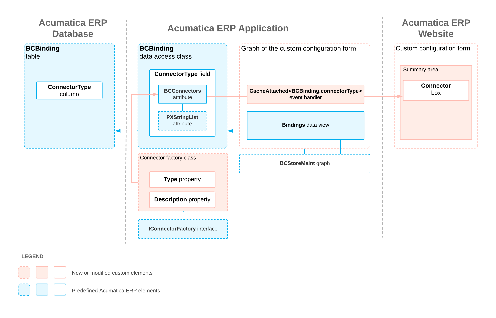

# Connector Implementation: How the Connector Is Detected in the Application {#_577cec3b-d1fe-4007-9382-08b2d7d52c70 .concept}

The **Connector** box of the configuration form of an ecommerce store contains the name of the connector if both of the following conditions are met:

-   The library that contains the connector class is placed in the `Bin` folder of an instance of Acumatica ERP.
-   The ASPX file of the configuration form of the connector is available in the `Pages` folder of the application.

**Tip:** The description in this topic assumes that the connector uses a standard configuration form, which is similar to the [BigCommerce Stores](../UserGuide/BC_20_10_00.md) \(BC201000\) and [Shopify Stores](../UserGuide/BC_20_10_10.md) \(BC201010\) forms.

The data that is displayed in the Summary area of the configuration form is obtained from the Bindings predefined data view of the BCStoreMaint graph, which is a base class of the graph through which the configuration form is managed. The Bindings data view retrieves data from the `BCBinding` predefined database table. This table includes the `ConnectorType` column, which stores the type of the connector.

The system obtains the type and name of the connector from the implementation of the Type and Description properties of the [IConnectorFactory](https://help.acumatica.com/(W(24))/Help?ScreenId=ShowWiki&pageid=1e65cb46-bc0b-041f-0676-10b928c4675f) interface. The ConnectorType field of the BCBinding DAC, which corresponds to the [`BCBinding`](https://help.acumatica.com/(W(24))/Help?ScreenId=ShowWiki&pageid=d1f69ccf-718c-a862-3fdd-12d9957b627a) table, has the BCConnectors attribute assigned to it. The BCConnectors attribute, which derives from the PXStringList attribute, matches the type of the connector to its name. The custom CacheAttached&lt;BCBinding.connectorType&gt; event handler sets the default value of the ConnectorType field to the type of the connector. The **Connector** box displays the connector name, which corresponds to this default value.

When a user specifies the settings of a commerce store in the Summary area of the configuration form, the system saves these settings in the `BCBinding` database table.

The following diagram illustrates the relations of the classes of the connector and the ASPX page.

**Parent topic:**[Implementing a Connector for an External System](../PlugInDevelopmentGuide/CommerceConnector_Implementation_Mapref.md)

