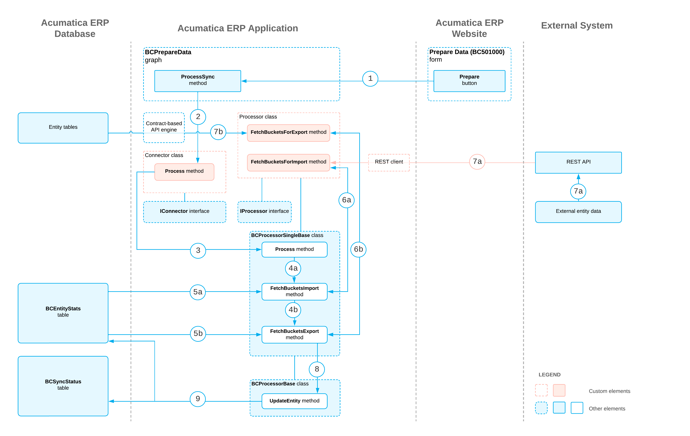

# Connector Implementation: How Data Is Prepared for Synchronization {#_26f409a1-f7d1-49f1-bd12-6a9305651a96 .concept}

The preparation for data synchronization can be started by an automation schedule, as a result of a push notification, or manually if a user clicks **Prepare** on the toolbar of the [Prepare Data](../UserGuide/BC_50_10_00.md) \(BC501000\) form. The following sections describe the general steps involved in the preparation of data for synchronization, presented in the order in which they occur; the process diagram at the end of this topic shows the entire data preparation process.

**Tip:** This topic describes the preparation for data synchronization when it is initiated on the [Prepare Data](../UserGuide/BC_50_10_00.md) \(BC501000\) form. The preparation process is slightly different if it is initiated by an automation schedule or as a result of a push notification. The preparation process initiated by an automation schedule proceeds as described in the [Fetching of the Data from Acumatica ERP and the External System](#_ea5c4f49-3792-4b94-b3ac-c7d17ce59ad7) section of this topic. The preparation process that is initiated as a result of a push notification calls the IProcessor.PullEntity\(\) method instead of the IProcessor.FetchBucketsForImport\(\) and IProcessor.FetchBucketsForExport\(\) methods.

## Starting of the Data Preparation { .section}

When the data preparation is started \(see Item 1 in the process diagram at the end of the topic\), the system executes the ProcessSync\(\) method of the PX.Commerce.Core.BCPrepareData graph. This method creates an instance of the connector class that corresponds to the store with which the synchronization is performed. The method also specifies the information about the current operation in a [PX.Commerce.Core.ConnectorOperation](https://help.acumatica.com/(W(24))/Help?ScreenId=ShowWiki&pageid=cf71a47b-ce0e-c2be-13af-45d5eacd62e3) object and runs the implementation of the [IConnector.Process\(\)](https://help.acumatica.com/(W(24))/Help?ScreenId=ShowWiki&pageid=463826b3-3c22-b89a-abaa-d5843ae1091d) method available in the connector class \(Item 2\).

For each entity that should be prepared for synchronization, the implementation of the IConnector.Process\(\) method creates an instance of the processor class, initializes it with the information about the current operation, and runs its IProcessor.Process\(\) method \(Item 3\), whose default implementation is available in the BCProcessorSingleBase&lt;&gt; class.

## Fetching of the Data from Acumatica ERP and the External System {#_ea5c4f49-3792-4b94-b3ac-c7d17ce59ad7 .section}

The processor calls the FetchBucketsImport\(\) \(see Item 4a in the process diagram\) or FetchBucketsExport\(\) \(Item 4b\) method, depending on the sync direction of the entity. These methods do the following:

-   Retrieve the information about the synchronization of the entity from the [`BCEntityStats`](https://help.acumatica.com/(W(24))/Help?ScreenId=ShowWiki&pageid=eaa5d1ad-c7f0-4747-20b2-15654b11b1d5) database table \(Items 5a and 5b\)
-   Determine the time frame for the entities that should be prepared based on the preparation mode, which for manual preparation is specified in the **Prepare Mode** box on the [Prepare Data](../UserGuide/BC_50_10_00.md) \(BC501000\) form\)
-   Call the BCProcessorSingleBase&lt;&gt;.FetchBucketsForImport\(\) \(Item 6a\) or BCProcessorSingleBase&lt;&gt;.FetchBucketsForExport\(\) \(Item 6b\) method

The FetchBucketsForImport\(\) method retrieves entity records from the external system \(Item 7a\). The FetchBucketsForExport\(\) method obtains entity records from Acumatica ERP \(Item 7b\).

## Saving of the Synchronization Data to the Database { .section}

For each entity record retrieved by the processor, the method creates a bucket of the entities by using the BCProcessorBase&lt;&gt;.CreateBucket\(\) method, initializes an object that implements the PX.Commerce.Core.IMappedEntity interface for the entity type, and checks the preparation status of the object by using the BCProcessorBase&lt;&gt;.EnsureStatus\(\) method.

Finally, in the BCProcessorBase&lt;&gt;.UpdateEntity\(\) method \(see Item 8 in the process diagram\), the processor saves data about the synchronization status of the entity to the [`BCEntityStats`](https://help.acumatica.com/(W(24))/Help?ScreenId=ShowWiki&pageid=eaa5d1ad-c7f0-4747-20b2-15654b11b1d5) and [`BCSyncStatus`](https://help.acumatica.com/(W(24))/Help?ScreenId=ShowWiki&pageid=a536b367-a822-2d48-a0ee-79dc15585981) database tables \(Item 9\).

## Process Diagram { .section}

The following diagram illustrates the preparation process.

**Parent topic:**[Implementing a Connector for an External System](../PlugInDevelopmentGuide/CommerceConnector_Implementation_Mapref.md)

