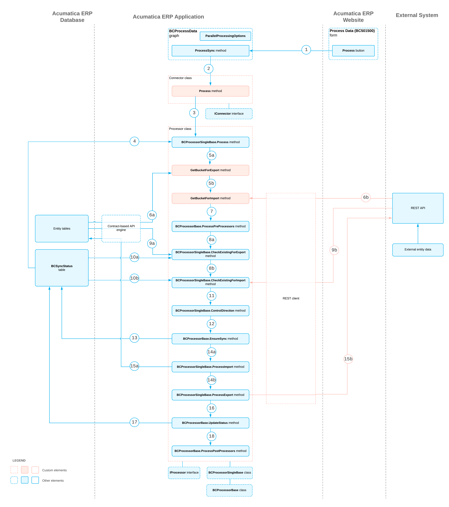

# Connector Implementation: How the Prepared Data Is Synchronized {#_e2229e35-1b85-4110-b509-72b5d4b89332 .concept}

The synchronization of the prepared data can be started by an automation schedule, as a result of the push notification, or manually if a user clicks **Process** on the toolbar of the [Process Data](../UserGuide/BC_50_15_00.md) \(BC501500\) form. The following sections describe the general steps involved in the synchronization of the prepared data in the order in which they occur; the process diagram at the end of this topic shows the entire synchronization process.

## Starting of the Synchronization { .section}

When the synchronization is started \(see Item 1 in the process diagram at the end of the topic\), the system executes the ProcessSync\(\) method of the PX.Commerce.Core.BCProcessData graph. The synchronization is performed in parallel threads. The parallel processing settings are specified in the [PXParallelProcessingOptions](https://help.acumatica.com/(W(26))/Help?ScreenId=ShowWiki&pageid=d4abce4c-2fbd-3411-9f1c-b1c724cf87af) object of the Statuses data view of the graph.

The ProcessSync\(\) method creates an instance of the connector class that corresponds to the store with which the synchronization is performed. The method also specifies the information about the current operation in a [PX.Commerce.Core.ConnectorOperation](https://help.acumatica.com/(W(24))/Help?ScreenId=ShowWiki&pageid=cf71a47b-ce0e-c2be-13af-45d5eacd62e3) object and runs the implementation of the [IConnector.Process\(\)](https://help.acumatica.com/(W(24))/Help?ScreenId=ShowWiki&pageid=463826b3-3c22-b89a-abaa-d5843ae1091d) method \(Item 2\) available in the connector class.

For each entity that should be synchronized, the implementation of the IConnector.Process\(\) method creates an instance of the processor class, initializes it with the information about the current operation, and runs its [IProcessor.Process\(\)](https://help.acumatica.com/(W(24))/Help?ScreenId=ShowWiki&pageid=463826b3-3c22-b89a-abaa-d5843ae1091d) method \(Item 3\), whose default implementation is available in the BCProcessorSingleBase&lt;&gt; class.

## Retrieval of the Records for the Synchronization { .section}

The processor retrieves the records for synchronization as follows:

1.  Retrieves the information about synchronized records from the [`BCSyncStatus`](https://help.acumatica.com/(W(24))/Help?ScreenId=ShowWiki&pageid=a536b367-a822-2d48-a0ee-79dc15585981) database table \(see Item 4 in the process diagram\).
2.  By calling BCProcessorSingleBase&lt;&gt;.GetBucketForExport\(\) \(Item 5a\) or BCProcessorSingleBase&lt;&gt;.GetBucketForImport\(\) \(Item 5b\), pulls the records that correspond to the entity through the APIs. These methods create a bucket object for the export or import of records, respectively. The processor pulls the records from Acumatica ERP \(Item 6a\) by the value of the `LocalID` column of the table, and pulls the records from the external system \(Item 6b\) by the value of the `ExternID` column of the table.

## Preprocessing of Data Before the Synchronization { .section}

If one entity has to be synchronized before the other—for example, address entities that need to be synchronized before the synchronization of customer entities—the processor synchronizes the entities that should be synchronized before the entity in the BCProcessorBase&lt;&gt;.ProcessPreProcessors\(\) method \(see Item 7 in the process diagram\).

## Search for the Records That Correspond to One Another { .section}

The processor searches for the records that correspond to one another in Acumatica ERP and the external system as follows:

1.  If the value in `ExternID` of the [`BCEntityStats`](https://help.acumatica.com/(W(24))/Help?ScreenId=ShowWiki&pageid=eaa5d1ad-c7f0-4747-20b2-15654b11b1d5) record is empty, searches for an external record that corresponds to the internal record in BCProcessorSingleBase&lt;&gt;.CheckExistingForExport\(\) \(see Item 8a in the process diagram\).
2.  If the value in `LocalID` of the `BCEntityStats` record is empty, searches for an internal record that corresponds to the external record in BCProcessorSingleBase&lt;&gt;.CheckExistingForImport\(\) \(Item 8b\).

    **Tip:** The connector performs the following actions during the search:

    1.  Pulls records from the destination system by using a unique key, such as the customer's email address, the product name, or the order's external reference number \(Item 9a or 9b\).
    2.  If no records are found, continues with the synchronization of the new record, as described in the following section.
    3.  If multiple records are returned from the destination system, throws an error and aborts the synchronization.
    4.  If only one record is returned from the destination system, checks whether this record has already been mapped to any other record by using the [`BCSyncStatus`](https://help.acumatica.com/(W(24))/Help?ScreenId=ShowWiki&pageid=a536b367-a822-2d48-a0ee-79dc15585981) table \(Item 10a or 10b\) as follows:
        1.  If there is a record that has already been mapped to another record, the processor throws an error and aborts the synchronization.
        2.  If there are no mapped records, the processor maps the currently processed record to the record it found. The record will be synchronized as an existing record, as described below.

## Control of the Synchronization Direction { .section}

The processor compares the time stamps of the synchronized records and decides in which direction these records should be synchronized as follows:

1.  If both the external records and the internal records have been changed \(which is indicated by their time stamps\), the synchronization from the primary system to the secondary system is performed.
2.  If neither an external record nor an internal record has been changed \(which is indicated by their time stamps\), the synchronization from the primary system to the secondary system is performed only if forced synchronization is being performed.

    **Tip:** Forced synchronization is performed if a user clicks **Sync** on the toolbar of the [Sync History](../UserGuide/BC_30_10_00.md) \(BC301000\) form.

3.  If only one time stamp has been changed, the processor synchronizes from the system of the changed record to the system of the record that has not been changed.

Then an implementation of the BCProcessorSingleBase&lt;&gt;.ControlDirection\(\) method \(see Item 11 in the process diagram\) is called, in which you can add additional logic to the control of the synchronization direction.

When a direction is chosen, in the BCProcessorBase&lt;&gt;.EnsureSync\(\) method \(Item 12\), the processor updates the `SyncInProcess` flag of the [`BCSyncStatus`](https://help.acumatica.com/(W(24))/Help?ScreenId=ShowWiki&pageid=a536b367-a822-2d48-a0ee-79dc15585981) table \(Item 13\). This locks the record so that it cannot be synchronized from the other threads. If the record has been locked already by the other process, the connector aborts the operation and proceeds to the processing of the next record.

## Import of Records { .section}

The processor imports the data to Acumatica ERP in the BCProcessorSingleBase&lt;&gt;.ProcessImport\(\) method \(see Item 14a in the process diagram\), which internally performs the following steps:

1.  For the records that have been deleted, removes the related records in Acumatica ERP in the BCProcessorBase&lt;&gt;.DeleteRelatedEntities\(\) method.
2.  Maps the properties of the external object to the properties of the Acumatica ERP object in the BCProcessorBase&lt;&gt;.MapBucketImport\(\) method.
3.  Applies the mappings that have been defined by the user on the [Entities](../UserGuide/BC_20_20_00.md) \(BC202000\) form in the BCProcessorBase&lt;&gt;.RemapBucketImport\(\) method.
4.  In the BCProcessorBase&lt;&gt;.ValidateImport\(\) method, validates the entity that is going to be saved to the Acumatica ERP database to ensure that no required fields are left empty.
5.  Saves the data to the database in BCProcessorSingleBase&lt;&gt;.SaveBucketImport\(\) \(Item 15a\).

    **Attention:** At the end of the implementation of the SaveBucketImport\(\) method, you need to call the BCProcessorBase&lt;&gt;.UpdateStatus\(\) method to update the time stamps and IDs of the synchronized records. For details, see [Update of the Synchronization Status](#_c8bcd02c-ade7-4b2c-9ca5-c1b59c313a4f).

## Export of Records { .section}

The processor exports the data from Acumatica ERP to the external system in the BCProcessorSingleBase&lt;&gt;.ProcessExport\(\) method \(see Item 14b in the process diagram\), which internally performs the following steps:

1.  For the records that have been deleted, removes the related records in the external system in the BCProcessorBase&lt;&gt;.DeleteRelatedEntities\(\) method.
2.  Maps the properties of the Acumatica ERP object to the properties of the external object in BCProcessorBase&lt;&gt;.MapBucketExport\(\) method.
3.  Applies the mappings that have been defined by the user on the [Entities](../UserGuide/BC_20_20_00.md) \(BC202000\) form in the BCProcessorBase&lt;&gt;.RemapBucketExport\(\) method.
4.  In the BCProcessorBase&lt;&gt;.ValidateExport\(\) method, validates the record that is going to be saved to the external system to ensure that no required fields are left empty.
5.  Saves the data to the external system in BCProcessorSingleBase&lt;&gt;.SaveBucketExport\(\) \(Item 15b\).

    **Attention:** At the end of the implementation of the SaveBucketExport\(\) method, you need to call the BCProcessorBase&lt;&gt;.UpdateStatus\(\) method to update the time stamps and IDs of the synchronized records. For details, see the next section.

## Update of the Synchronization Status {#_c8bcd02c-ade7-4b2c-9ca5-c1b59c313a4f .section}

In the BCProcessorBase&lt;&gt;.UpdateStatus\(\) method \(see Item 16 in the process diagram\), the processor updates the [`BCSyncStatus`](https://help.acumatica.com/(W(24))/Help?ScreenId=ShowWiki&pageid=a536b367-a822-2d48-a0ee-79dc15585981) record \(Item 17\) with the result of the operation as follows:

-   If the synchronization was successful, the processor updates the record to reflect the new time stamps and IDs. `PendingSync` is set to `false`.
-   If the synchronization has failed, the processor updates the status to *Failed*, updates the error message, and increments the number of failed attempts.
-   If the synchronization of this record has failed more than the configured maximum number of attempts, the processor automatically assigns the *Skipped* status to the record.

The processor unlocks the record by updating the `SyncInProcess` flag of the `BCSyncStatus` table. The processor then saves all the changes to the database.

## Synchronization of the Dependent Records { .section}

The processor synchronizes the entities that should be synchronized after the entity in the BCProcessorBase&lt;&gt;.ProcessPostProcessors\(\) method \(see Item 18 in the process diagram\). If post-processing has failed, the synchronization of the current entity is not affected.

## Process Diagram { .section}

The following diagram illustrates the process of data synchronization.

**Parent topic:**[Implementing a Connector for an External System](../PlugInDevelopmentGuide/CommerceConnector_Implementation_Mapref.md)

