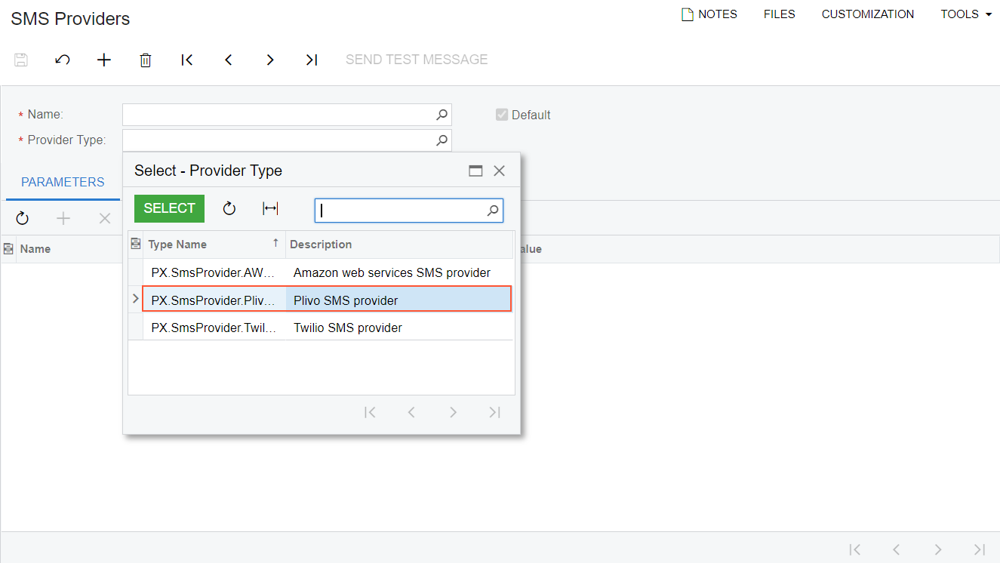

# Custom SMS Provider: To Add a Custom SMS Provider {#_7e99ec44-4ef3-48ad-a712-4dc9a557c9b8 .task}

The following activity will walk you through the process of adding a custom SMS provider.

## Story { .section}

Suppose that your company has a business relationship with the Plivo SMS provider, which is not supported by default by Acumatica ERP. You need to support the sending of SMS notifications through this SMS provider in Acumatica ERP.

## Process Overview { .section}

You will implement the [PX.SmsProvider.ISmsProvider](https://help.acumatica.com/(W(1))/Help?ScreenId=ShowWiki&pageid=9483d8b6-ec79-9e25-855b-5caa6d011a7d) and [PX.SmsProvider.ISmsProviderFactory](https://help.acumatica.com/(W(1))/Help?ScreenId=ShowWiki&pageid=7af9ed30-2abd-4048-a85b-79282c5aeb9b) interfaces in the Visual Studio project of the extension library. You will then publish the customization project with the implemented interfaces and test the availability of the provider on the [SMS Providers](../UserGuide/SM_20_35_35.md) \(SM203535\) form.

## System Preparation { .section}

Before you begin performing the steps of this activity, do the following:

1.  Prepare an Acumatica ERP instance, as described in [Instance Deployment: To Deploy an Instance with Demo Data](../UserGuide/INST_Deploying_Instances_Deploy_Tenant_With_Demodata_Activity.md).
2.  Create a new customization project. For details about this process, see [Customization Projects: To Create a Customization Project](../CustomizationPlatform/CustomizationProjects_GettingStarted_Activity_CreateProject.md).
3.  Create an extension library, as described in [To Create an Extension Library](../CustomizationPlatform/cg_platform_tocreateextensionlib.md).

**Tip:** You can find the source code of this activity in the [Help-and-Training-Examples](https://github.com/Acumatica/Help-and-Training-Examples) repository on GitHub.

## Step 1: Implementing the ISmsProvider Interface { .section}

To implement the [PX.SmsProvider.ISmsProvider](https://help.acumatica.com/(W(1))/Help?ScreenId=ShowWiki&pageid=9483d8b6-ec79-9e25-855b-5caa6d011a7d) interface, do the following:

1.  In the Visual Studio project of the extension library, add a reference to the `PX.SmsProvider.Core.dll` library from the `Bin` folder of the Acumatica ERP instance.
2.  In the project, define the `PlivoSmsProvider` class, which implements the ISmsProvider interface, in the `PX.SmsProvider.Plivo` namespace.

    ```
    using System.Collections.Generic;
    using System.Threading;
    using System.Threading.Tasks;
    using PX.Data;
    
    namespace PX.SmsProvider.Plivo
    {
        public class PlivoSmsProvider : ISmsProvider
        {
        }
    }
    ```

3.  In the project, add the `Helper` folder. Within the folder, add the `Messages.cs` file and add the following code to it.

    ```
    using PX.Common;
    
    namespace PX.SmsProvider.Plivo
    {
        [PXLocalizable]
        public static class Messages
        {
            public const string AuthID_DetailID_Display = "Auth ID";
            public const string AuthToken_DetailID_Display = "Auth Token";
            public const string FromPhoneNbr_DetailID_Display = "From Number";
        }
    }
    ```

4.  In the ExportSettings method of the class, add the following code. This code adds the `Auth ID`, `Auth Token`, and `From Number` parameters to the list that will be displayed on the **Parameters** tab of the [SMS Providers](../UserGuide/SM_20_35_35.md) \(SM203535\) form. You need these parameters to work with Plivo.

    ```
    using System.Collections.Generic;
    using System.Threading;
    using System.Threading.Tasks;
    using PX.Data;
    
    namespace PX.SmsProvider.Plivo
    {
        public class PlivoSmsProvider : ISmsProvider
        {
            #region DetailIDs const
            private const string AuthID_DetailID = "AUTH_ID";
            private const string AuthToken_DetailID = "AUTH_TOKEN";
            private const string FromPhoneNbr_DetailID = "FROM_PHONE_NBR";
            #endregion
    
            private string m_AuthID;
            public string AuthID { get { return m_AuthID; } }
    
            private string m_AuthToken;
            public string AuthToken { get { return m_AuthToken; } }
    
            private string m_FromPhoneNbr;
            public string FromPhoneNbr { get { return m_FromPhoneNbr; } }
    
            public IEnumerable<PXFieldState> ExportSettings
            {
                get
                {
                    var settings = new List<PXFieldState>();
    
                    var authID = (PXStringState)PXStringState.CreateInstance(
                        m_AuthID,
                        null,
                        false,
                        AuthID_DetailID,
                        null,
                        1,
                        null,
                        null,
                        null,
                        null,
                        null
                    );
                    authID.DisplayName = Messages.AuthID_DetailID_Display;
                    settings.Add(authID);
                    var authToken = (PXStringState)PXStringState.CreateInstance(
                        m_AuthToken,
                        null,
                        false,
                        AuthToken_DetailID,
                        null,
                        1,
                        "*",
                        null,
                        null,
                        null,
                        null
                    );
                    authToken.DisplayName = Messages.AuthToken_DetailID_Display;
                    settings.Add(authToken);
    
                    var fromPhoneNbr = (PXStringState)PXStringState.CreateInstance(
                        m_FromPhoneNbr,
                        null,
                        false,
                        FromPhoneNbr_DetailID,
                        null,
                        1,
                        null,
                        null,
                        null,
                        null,
                        null
                    );
                    fromPhoneNbr.DisplayName = Messages.FromPhoneNbr_DetailID_Display;
                    settings.Add(fromPhoneNbr);
    
                    return settings;
                }
            }
        }
    }
    ```

5.  In the LoadSettings method of the class, obtain the values that have been entered on the **Parameters** tab of the [SMS Providers](../UserGuide/SM_20_35_35.md) form and assign them to variables in the class, as shown in the following code.

    ```
    public void LoadSettings(IEnumerable<ISmsProviderSetting> settings)
    {
        foreach (ISmsProviderSetting detail in settings)
        {
            switch (detail.Name.ToUpper())
            {
                case AuthID_DetailID: m_AuthID = detail.Value; break;
                case AuthToken_DetailID: m_AuthToken = detail.Value; break;
                case FromPhoneNbr_DetailID: m_FromPhoneNbr = detail.Value; break;
            }
        }
    }
    ```

6.  In the class, implement SMS processing in the SendMessageAsync method. For an example of the implementation of this method, see [PlivoSmsProvider.cs](https://github.com/Acumatica/Help-and-Training-Examples/blob/HEAD/PlugInDevelopment/Help/AddingCustomSmsProvider/CustomSmsProvider_Code/CustomSmsProvider/PlivoSmsProvider.cs) in the GitHub repository.

## Step 2: Implementing the ISmsProviderFactory Interface { .section}

Implement the [PX.SmsProvider.ISmsProviderFactory](https://help.acumatica.com/(W(1))/Help?ScreenId=ShowWiki&pageid=7af9ed30-2abd-4048-a85b-79282c5aeb9b) interface as follows:

1.  In the `Messages.cs` file, add the name of the provider that will be displayed in the **Provider Type** box of the [SMS Providers](../UserGuide/SM_20_35_35.md) \(SM203535\) form, as shown in the following code.

    ```
    using PX.Common;
    
    namespace PX.SmsProvider.Plivo
    {
        [PXLocalizable]
        public static class Messages
        {
            ...
            public const string ProviderName = "Plivo SMS provider";
        }
    }
    ```

2.  Define the `PlivoSmsProviderFactory` class, which implements the PX.SmsProvider.ISmsProviderFactory interface, as the following code shows.

    ```
    using System.Collections.Generic;
    
    namespace PX.SmsProvider.Plivo
    {
        public class PlivoSmsProviderFactory : ISmsProviderFactory
        {
            public ISmsProvider Create(IEnumerable<ISmsProviderSetting> settings)
            {
                var provider = new PlivoSmsProvider();
                provider.LoadSettings(settings);
                return provider;
            }
    
            public ISmsProvider Create()
            {
                var provider = new PlivoSmsProvider();
                return provider;
            }
    
            public string Description { get; } = Messages.ProviderName;
            public string Name { get; } = typeof(PlivoSmsProvider).FullName;
        }
    }
    ```


## Step 3: Testing the SMS Provider { .section}

To test the Plivo SMS provider, do the following:

1.  Build the Visual Studio project.
2.  On the [SMS Providers](../UserGuide/SM_20_35_35.md) \(SM203535\) form, make sure that the new SMS provider is available for selection in the **Provider Type** box, as shown in the following screenshot.

    

3.  Include the extension library in the customization project as a *File* item, as described in [To Add a Custom File to a Project](../CustomizationPlatform/CG_GL_Items_Files_Adding.md).
4.  Optional: Test the SMS provider as follows:
    1.  Create a Plivo account on [https://console.plivo.com/accounts/register/](https://console.plivo.com/accounts/register/), and get your Plivo phone number.
    2.  On the [SMS Providers](../UserGuide/SM_20_35_35.md) \(SM203535\) form, create a new SMS provider by specifying the following parameters:
        1.  **Name**: *Plivo SMS Provider*
        2.  **Provider Type**: *Plivo SMS Provider \(PX.SmsProvider.Plivo.PlivoSmsProvider\)*
        3.  **Auth ID**: The Auth ID from your account dashboard in Plivo console
        4.  **Auth Token**: The Auth Token from your account dashboard in Plivo console
        5.  **From Number**: The Plivo phone number from which the message will be sent
    3.  Save your changes, and click **Send Test Message** on the form toolbar.

**Parent topic:**[Adding a Custom SMS Provider](../PlugInDevelopmentGuide/PlugIn_SmsProvider_Mapref.md)

