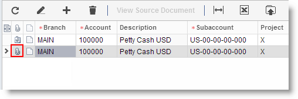
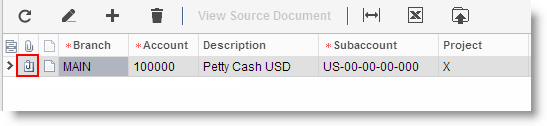

# Attaching Files to Record Details {#_d16227fc-34d0-4290-b72b-9364d5edcee3 .concept}

In the Self-Service Portal, files can be attached to any record detail, which is a particular line in the record that you add by using data entry forms. You can attach different files, such as images in various formats and scanned documents.

## Attaching a File to a Record Detail { .section}

To attach a file to a record detail, do the following:

1.  Open the form, select the record, and then select the record you want to attach the file to.
2.  In the table, at the beginning of the detail row you want to attach the file to, click Attach File \(\), as shown in the screenshot below.

    

3.  In the **Files** dialog box, click **Add File**.
4.  In the **File Upload** dialog box, click **Choose File**, browse to the file you want to attach, select the file, and click **Upload**.

    

5.  Verify that the Attach File \(\) icon has changed to the File Attached \(\) icon, as shown in the screenshot below.

    

**Parent topic:**[Table Overview](../Portal/SP_Details_Table.md)

