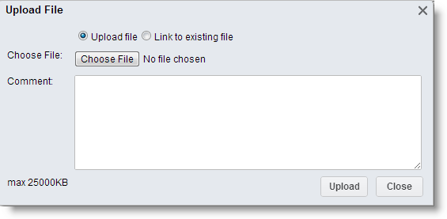

# Attaching Files to Records {#_4fe200c7-e24b-43e0-bc13-aa010b5afed8 .concept}

In the Self-Service Portal, files can be attached to any record that the Self-Service Portal keeps for the objects—such as a case or an opportunity—that users add by using data entry forms. You can attach different files, such as images in various formats and scanned documents.

## Attaching Files to Records { .section}

To attach a file to a record, do the following:

1.  Open the form, and then select the record you want to attach the file to.
2.  On the form title bar, click **Files**.
3.  In the **Files** dialog box, click **Add File**.
4.  In the **File Upload** dialog box, click **Choose File**, browse to the file you want to attach, select the file, and click **Upload**.

    

The file is attached to the record and the counter of files attached to the selected record is incremented.

**Parent topic:**[Form Overview](../Portal/SP_Form_Interface.md)

