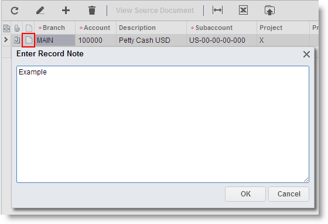
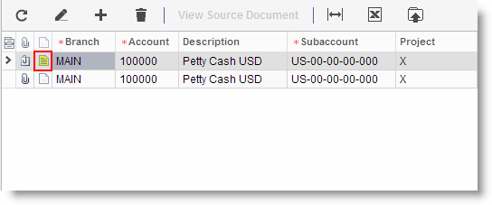

# Attaching Notes to Record Details {#_3fb28cc9-e3be-43b4-9500-d63e3ee92f80 .concept}

In the Self-Service Portal, you can attach text notes to any record detail, which is a particular line in the record. By using these notes, you can communicate key information about the record or record detail to other users.

The process of attaching notes, described below, is similar to the process of attaching files.

## Attaching a Note to a Record Detail { .section}

To attach a note to a record detail, do the following:

1.  Open the form, and then select the record you want to attach the note to.
2.  In the table, at the beginning of the detail row you want to attach the note to, click Attach Note.

    

3.  In the **Enter Record Note** dialog box, type the text of the note.
4.  Click **OK**.
5.  On the form toolbar, click **Save**.
6.  Verify that the Add Note button has changed to the Note Attached button, as shown in the screenshot below.

    

7.  On the form toolbar, click **Save**.

To read the note, open the form, select the record, select the record detail with the note attached, and click Note Attached.

## Managing Attached Files { .section}

With the Self-Service Portal, you can easily manage and track files and images attached to records and record details for various purposes.

**Parent topic:**[Table Overview](../Portal/SP_Details_Table.md)

