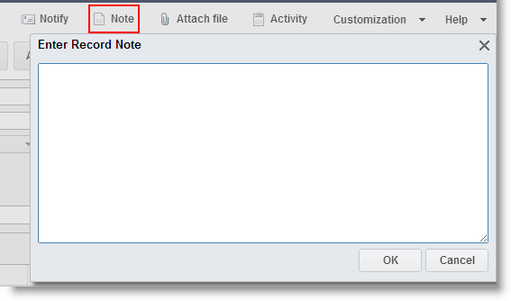
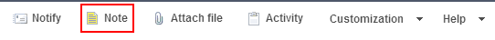

# Attaching Notes to Records {#_faf3125c-194b-477b-b2db-4b92016b637d .concept}

In the Self-Service Portal, you can attach text notes to any record that the Self-Service Portal keeps for the objects—such as opportunities and cases—that users add by using data entry forms. You use these notes to communicate key information about the record or record detail to other users.

## Attaching a Note to a Record { .section}

To attach note to a record, do the following:

1.  Open the form, and then select the record you want to attach a note to.
2.  On the form title bar, click **Notes**.

    

3.  In the **Enter Record Note** dialog box, type the text of the note.
4.  Click **OK**.
5.  Verify that the Add Note icon has changed to the Note Attached icon, as shown in the screenshot below.

    

You can read the note if you click **Notes** on the form title bar.

**Parent topic:**[Form Overview](../Portal/SP_Form_Interface.md)

