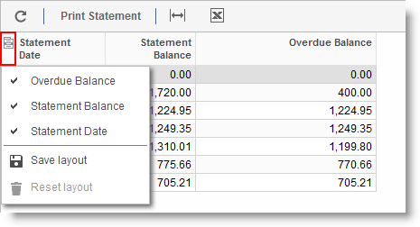
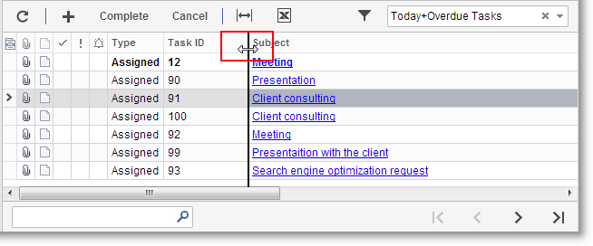
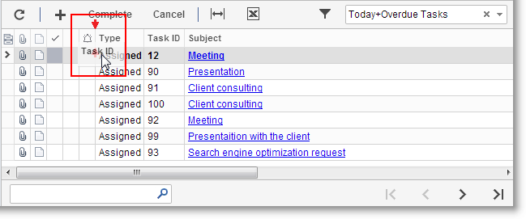

# Changing the Table Layout {#_acd74cd9-7121-4805-aa5b-58a801b2a35f .concept}

In the Self-Service Portal, you can adjust any table to meet your information needs. If some columns in the table are unimportant or not useful to you, you can hide them temporarily or permanently. For the remaining columns in the table, you can automatically adjust column width so that all columns fit on the screen, or you can manually adjust column widths. These changes affect only your user account and are not visible to other users.

**Note:** When you make any changes, the table will display them immediately. If you want to see these changes when you access the form in the future, save the layout of the table.

## Hiding or Displaying Columns in Tables { .section}

You use the Column Selection button, shown in the screenshot below, to change the columns to be displayed and to save the layout.

-   Column Selection button

To hide or display a column in a table on a form, do the following:

1.  In the table, click the Column Selection button \(the leftmost icon on the table heading\) to open the list of columns available for the table. Note that columns that are displayed in the table are preceded by checkmarks, while columns that are not displayed have no checkmarks.
2.  Click each column name you want to display or hide; this adds or removes the checkmark.
3.  Optional: When only the columns you want to display are preceded by checkmarks, click **Save Layout** to save the changes.

## Adjusting Column Widths { .section}

If not all columns fit on the screen and you must scroll the form to the right to view some of them, you can adjust the column width so that you can view all columns on the screen without scrolling. You might not see some column headers in their entirety, if their full text cannot be shown in the reduced column width, but making this adjustment will display all the columns.

To adjust the column width automatically, do the following:

1.  On the table toolbar, click **Fit to Screen**. The widths of the columns will be reduced proportionally so that the whole table will fit the screen.
2.  Optional: To save the changes, click the Column Selection button, and then click **Save Layout**.

To change the width of certain columns manually, do the following:

1.  Move the pointer over the column split line. When the pointer becomes a double-headed arrow, as shown in the screenshot above, drag the pointer to move the line.
2.  Repeat this step for each column split line you want to move.
3.  Optional: To save the changes, click the Column Selection button, and then click **Save Layout**.

## Changing the Order of Columns { .section}

At times, you might want to change the order of columns so that the information is grouped to better fit your work and preferences.

To move columns to other positions in the table, do the following:

1.  In the table header, drag the column heading to the desired position. Note the red arrows \(see the screenshot above\) that indicate the exact position where you can drop the column between two other columns.
2.  Repeat this step for each column you want to move.
3.  Optional: To save the changes, click the Column Selection button, and then click **Save Layout**.

**Parent topic:**[Table Overview](../Portal/SP_Details_Table.md)

