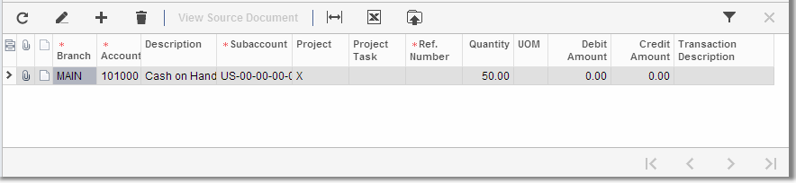
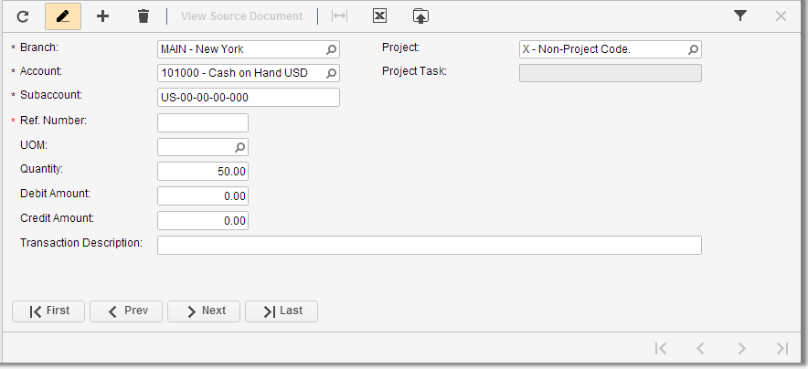

# Working with Tables {#_1a21d4f9-b832-4455-8c3e-350fa892e895 .task}

Whether you enter new data or view the results of an inquiry, you may need to perform specific operations with tables; typical operations are discussed below.

For instructions on adjusting table layout, see [Changing the Table Layout](SP_Changing_the_Details_Table_Layout.md).

## Switching between Form View and Grid View { .section}

On data entry forms, tables can be presented in grid view or form view, as shown in the screenshots below:

-   **Grid view**. A standard tabular view, with all details arranged in a table and each row representing one detail or document line.

    

-   **Form view**. A set of elements intended for only one detail or document line; you use the navigation buttons \(in the lower left corner of the form\) to move from one detail to another.

    

To switch between these two views, you click **Switch Between Grid and Form** on the table toolbar.

## Adding a Row to the Table { .section}

To add a row to a table, you do one of the following:

-   On the table toolbar \(in any view\), click **Add Row**.
-   In the grid view, click anywhere in the table below the existing table rows.
-   In the form view, click **Next**.

The system appends a new row to the table, and you can fill out all required boxes \(and any optional ones\) for a new detail or object. You can click in any box to display its controls. Some boxes have selectors and some have input validation masks; for some boxes, you can type the value directly. For more information about data input, see [Form Elements](SP_Form_Fields.md).

## Deleting a Row from the Table { .section}

If you need to delete a row from a table, do the following:

1.  Make sure the object specified in the row is not used in the system. For example, if it is a ledger, no transactions should be posted to it; if it is a class, it should have no members; and if it is a document detail line, the document should not be released.
2.  In the table, click the row to select it.
3.  On the table toolbar, click **Delete**.
4.  On the form toolbar, click **Save**.

## Selecting Objects in the Table { .section}

Some forms have a Select column \(with a check box as a header\) that you can use as follows to select objects from the table:

-   To select particular objects, click the check box in the Select column for each object.
-   To select all objects displayed on the current page of the table, click the Select check box in the column header.

## Filtering and Sorting { .section}

You might find it helpful to narrow and rearrange the range of displayed objects before selecting particular ones. For more information, see [Filters](SP_Filters.md).

## Attaching Files to the Table Rows { .section}

You can attach a file or multiple files, such as a scanned image of the original document or its electronic version, to each row. For more information, see [Attaching Notes to Record Details](SP_Attaching_Notes_to_Record_Details.md).

## Attaching Notes to the Table Rows { .section}

You can attach a note to each row. For more information, see [Attaching Notes to Record Details](SP_Attaching_Notes_to_Record_Details.md).

**Parent topic:**[Table Overview](../Portal/SP_Details_Table.md)

