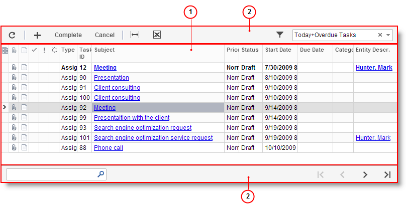

# Table Overview {#_02f0dbdc-1d9b-44f8-9e87-6603f07424a5 .concept}

On many Self-Service Portal forms, the data is arranged in *tables*, where each row represents an object or detail \(for example, an account, a subaccount, a document line, or a journal entry\) and each column shows a parameter of each object or detail. The following screenshot shows a typical table.

1.  Table
2.  Table toolbar

## In This Section { .section}

-   [Table Toolbar Overview](SP_Details_Toolbar.md)
-   [Changing the Table Layout](SP_Changing_the_Details_Table_Layout.md)
-   [Exporting to Excel](SP_Exporting_to_Excel.md)
-   [Attaching Files to Record Details](SP_Attaching_Files_to_Record_Details.md)
-   [Attaching Notes to Record Details](SP_Attaching_Notes_to_Record_Details.md)

-   **[Table Toolbar Overview](../Portal/SP_Details_Toolbar.md)**  

-   **[Changing the Table Layout](../Portal/SP_Changing_the_Details_Table_Layout.md)**  

-   **[Working with Tables](../Portal/SP_Detail_table_Using.md)**  

-   **[Exporting to Excel](../Portal/SP_Exporting_to_Excel.md)**  

-   **[Attaching Files to Record Details](../Portal/SP_Attaching_Files_to_Record_Details.md)**  

-   **[Attaching Notes to Record Details](../Portal/SP_Attaching_Notes_to_Record_Details.md)**  

**Parent topic:**[Portal Interface Guide](../Portal/SP_Getting_Started.md)

