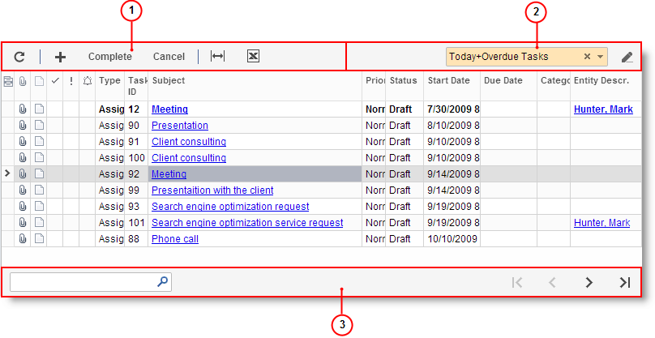
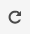
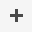
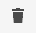
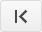
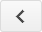
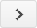
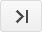

# Table Toolbar Overview {#_17d2d8a8-1d3c-45ef-b927-ceffde496f56 .concept}

Each table on a Self-Service Portal form or dialog box has a table toolbar, which contains buttons you can use to work with the details or objects of the table.

The table toolbar buttons are grouped into sections:

-   *Action section*: Contains buttons that are specific to the form and standard buttons that most table toolbars have.
-   *Filter section*: Contains a box you can use to select a filter \(to narrow the range of data you want to view in the table\) and related buttons.

The *footer* displays navigation buttons if there are too many details or objects \(that is, table rows\) to fit on one page.

1.  Action section
2.  Filter section
3.  Footer

## Table Toolbar Action Section { .section}

The table toolbar action section, commonly located in the upper-left corner of a table, can contain standard and table-specific buttons. If a table toolbar includes table-specific buttons, they are described in the relevant form reference help topic.

The following table describes the standard table toolbar buttons. A table toolbar may include some or all of those buttons.

|Button|Icon|Description|
|------|----|-----------|
|**Refresh**||Refreshes the data in the table.|
|**Add Row**||Appends a new blank row to the table so you can define a new detail or object. A row may contain some default values.|
|**Delete Row**||Deletes the selected row.|
|**Fit to Screen**||Expands the form to fit on the screen and adjusts the column widths proportionally.|
|**Export to Excel**||Exports the data to an Excel file. For more information, see [Exporting to Excel](SP_Exporting_to_Excel.md).|

## Table Toolbar Filter Section { .section}

You can use the filter section of the table toolbar, located in the upper right, to filter the table data. The filter section may contain some or all the elements described below.

|Element|Icon|Description|
|-------|----|-----------|
|**Add Filter**||Opens the **Filter Settings** dialog box, which you can use to define a new filter.|
|**Select Filter**| |Gives you the ability to select one of the available filters, apply the selected filter to the data, and display only the rows that have values matching the logical expression of the filter.|
|**Clear Filter**||Clears the filtering.|

For more information about filtering, see the [Filters](SP_Filters.md).

## Footer { .section}

You use the footer to search for data or to browse the table pages, if there are too many details \(table rows\) to fit on one page. You can see this section at the bottom of the table.

|Element|Icon|Description|
|-------|----|-----------|
|**Go to First Page**||Displays the first page of the table.|
|**Go to Previous Page**||Displays the previous page of the table.|
|Page Number| |Opens a particular page of the table.|
|**Go to Next Page**||Displays the next page of the table.|
|**Go to Last Page**||Displays the last page of the table.|

**Parent topic:**[Table Overview](../Portal/SP_Details_Table.md)

