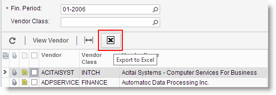

# Exporting to Excel {#_e3f101e9-ed54-417f-856f-d85f37d2a0a4 .concept}

Many users, having worked with Microsoft Excel for years, prefer to perform detailed financial analysis using an Excel spreadsheet on their desktop. For such users, the Self-Service Portal broadly supports integration with Microsoft Excel.

**Note:** The Self-Service Portal uses the spreadsheet format introduced in Microsoft Office 2007, so if you use an earlier version of Microsoft Office, you should install the appropriate plug-in.

## To Export Data to Microsoft Excel { .section}

1.  Open the form whose data you want to export.
2.  In the summary or selection area \(if any\), use the form elements or navigation buttons to select the data displayed in the table.
3.  Optional: Further select the data for export by filtering. For more information on using filters, see [Filters](SP_Filters.md).
4.  On the table toolbar, click **Export to Excel** \(\).
5.  Follow the necessary steps, depending on your browser and settings, to download the Excel file with the exported data.

## Updating Excel Files { .section}

If you exported the data from an inquiry form to an Excel file, you can update your Excel file from the Self-Service Portal database. You can retrieve the data from the web and update the file contents without again exporting data from the system and repeating all post-export configuration steps.

To update an Excel file, do the following:

1.  Open the file.
2.  When you're prompted, enable editing and enable external data connections so that Excel can update the file.
3.  Refresh the data. Do the following:

    -   In Microsoft Excel 2007, 2010, and 2013: On the **Data** tab, in the **Connections** group, click **Refresh All**.
    -   In Microsoft Excel 2003: On the **External Data** toolbar, click **Refresh All**.
    When you are prompted to authenticate yourself, enter your Self-Service Portal username and password.

The contents of the file are updated with the filtering criteria you specified on the inquiry form before exporting the data. If the filtering criteria includes the default values, such values will be updated as well. For example, if the filtering criteria includes the current financial period, when the period is changed in the system, it will be automatically updated in the file.

Additionally, you can aggregate data from several forms to one Excel workbook and use the file as you want—for example, as a source for summarizing and analyzing data. Do the following:

1.  Export data from the form you want to use.
2.  Copy the sheets from the exported files to one Excel workbook and save the resulting file.

Once you have performed these steps, when you refresh data in Excel, the data on all spreadsheets will be updated simultaneously.

**Parent topic:**[Table Overview](../Portal/SP_Details_Table.md)

