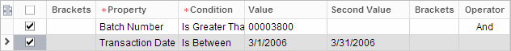

# Filter Conditions {#_b1eddbea-81a6-4550-8132-f3d274c4795a .concept}

To create a filter, you create conditions for the form the filter will be applied to. A filter may contain just one condition, or it may contain multiple simple condition lines, each on its own row of the table, that you combine into one logical expression by using brackets and logical operators.

|Column|Description|
|------|-----------|
|Select|An unlabeled check box that you use to select conditions you want to be active.

 As you specify a condition, it becomes active, with the Select check box automatically selected. To quickly modify the filter, you can clear check boxes for some of the conditions to exclude them from the filter. This check box is not, however, available for reports.

|
|**Brackets**|A set of opening brackets used to group logical conditions. You can use brackets to form filters with multiple lines.|
|**Property**|Required. The property, which you select from a list that includes the properties associated with the particular table the filter will be applied to.|
|**Condition**|Required. The logical operation that applies to the value of the selected property, such as *Equals*, *Does Not Equal*, *Is Greater Than*, *Is Less Than or Equal To*, *Contains*, *Starts With*, *Does Not Contain*, *Is Between*, *Is Empty*, or *Is Not Empty*.|
|**Value**|The value for the logical condition used to specify the criteria of data you want to view. You can either type a value or select one from the list of possible values for the property.|
|**Second Value**|The second value for the logical condition, if the selected logical condition requires a second value. \(For example, the *Is Between* logical condition requires a second value.\)|
|**Brackets**|A set of closing brackets to group logical conditions. You use brackets to form filters with multiple condition lines.|
|**Operator**|The logical operator \(*And* or *Or*\) to be used between groups of logical conditions. You select this operator to join the current condition with the following.|

To specify filter conditions, do the following:

1.  In the filter conditions table, add a new row.
2.  In the table row, specify the condition.
3.  Repeat Steps 1 and 2 for each additional condition.
4.  Click the Select check boxes in the table rows for the active conditions.

## Filter Example { .section}

For example, if you want to filter transactions with batch numbers greater than 3800 that were entered in March 2006, you specify the condition rows as shown in the following screenshot.

**Parent topic:**[Filters](../Portal/SP_Filters.md)

