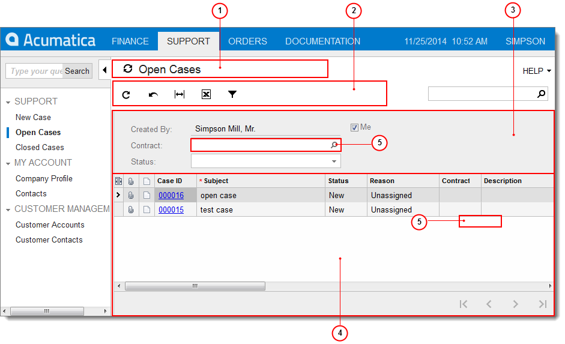

# Form Overview {#_655ba633-48ef-48f6-bceb-63e13ed87517 .concept}

Self-Service Portal forms have an intuitive point-and-click interface, described later in this section.

A Self-Service Portal form can include only one part or a combination of parts, depending on the functionality and use of the form. The following screenshot shows a typical Self-Service Portal screen with the parts of a form that appear on it.

1.  Form title bar
2.  Form toolbar
3.  Summary or Selection area
4.  Details area

|Element|Description|
|-------|-----------|
|Form Title Bar|This bar, present on each Self-Service Portal page, includes buttons for managing the form-related information. You can use this bar to navigate to a help topic for the form and view the files and notes attached to form records. For more information, see [Form Title Bar](SP_Form_Title_Bar.md).|
|Form Toolbar|This toolbar provides data navigation and processing buttons that apply to the entire form. You can use these buttons on the documents created while using the form \(for example, to cancel or save changes you've made\). For more information, see [Form Toolbar Overview](SP_Form_Toolbar.md).|
|Summary or Selection Area|The summary or selection area includes a collection of elements of different types, generally arranged in a column or multiple columns. This area may contain a summary of a document if a form contains a document or a variety of selections you can make to determine the information in the details area.|
|Details Area|The details area contains the data of the object or entity.

 On some forms, the details area contains a *table*. A table is an arrangement of similar objects or details displayed with the same number of parameters. For more information, see [Table Overview](SP_Details_Table.md).

|

-   **[Form Title Bar](../Portal/SP_Form_Title_Bar.md)**  

-   **[Form Toolbar Overview](../Portal/SP_Form_Toolbar.md)**  

-   **[Formatting Toolbar Overview](../Portal/SP_Formatting_toolbar.md)**  

-   **[Form Elements](../Portal/SP_Form_Fields.md)**  

-   **[Attaching Files to Records](../Portal/SP_Attaching_Files_to_Records.md)**  

-   **[Attaching Notes to Records](../Portal/SP_Attaching_Notes_to_Records.md)**  

**Parent topic:**[Portal Interface Guide](../Portal/SP_Getting_Started.md)

