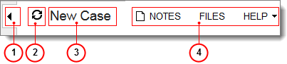

# Form Title Bar {#_994af961-828a-40d4-871a-b83f2afb85e6 .concept}

The form title bar, located on the top of every Self-Service Portal form, includes general buttons you use to attach files and notes to the documents on form.

1.  Hide Navigation Pane / Show Navigation Pane
2.  Sync Navigation Pane
3.  Form title
4.  Menu buttons

A form title bar on a particular form includes standard and form-specific buttons.

|Button|Description|
|------|-----------|
|**Show Navigation Pane** / **Hide Navigation Pane**|Shows or hides the navigation pane.|
|**Sync Navigation Pane**|Displays the position of the current form or article in the main menu and the navigation pane.

 If you browse the forms by using the main menu and the navigation pane or if you use other navigation options to select the form, the navigation pane would not show the position of the current form. Click **Sync Navigation Pane** to synchronize the panes.

|
|**Form Title**|Shows the title of the current form. You can click the form title to refresh the form.|
|**Notes**|Lets you attach notes to records. For more information, see [Attaching Notes to Records](SP_Attaching_Notes_to_Records.md).|
|**Files**|Lets you attach files to the form and manage the attached files. For more information, see [Attaching Files to Records](SP_Attaching_Files_to_Records.md).|
|**Help**|Opens the reference topic for the currently open form. The reference topic contains descriptions of all the elements and explains how to use the form.|

**Parent topic:**[Form Overview](../Portal/SP_Form_Interface.md)

