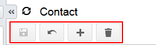

# Form Toolbar Overview {#_f7c75e6a-28cf-4a95-9069-440851d06a38 .concept}

The form toolbar, available on most forms, is located near the top of the form, under the form title bar \(see the screenshot below\). The form toolbar may include standard and form-specific buttons.

You use the standard buttons on the form toolbar to insert or delete an record, save the data you have entered, or cancel your work on the form.

In addition to standard buttons, a form toolbar on a particular form may include form-specific buttons. These buttons usually let you navigate to other forms to quickly review related details and modify or process records on the form.

## Standard Form Toolbar Buttons { .section}

The following table lists the standard buttons of the form toolbar. A form toolbar may include some or all of those buttons.

|Button|Icon|Description|
|------|----|-----------|
|**Save**||Saves the changes made to the record.|
|**Cancel**||Depending on the context, does one of the following:-   Discards any unsaved changes you have made to objects or entities and retrieves the last saved version.
-   Clears all changes and restores default settings.

|
|**Add New Record**||Clears any values you've specified on the form, restores any default values, and initiates the creation of a new object or entity.|
|**Delete**||Deletes the currently selected object or entity, clears any values you've specified on the form, and restores default values.**Note:** You'll be able to delete a document that is not linked with another document.

|

**Parent topic:**[Form Overview](../Portal/SP_Form_Interface.md)

