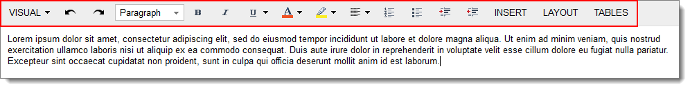
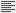

# Formatting Toolbar Overview {#_162ff622-57e7-4fa2-abae-7d6be0d4d8e3 .concept}

The formatting toolbar, which is available on forms with the text editor, is located at the top of the text editor area \(see the screenshot below\). The formatting toolbar may include standard and form-specific buttons.

You use the standard buttons on the formatting toolbar to write and edit text, use the clipboard, and format the text.

## Standard Formatting Toolbar Buttons { .section}

The following table lists the standard buttons that a formatting toolbar might include.

|Button|Icon|Description|
|------|----|-----------|
|**Visual**| |Provides the following options:-   *Visual*: Opens the editor view, where you can input and format the text.
-   *HTML*: Opens the editor in HTML view, where you can input multiple HTML elements.
-   *Plain text*: Opens the plain text view, in which all the formatting is removed. You can edit the text without formatting.
-   *Preview*: Opens the preview mode, where you can view the content as it will look.

|
|**Undo**| |Cancels the last changes you made.|
|**Redo**| |Restores the changes you canceled by clicking **Undo**.|
|Style| |Applies the selected style to the text. The following styles are available: *Paragraph*, *Header1*, *Header2*, *Header3*, *Header4*, *Header5*, *Header6*, *Preformatted*, or *Quote*.|
|**Bold**||Marks the selected text in bold style.|
|**Italic**||Marks the selected text in italic style.|
|**Underline**||Marks the selected text as underlined. You can also use the following options available in the drop-down list:-   *Strike Through*: Marks the selected text as strike through.
-   *Subscript*: Marks the selected text as subscript.
-   *Superscript*: Marks the selected text as superscript.

|
|**Font Color**||Changes the color of the selected text to the color you click.|
|**Text Highlight Color**||Highlights the selected text in the color you click.|
|**Align Text Left**||Aligns the selected text to the left with a ragged right margin. You can also use the following options available in the drop-down list:-   *Center*: Centers the selected text.
-   *Align Text Right*: Aligns the selected text to the right with a ragged left margin.
-   *Justify*: Aligns the selected text evenly between the left and right margins.

|
|**Numbered List**||Starts a numbered list or converts the selected text to a numbered list.|
|**Bulleted List**||Starts a bulleted list or converts the selected text to a bulleted list.|
|**Increase Indent**||Moves the paragraph farther away from the margin.|
|**Decrease Indent**||Moves the paragraph closer to the margin.|
|**Insert**| |Gives you the ability to insert images, links, attachments, macros, templates, and placeholders.|
|**Insert Image**| |Opens the **Insert Image** dialog box, which contains the options for inserting the image into the text area \(described in the table below\).|
|**Insert Link**| |Opens the **Insert Link** dialog box, which contains the options for inserting the link into the text \(described in the table below\).|
|**Layout**| |Contains the following buttons:-   **Create Section**: Creates a section in the editing area.
-   **Remove Section**: Removes a section.
-   **Section Up**: Moves the section that the cursor is pointing to one level up.
-   **Section Down**: Moves the section that the cursor is pointing to one level down.
-   **One section**: Changes the markup layout by uniting a section that was divided earlier into one section.
-   **Two sections**: Changes the markup layout by dividing the section into two parts \(sections\).
-   **Left bar**: Changes the markup layout by dividing the section into two parts. The left part is located closer to the left margin.
-   **Right bar**: Changes the markup layout by dividing the section into two parts. The right part is located closer to the right margin.
-   **Three sections**: Changes the markup layout by dividing the section into three equal parts \(sections\).
-   **Side bars**: Changes the markup layout by dividing the section into three parts \(sections\) by creating side bars on the left and on the right.

|
|**Tables**| |Contains the following options:-   **Create Table**: Invokes the dialog box, where you can specify the number of rows and columns and create the table.
-   **Insert Row Before Selected**: Inserts the row before the selected one.
-   **Insert Row After Selected**: Inserts the row after the selected one.
-   **Insert Column Before Selected**: Inserts the column before the selected one.
-   **Insert Column After Selected**: Inserts the column after the selected one.
-   **Delete Row**: Deletes the selected row.
-   **Delete Column**: Deletes the selected column.
-   **Del. Table**: Deletes the selected table.

|

**Parent topic:**[Form Overview](../Portal/SP_Form_Interface.md)

