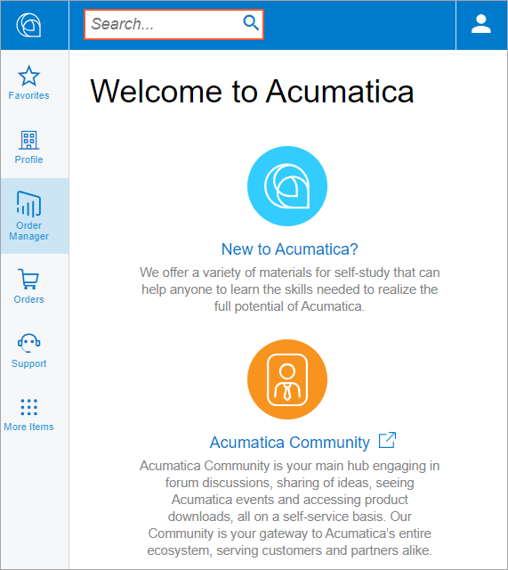

# Search {#_116f5714-e369-4b3c-b0fe-23caee068efc .concept}

Searching in the Self-Service Portal gives you the ability to quickly open a form or find a help topic with required information.

## Basic Search { .section}

To start a search, type a word, form number, or a phrase in the **Search** box of the navigation pane \(see the screenshot below\).

## Search Results { .section}

The search results appear in the **Screen**, **Profiles**, or **Help** tabs.

Click required form or article title to open it.

**Parent topic:**[Portal Interface Guide](../Portal/SP_Getting_Started.md)

