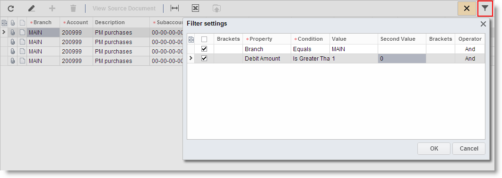

# Ad Hoc Filters {#_ec53ddd6-32d8-40e9-a29c-7dc20a7601e8 .task}

On data entry forms, you can set up ad hoc filters, which display only the data you need at the moment. The filters you create on such forms cannot be saved and then reused at a later time.

## Ad Hoc Filter on Data Entry Form { .section}

Follow these steps to set up an ad hoc filter for a data entry form:

1.  Open the data entry form.
2.  On the table toolbar, click **Add Filter**.

    

3.  In the **Filter Settings** dialog box \(as shown above\), click somewhere below the header row or the last row to add a new row.
4.  Specify conditions for the filter. For more information about filter conditions, see [Filters](SP_Filters.md).
5.  Click **OK** to apply the filter.

    The **Cancel Filter** button becomes highlighted to indicate that the filter has been applied, and the data you see on the form matches the filter conditions.

To modify the filter conditions, do the following:

1.  On the table toolbar, click **Add Filter**.
2.  In the **Filter Settings** dialog box, modify the filter conditions:
    -   Click the Select check box to specify the active conditions.
    -   Modify filter conditions.
    -   Add or remove filter condition lines.
3.  Click **OK** to apply the filter.

To cancel filtering on the table, do the following:

-   On the table toolbar, click **Cancel Filter**.

**Parent topic:**[Filters](../Portal/SP_Filters.md)

