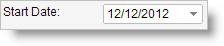
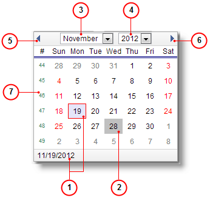

# Date Boxes {#_cbfe0ebb-b61a-4c40-ab33-2baef8c23eac .concept}

Date boxes are used specifically to enter dates.

By default, the current date is displayed in the date boxes of a form. To change the date, you can either type a specific date or select it by using the calendar.

## Calendar { .section}

The calendar dialog box displays the calendar page for the selected date, as shown in the screenshot below. By default, the selected date is the current date specified in the Self-Service Portal.

1.  Current date
2.  Selected date
3.  Selected month
4.  Selected year
5.  Previous month
6.  Next month
7.  Week number column

To select the date by using the calendar, follow these steps:

1.  Click the Date arrow to open the calendar.
2.  Browse calendar pages:
    -   To change the year, click the selected year, and then click the year you want to view.
    -   To change the month, click the selected month, and then click the month you want to view.
    -   To view the previous month page, click the previous month arrow.
    -   To view the next month page, click the next month arrow.
3.  Click the selected day to close the dialog box.

The selected date is now displayed in the Date box.

**Parent topic:**[Form Elements](../Portal/SP_Form_Fields.md)

