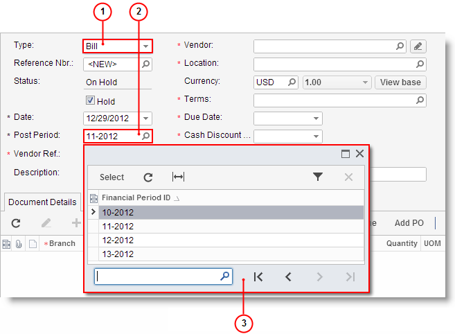
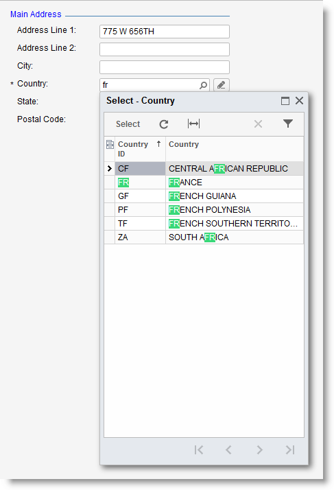

# Lookup Boxes {#_b15b2df1-9cfb-487e-94f0-cac267e2dde8 .concept}

The Self-Service Portal uses two types of lookup boxes:

-   *Drop-down list*: The currently selected option is shown in the box. Click the box arrow to see more options.
-   *Lookup table*: This lookup box has a selector, indicated with a magnifier icon. Click the selector button to open a lookup table showing objects in the database and information about each object.

1.  Lookup box with drop-down list
2.  Lookup box with lookup table
3.  Lookup table

## Autocomplete { .section}

You can use Autocomplete to enter values into most lookup boxes with lookup table. You start typing in the box, and you get the list of suggestions in the lookup table with the same letters you have typed.

For example, you want to find France in the list of countries. In the **Country** box, you type `fr` and the list of countries is filtered down to include only the countries whose name include the same letters you typed as shown in the screenshot below. Now press Down Arrow key two times and press Enter to select the country.

## How to Select a Value in the Lookup Box { .section}

-   If you know the value, type it in the box and press Enter.
-   If the box supports Autocomplete, start typing the value, and then select the value in the table.
-   Click the magnifier icon and select the value in the lookup table.

    **Note:** You can use filtering options to display only documents with specific properties. For more information, see [Filters](SP_Filters.md).

**Parent topic:**[Form Elements](../Portal/SP_Form_Fields.md)

