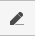
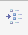
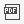
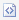

# Reports {#_c9e4ec0f-442f-4f85-a826-f26a14527e4f .reference}

Once you open the report, the prepared report appears on your screen. You can print the report or export the report to a file.

## Report Toolbar { .section}

The following table lists report toolbar buttons.

|Buttons|Icon|Description|
|-------|----|-----------|
|**Parameters**||Navigates back to the report form to let you change the report parameters.|
|**Refresh**||Refreshes the information displayed in the report \(if any data changes were made\).|
|**Groups**||Adds to the report a left pane where the report structure is shown. Click a report node to highlight the pertinent data in the right pane.|
|**View PDF** / **View HTML**| / |Displays the report as a PDF, or displays the report in HTML format. The available button depends on the current report view; if you're viewing a PDF, for instance, you will see the **View HTML** button.|
|**First**||Displays the first page of the report.|
|**Previous**||Displays the previous page.|
|**Next**||Displays the next page.|
|**Last**||Displays the last page of the report.|
|**Print**| |Opens the browser dialog box so you can print the report.|
|**Send**| |Opens the **Email Activity** dialog box, which you use to send the report file \(in the chosen format\) to the specified email address.|
|**Export**| |Enables you to export the data in the chosen format \(Excel or PDF\).|

**Parent topic:**[Portal Interface Guide](../Portal/SP_Getting_Started.md)

