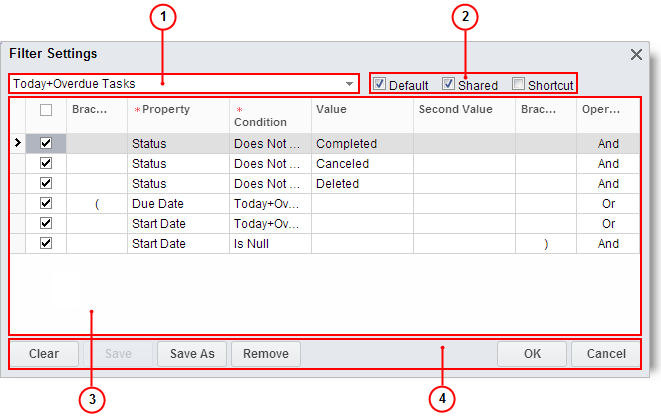

# Advanced Filters {#_191662ea-99ac-46c8-b88e-adbb55612c7b .task}

Advanced filters, available on processing forms, are created once and can be reused at a later date. Those filters are form-specific—meaning that a reusable filter can be applied to one specific form.

You can create and manage advanced filters by using the **Filter Settings** dialog box, which you invoke directly from the processing or inquiry form for which the filter is intended.

The filters section of the table toolbar is used to apply and cancel filtering, and to create, delete, and manage your advanced filters for the form. You can see the available filters listed in the **Select Filter** box of the table toolbar. This list includes the system advanced filters, the advanced filters you created, and the advanced filters other users have created and shared.

If a filter has been applied to the table, you can see the name of this filter in the **Select Filter** box on the table toolbar. If the default filter for this form is specified, the name of this filter is displayed in the **Select Filter** box when you open that form.

For more information about the filters section of the table toolbar, see [Table Toolbar Overview](SP_Details_Toolbar.md).

## Categories of Advanced Filters {#section_e4x_5k5_3k .section}

Reusable filters have categories that define the use of the filter. For example, if you define a filter as default, this filter is automatically applied to the form when this form is opened.

|Check Box|Description|
|---------|-----------|
|**Default**|Indicates that this is the default filter for the selected form.|
|**Shortcut**|Indicates that the form with this particular filter applied will be available if you click the link on the dashboard, if the form was added to a dashboard.|
|**Shared**|Indicates that the filter will be shared with other users. If it is checked, the filter is shared, no matter who created it.|

## Managing Filters in Forms { .section}

You can manage filters that can be applied to the table of the particular form by using the **Filter Settings** dialog box of that form.

To open the **Filter Settings** dialog box, do the following:

1.  Open the form.
2.  On the table toolbar, click **Add Filter**.

1.  Filter name
2.  Categories
3.  Filter conditions
4.  Buttons

|Element|Description|
|-------|-----------|
|Filter name box|Lists the names of the filters that can be applied to the currently selected form. You can click the filter name to see the details of the filter.|
|Categories|Shows the filter usage. You can select the categories for the currently selected filter from the list of available, as described in [Categories of Reusable Filters](#section_e4x_5k5_3k) section.|
|**Clear**|Clears all changes and restores default settings to let you specify a new filter.|
|**Save**|Gives you the ability to enter a name for the new filter and saves it, or saves the existing filter after you have modified it.|
|**Save As**|Saves the filter under a new name.|
|**Remove**|Deletes the filter from the system.|
|**OK**|Applies the filter and closes the dialog box.|
|**Cancel**|Closes the dialog box without filtering the data.|

To create an advanced filter directly from the form to which it would be applied to, do the following:

1.  Open the form you want to add a filter to.
2.  On the table toolbar, click **Add Filter**.
3.  In the **Filter Settings** dialog box, click anywhere in the table below the existing table rows.
4.  Specify conditions for the filter. For more information about filter conditions, see [Filters](SP_Filters.md).
5.  Select the filter categories:
    -   If you want to use this filter as the default filter for the current form, select the **Default** check box.
    -   If you want to share this filter with other users, select the **Shared** check box.
6.  Click **Save**.
7.  In the **Enter the filter name here** dialog box, type the name of the newly defined filter.
8.  Click **OK**.
9.  Click **Save** to save the filter.
10. Click **OK** to close the **Filter Settings** dialog box and apply the filter.

To modify an advanced filter in the form that this filter can be applied to:

1.  Open the form you want to add a filter to.
2.  On the table toolbar, click **Add Filter**.
3.  In the **Filter Settings** dialog box, click the filter name box and select the filter.
4.  Do any of the following to modify the filter:
    -   Click the Select check boxes in the table rows to select the active conditions of the filter.
    -   Click below the last condition row to add a new row, and then specify the new condition.
    -   Click the categories check boxes to specify the filter categories.
5.  Do one of the following to save the changes:
    -   If the filter is one of your user-created filters, click **Save**.
    -   If the filter is a system filter, then you can't save changes to this particular filter and the **Save** button is unavailable. In this case, click **Save as** and specify the new filter name to create a new filter based on the system filter.
6.  Click **OK** to close the dialog box.

To delete an advanced filter from the form this filter can be applied to:

1.  Open the form.
2.  On the table toolbar, click **Add Filter**.
3.  In the **Filter Settings** dialog box, click the filter name box and select the filter.
4.  Click **Remove**.
5.  Click **OK** or **Cancel** to close the dialog box.

## Setting Default Filter { .section}

If an advanced filter was selected as a default for a specific form, this filter is applied automatically when you open the form. The name of the default filter is shown in the **Select Filter** box.

To select an advanced filter as the default form filter, do the following:

1.  On the table toolbar of the form, click **Add Filter**.
2.  In the **Filter Settings** dialog box, click the filter name box and click the filter name.
3.  Select the **Default** check box, and then click **Save**.
4.  Click **OK** to close the dialog box.

## Applying Advanced Filter {#3 .section}

To apply one of the available advanced filters to the conditions table displayed on a form, do the following:

-   On the table toolbar, click the **Select Filter** arrow and select the filter you want to apply.

An advanced filter may contain active and inactive conditions, and you can easily modify the advanced filter by changing the active status of conditions before applying the filter. To select the active conditions of the advanced filter and apply this filter, do the following:

1.  On the table toolbar, click **Add Filter**.
2.  In the **Filter Settings** dialog box, click the filter name box and select the filter.
3.  Click the Select check boxes to select the conditions you want to use.
4.  Click **OK** to apply the filter.

## Canceling Filtering { .section}

If you want to view a table without filter effects, you need to cancel the filtering.

To cancel the currently applied reusable filter, do the following:

-   On the table toolbar, click **Cancel Filter**.

**Parent topic:**[Filters](../Portal/SP_Filters.md)

