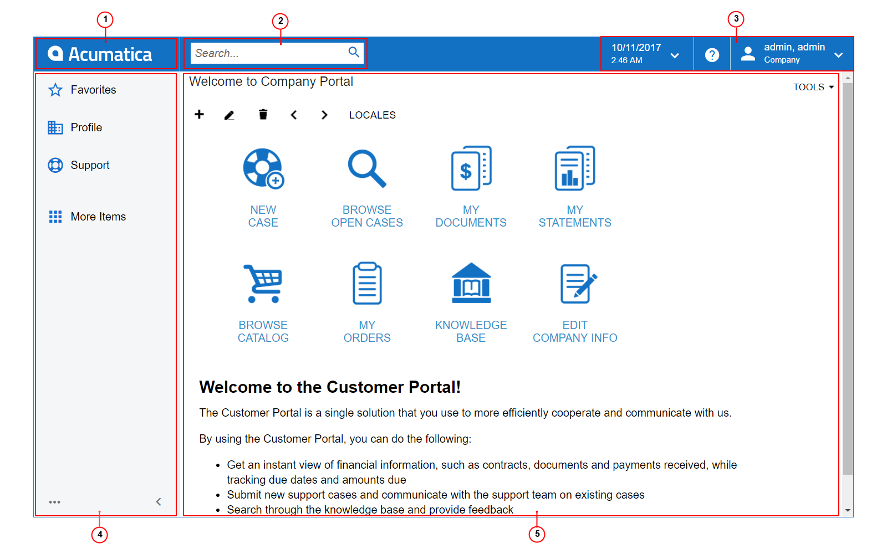

# Basic Elements of the User Interface {#_4f571bb5-4b95-4b99-9cde-5e1546423a8e .concept}

Every Self-Service Portal screen includes basic elements that users use for navigating the system, viewing and managing data, and performing other basic functions. The following screenshot shows a typical Self-Service Portal screen with the basic elements that appear on it.

1.  Home button
2.  Search box
3.  Info area
4.  Main menu \(displayed as a panel\)
5.  Working area

## Home Button { .section}

When you click the Home button, which has the Acumatica logo on it by default and is located in the top left corner of the Self-Service Portal screen, you are forwarded to the home page of your instance.

If the main menu is minimized the Home button is displayed to the left of the Info area.

## Search Box { .section}

By using the **Search** box on the top pane of the Self-Service Portal screen, you can search for a text string in menu items, form titles, help topics, files, notes, and *entities* created using system forms, such as vendors and cases. Additionally, you can search for a form by its title and ID. For details, see [Search](SP__con_New_UI_Search.md).

## Info Area { .section}

The info area, in the upper-right corner of the Self-Service Portal screen, contains the menus and buttons that you can use to sign out from the system, change the settings of your account, and view the business date. For more information, see [Info Area](SP__con_New_UI_Info_Area.md).

## Main Menu { .section}

The main menu in the Self-Service Portal contains the links to your favorites and workspaces \(menus with links to forms\). By default, the main menu is a panel located on the left side of the Self-Service Portal screen. You can minimize the menu so that it is displayed as a button in the top left corner of the screen \(instead of the Home button\). For details, see [Main Menu](SP__con_New_UI_Main_Menu.md).

When you click a workspace item on the main menu, the workspace menu opens. This menu contains the forms dedicated to a particular functional area. For details, see [Workspaces](SP__con_New_UI_Workspaces.md).

## Working Area { .section}

The working area, which is the large area on the right side of the screen, may display any of the following:

-   Form: The Self-Service Portal has forms of multiple types. For more information, see [Form Overview](SP_Form_Interface.md).
-   The Welcome dashboard: On this dashboard, usually, you can see introductory information about capabilities of the portal. The dashboard is configured by the organization which hosts Self-Service Portal.

**Parent topic:**[Self-Service Portal User Interface](../Portal/SP__con_Modern_UI.md)

