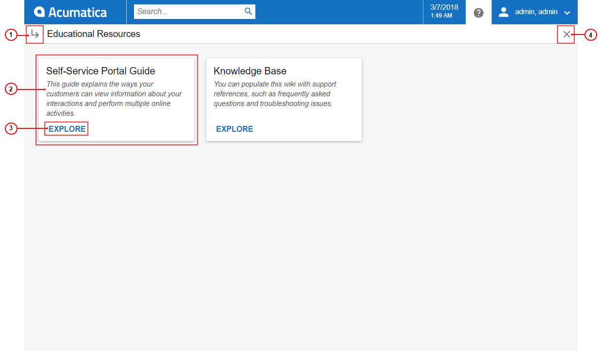
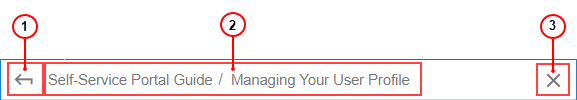

# Help {#_c04c3c0d-eb62-4c0b-b4d5-729484acc726 .concept}

In the user interface of the Self-Service Portal, you can click the Help button \(\) to view relevant Help information. The specific Help information you view depends on the item displayed in the working area when you click this button, as follows:

-   If the working area is displaying a dashboard or a form other than a data entry form or mass-processing form \(because forms of types other than data entry and mass processing are not described in documentation\), the Help dashboard, which contains cards with descriptions of guides and links to them, is opened in a separate tab of a browser. For details, see [Help Dashboard](#_af06ab6e-c30a-407b-8df7-2e104652ba2b).
-   If the working area is displaying a Self-Service Portal form, the reference topic that describes this form is opened in a separate tab of a browser.

The Help menu covers part of the working area. You can come back to the page that had been displayed in the working area by clicking the Help button again. The Help dashboard and Help topics are opened in separate tabs of a browser. If you want to open the Help dashboard and Help topics over the working area, you should press Ctrl and click the Help button.

## Help Dashboard {#_af06ab6e-c30a-407b-8df7-2e104652ba2b .section}

The Help dashboard is the main navigation page of Acumatica ERP documentation \(see the following screenshot\).

1.  Topic View button
2.  Guide card
3.  **Explore** button
4.  Close Help button

By clicking the Topic View button, you switch from the Help dashboard to a Help topic. The Help topic that you last viewed in the current session is displayed. If you haven't opened any Help topic yet, you see the list of Help guides in the navigation pane.

The guide card is the card that contains a description of each guide. By clicking the **Explore** button on the guide card, you open the guide.

By clicking the Close Help button, you close the Help dashboard. The form, report, or dashboard that was displayed in the working area before you opened Help becomes visible on the screen.

## Help Navigation Toolbar { .section}

When you open a Help topic, you can see the navigation toolbar, which has tools you can use to quickly switch between Help topics and to close the Help topic you are viewing \(see the following screenshot\).

1.  Open Help Dashboard button
2.  Path to the opened topic in the Help tree
3.  Close

By clicking the Open Help Dashboard button, you open the Help dashboard \(for example, if you want to switch to another guide\).

Each segment of the path to the opened topic is a link to the corresponding Help topic. By clicking the link, you can open a parent topic on any level.

By clicking the Close button, you close the current topic. The form, report, or dashboard that was displayed in the working area before you opened Help becomes visible on the screen.

## Search for Help Topics { .section}

You can search for information in Help in the following ways:

-   By using the Help button: If you are working with a form and have questions related to the form, you can click the Help button to open a reference topic.
-   By using the **Search** box: If you want to find information that is not related to the form you are currently working with, you can type a search string in the **Search** box, switch to the **Help Topics** search filter tab, and find the necessary information in the search results.
-   By using navigation in Help: If you want to read all information related to a particular functional area \(for example, what tools the system provides for cash management\), you open the Help dashboard, open a particular guide, and in the Help topic tree, click the title of the chapter you want to read.

**Parent topic:**[Self-Service Portal User Interface](../Portal/SP__con_Modern_UI.md)

